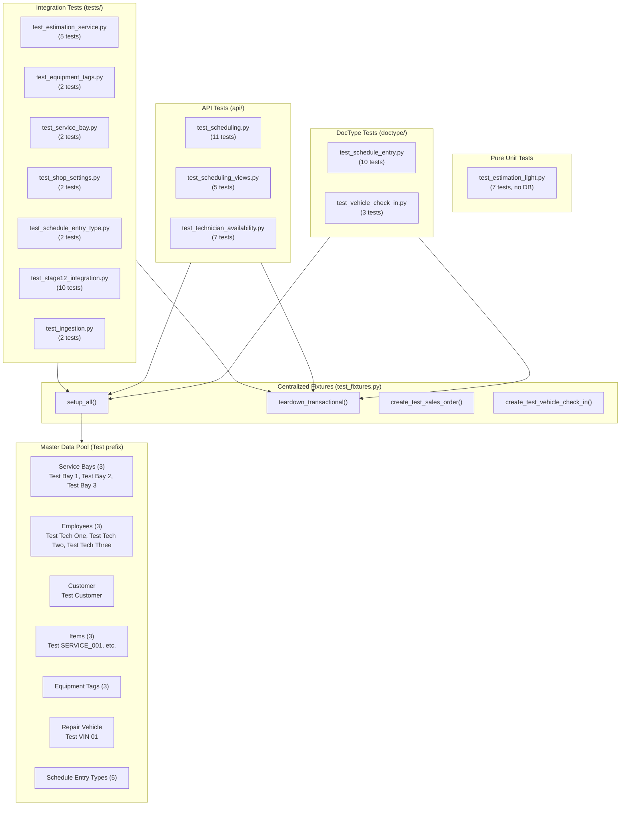

# Testing Methodology Improvement Specification

## 1. Executive Summary

This document specifies the technical design for improving the `induct_shop` automated testing methodology across three areas:

1. **Transactional Record Leak Fixes** — Audit and fix test files that insert transactional records (Vehicle Check-in, Project, Sales Order, Schedule Entry) without cleaning them up in `tearDown()`. Migrate ad-hoc master data creation to the centralized `test_fixtures.py` pool.
2. **Comprehensive Testing Documentation** — Create a full test suite inventory and architecture reference document at `docs/playbooks/testing/test-suite-overview.md`.
3. **Architectural Improvements** — Expand the `teardown_transactional()` scope, add missing master data to the fixture pool, and convert `run_ingestion_test.py` to a proper unit test.

---

## 2. Audit Findings

### 2.1 Test Suite Inventory

The `induct_shop` test suite spans **15 test files** across **3 locations**, containing **49 test methods** and **8 test classes**.

| Location | Files | Purpose |
|:---|:---|:---|
| `induct_shop/tests/` | 9 files | Centralized unit & integration tests |
| `induct_shop/api/` | 3 files | API-layer tests |
| `induct_shop/induct_shop/doctype/*/` | 4 files | DocType controller tests |

### 2.2 Transactional Record Leak Report

| File | Records Leaked | Severity | Root Cause |
|:---|:---|:---|:---|
| `doctype/vehicle_check_in/test_vehicle_check_in.py` | Vehicle Check-in, Project | 🔴 Critical | `tearDown` only cleans Schedule Entries by bay. VCI + auto-created Projects never deleted. |
| `doctype/schedule_entry/test_schedule_entry.py` | Vehicle Check-in, Project, Sales Order | 🔴 Critical | `tearDown` only cleans Schedule Entries by bay. Cross-DocType records from `test_vehicle_check_in_linkage()` and `test_so_line_frt_override()` not cleaned. |
| `api/test_scheduling_views.py` | Repair Vehicle, Project | 🟠 Moderate | `test_resolve_vehicle_info_with_model_formatting` creates ad-hoc Repair Vehicle + Project, never cleaned. |

### 2.3 Convention Violations

| File | Violation |
|:---|:---|
| `test_vehicle_check_in.py` | Uses `_Test Checkin` prefix instead of `Test `. Creates master data in `setUpClass` instead of `test_fixtures.setup_all()`. |
| `test_schedule_entry.py` | 91-line ad-hoc `setUp()` creating master data (`Customer`, `Service Bay`, `Item`, `Repair Vehicle`, `Project`, `Sales Order`) bypassing centralized fixtures. Uses `_Test Schedule` / `Test Schedule Bay` prefixes instead of `Test `. |

### 2.4 Compliant Files (No Issues)

| File | Notes |
|:---|:---|
| `tests/test_stage12_integration.py` | ✅ `setup_all()` + `teardown_transactional()` (uses legacy `_IST_` prefix — will be migrated) |
| `api/test_scheduling.py` | ✅ `setup_all()` + `teardown_transactional()` (uses legacy `_IST_` prefix — will be migrated) |
| `api/test_technician_availability.py` | ✅ `setup_all()` + `teardown_transactional()` (uses legacy `_IST_` prefix — will be migrated) |
| `tests/test_estimation_light.py` | ✅ Pure unit tests, no DB interaction |
| `tests/test_estimation_service.py` | ✅ `setup_all()`, no transactional writes (uses legacy `_IST_` prefix — will be migrated) |
| `tests/test_equipment_tags.py` | ✅ `setup_all()`, idempotent master data (uses legacy `_IST_` prefix — will be migrated) |
| `tests/test_service_bay.py` | ✅ Proper `tearDown()` |
| `tests/test_shop_settings.py` | ✅ `try/finally` for value restoration |
| `tests/test_schedule_entry_type.py` | ✅ Inline create/delete, acceptable |
| `doctype/repair_vehicle/test_repair_vehicle.py` | ✅ Empty stub, no action needed |
| `doctype/inspection_template/test_inspection_template.py` | ✅ Empty stub, no action needed |

---

## 3. Detailed Design

### 3.1 `test_fixtures.py` — Expanded Master Data Pool

#### Prefix Convention Change: `_IST_` → `Test `

The existing `_IST_` prefix (e.g., `_IST_Bay 1`, `_IST_Customer`) is replaced with a human-readable `Test ` prefix (e.g., `Test Bay 1`, `Test Customer`). This makes test data immediately recognizable when browsing the database.

```python
# Before
PREFIX = "_IST_"
# After
PREFIX = "Test "
```

All existing master data constants will be renamed:

| Before (`_IST_`) | After (`Test `) |
|:---|:---|
| `_IST_Bay 1` | `Test Bay 1` |
| `_IST_Bay 2` | `Test Bay 2` |
| `_IST_Bay 3` | `Test Bay 3` |
| `_IST_Customer` | `Test Customer` |
| `_IST_Tech One` | `Test Tech One` |
| `_IST_Tech Two` | `Test Tech Two` |
| `_IST_Tech Three` | `Test Tech Three` |
| `_IST_SERVICE_001` | `Test SERVICE_001` |
| `_IST_EST_ITEM_001` | `Test EST_ITEM_001` |
| `_IST_EST_ITEM_002` | `Test EST_ITEM_002` |

The `.agents/rules/test-conventions.md` rule will also be updated to reflect this new convention.

#### New Master Records: Valid Tesla VINs & Automatic Vehicle Decoding

Add standardized `Repair Vehicle` master records to the fixture pool, using valid 17-character Tesla VINs that pass checksum validation (`is_valid_vin = 1`) and automatically decode all vehicle specifications (`manufacturer`, `model`, `model_year`, `trim`, `drivetrain`, `battery_type`, `drive_unit`, `assembly_plant`).

> [!CRITICAL]
> **No Manual Vehicle Info Population**: Tests MUST NOT populate vehicle attributes (`manufacturer`, `model`, `trim`, `model_year`, etc.) by hand or using fake VIN strings (e.g., `TEST-VIN-01`, random hashes). Tests must insert/save a `Repair Vehicle` with a valid 17-character Tesla VIN, allowing `RepairVehicle.before_save()` to decode and set matching details automatically.

Standard fixture VINs provided in `test_fixtures.py`:

```python
REPAIR_VEHICLE_MODEL_S = {
    "vin": "5YJSA1E27PF123456",  # Valid 2023 Tesla Model S Plaid (Fremont)
}

REPAIR_VEHICLE_MODEL_Y = {
    "vin": "5YJYGDEE1PF123456",  # Valid 2023 Tesla Model Y Long Range (Fremont)
}
```

A new `ensure_repair_vehicles()` function will be added to `setup_all()`.

#### Expanded `teardown_transactional()` Scope

The current function only cleans **Schedule Entry**, **Sales Order**, and **Leave Application**. The expanded version will also clean:

| DocType | Filter Strategy | Order (FK-safe) |
|:---|:---|:---|
| Vehicle Check-in | `customer LIKE 'Test %' OR customer LIKE '_Test%'` | 1st (depends on Project, SE) |
| Schedule Entry | `service_bay LIKE 'Test %'` filter | 2nd |
| Project | `customer LIKE 'Test %' OR customer LIKE '_Test%'` | 3rd |
| Sales Order | `customer LIKE 'Test %' OR customer LIKE '_Test%'` | 4th |
| Leave Application | Existing employee ID filter | 5th |

```python
def teardown_transactional(employee_ids=None):
    """Cleans up ALL transactional test entries created during tests."""
    # 1. Vehicle Check-in (before Project due to link)
    frappe.db.sql(
        "DELETE FROM `tabVehicle Check-in` WHERE customer LIKE %s OR customer LIKE %s",
        (f"{PREFIX}%", "_Test%")  # "Test %" and legacy "_Test%"
    )
    # 2. Schedule Entry
    frappe.db.sql(
        "DELETE FROM `tabSchedule Entry` WHERE service_bay LIKE %s "
        "OR sales_order IN (SELECT name FROM `tabSales Order` WHERE customer LIKE %s OR customer LIKE %s)",
        (f"{PREFIX}%", f"{PREFIX}%", "_Test%")  # "Test %" prefix
    )
    # 3. Project (after VCI and SE which may link to it)
    frappe.db.sql(
        "DELETE FROM `tabProject` WHERE customer LIKE %s OR customer LIKE %s",
        (f"{PREFIX}%", "_Test%")
    )
    # 4. Sales Order
    frappe.db.sql(
        "DELETE FROM `tabSales Order` WHERE customer = %s OR customer LIKE %s OR po_no LIKE %s",
        (CUSTOMER, "_Test%", f"{PREFIX}%")  # CUSTOMER = "Test Customer"
    )
    # 5. Leave Application
    if employee_ids:
        frappe.db.sql(
            "DELETE FROM `tabLeave Application` WHERE employee IN (%s)"
            % ", ".join(["%s"] * len(employee_ids)),
            tuple(employee_ids)
        )
    frappe.db.commit()
```

#### New Helper: `create_test_vehicle_check_in()`

```python
def create_test_vehicle_check_in(customer=None, vehicle=None, schedule_entry=None):
    """Helper to create a transactional Vehicle Check-in on demand during test execution."""
    customer = customer or CUSTOMER  # "Test Customer"
    vehicle = vehicle or REPAIR_VEHICLE_MODEL_S["vin"]  # "5YJSA1E69PF123456"
    vci = frappe.get_doc({
        "doctype": "Vehicle Check-in",
        "customer": customer,
        "vehicle": vehicle,
        "schedule_entry": schedule_entry,
        "intake_mileage": 10000,
        "check_in_date": frappe.utils.now_datetime()
    }).insert(ignore_permissions=True)
    return vci
```

#### New Verification Helper: `count_test_records()`

```python
def count_test_records():
    """Returns record counts for all test transactional records in the database."""
    vci_count = frappe.db.sql("SELECT count(*) FROM `tabVehicle Check-in` WHERE customer LIKE %s OR customer LIKE %s", (f"{PREFIX}%", "_Test%"))[0][0]
    project_count = frappe.db.sql("SELECT count(*) FROM `tabProject` WHERE customer LIKE %s OR customer LIKE %s", (f"{PREFIX}%", "_Test%"))[0][0]
    se_count = frappe.db.sql("SELECT count(*) FROM `tabSchedule Entry` WHERE service_bay LIKE %s OR service_bay = 'Test Schedule Bay'", (f"{PREFIX}%",))[0][0]
    so_count = frappe.db.sql("SELECT count(*) FROM `tabSales Order` WHERE customer = %s OR customer LIKE %s", (CUSTOMER, "_Test%"))[0][0]
    return {"vci": vci_count, "project": project_count, "se": se_count, "so": so_count}
```

---

### 3.2 `test_vehicle_check_in.py` — Migration to Centralized Fixtures

**Before (current):**
- `setUpClass()` creates master data inline with `_Test Checkin` prefix.
- Sets `manufacturer`, `model`, `trim` by hand on `Repair Vehicle`.
- `tearDown()` only cleans Schedule Entries filtered by `_Test Checkin Bay`.
- Vehicle Check-in and Project records leak.

**After:**
- `setUp()` calls `test_fixtures.setup_all()` to get standardized master data.
- All references use `Test Customer`, `Test Bay 1`, `5YJSA1E27PF123456`.
- Vehicle fields (`model`, `trim`, `manufacturer`) are automatically decoded by `RepairVehicle.before_save()` — zero manual population.
- `tearDown()` calls `test_fixtures.teardown_transactional()` for complete cleanup.
- All 3 existing test methods preserved with identical coverage.

---

### 3.3 `test_schedule_entry.py` — Migration to Centralized Fixtures

**Before (current):**
- 91-line `setUp()` creating 6 master records inline with `_Test Schedule` / `Test Schedule Bay` prefixes.
- Sets vehicle fields by hand on dummy VIN `TEST-VIN-SCHED-01`.
- `tearDown()` only cleans Schedule Entries by bay.
- `test_vehicle_check_in_linkage()` and `test_so_line_frt_override()` create cross-DocType records that leak.

**After:**
- `setUp()` calls `test_fixtures.setup_all()` + `create_test_sales_order()`.
- All references use `Test *` pool records (e.g., `Test Bay 1`, `Test Customer`, `5YJSA1E27PF123456`).
- Vehicle fields automatically decoded from valid VIN on save.
- `tearDown()` calls `test_fixtures.teardown_transactional()`.
- All 10 existing test methods preserved with identical coverage.

---

### 3.4 `test_scheduling_views.py` — Cleanup Expansion & Valid VIN Migration

- `test_resolve_vehicle_info_with_model_formatting` currently uses a fake hash VIN and sets vehicle fields by hand (`model_year="2023"`, `model="Model Y"`, `trim="Long Range"`).
- Replace with valid Tesla VIN (`5YJYGDEE1PF123456` Model Y) and remove manual field assignments — allow `RepairVehicle.before_save()` to decode matching details automatically.
- The existing `tearDown()` already calls `teardown_transactional()`, which will clean up the `Repair Vehicle` and `Project` records.
- Legacy `_IST_` prefixed references in the existing `setUp` will be updated to `Test ` prefix.

---

### 3.5 `run_ingestion_test.py` — Conversion to Proper Unit Test

**Before (current):**
- Manual script using `print()` for output, external HTTP calls to `service.tesla.com`, no assertions, not discoverable by `bench run-tests`.

**After:**
- Standard `unittest.TestCase` class with `setUp()` calling `test_fixtures.setup_all()`.
- `ingest_part()` test: passes static `TEST_PARTS` string, asserts expected items are created, verifies deduplication via `custom_model_compatibility`.
- `ingest_service()` test: uses `unittest.mock.patch` to mock HTTP response from `service.tesla.com`, asserts service item is ingested correctly.
- Proper `tearDown()` for any created Items.

---

## 4. Test Suite Documentation (`docs/systems/testing-suite.md`)

A new OKF-compliant document will be created at `docs/systems/testing-suite.md` (and linked in `docs/index.md` under `# Systems`) containing:

> [!NOTE]
> Testing documentation for the `induct_shop` application belongs in `docs/systems/testing-suite.md` as an architectural reference, reserving `docs/playbooks/` strictly for generic Frappe framework guides.

### Structure

| Section | Content |
|:---|:---|
| **Architecture Diagram** | Mermaid diagram showing test file → fixture → API/DocType dependency graph |
| **Test Suite Inventory** | Complete table of all test files, classes, and methods organized by module |
| **Test Categories** | Pure unit tests vs. integration tests vs. DocType controller tests |
| **Fixture System Reference** | How `test_fixtures.py` works: master pool, transactional helpers, `Test ` prefix convention |
| **Valid VIN Requirement** | Strict rule requiring valid 17-char Tesla VINs and zero manual vehicle field population |
| **Running Tests** | Docker-specific commands for this project |
| **Transactional Hygiene Contract** | Explicit rules with examples for `setUp`/`tearDown` |

### Architecture Diagram



---

## 5. Decisions

| Decision | Resolution | Rationale |
|:---|:---|:---|
| Test data prefix | `Test ` (reader-friendly) | User decision — replaces cryptic `_IST_` with human-readable `Test ` prefix (e.g., `Test Bay 1`, `Test Customer`). |
| `run_ingestion_test.py` treatment | Convert to proper unit test with mocked HTTP | User decision — eliminates external network dependency, makes it discoverable by `bench run-tests`. |
| Empty DocType test stubs | Leave as-is | User decision — `test_repair_vehicle.py` and `test_inspection_template.py` remain empty `pass` classes. |
| `test_schedule_entry.py` location | Keep in DocType directory | Follows Frappe convention. Cross-DocType behavior is acceptable when the primary subject is the DocType under test. |
| Test base class | `unittest.TestCase` | All real tests already use this. `IntegrationTestCase` stubs remain untouched. |

---

## 6. Test Conventions Rule Overhaul

### 6.1 Gap Analysis of Current Rule

The current [test-conventions.md](file:///home/real2/projects/.project/frappe_docker/development/frappe-bench/apps/induct_shop/.agents/rules/test-conventions.md) is the root cause of the violations found in this audit. It was created as a quick checklist of API calls without a thorough requirement discovery process. The following critical gaps allowed compliant-looking tests to still leak data:

| Gap | Impact | Evidence |
|:---|:---|:---|
| **Incomplete transactional DocType list** | Rule 4 only mentions "Schedule Entries, Leave Applications, Sales Orders". `Vehicle Check-in` and `Project` are completely absent. An agent following the rule has no idea these need cleanup. | `test_vehicle_check_in.py` leaks VCI + Project records |
| **No side-effect / cascade awareness** | Inserting a `Vehicle Check-in` auto-creates a `Project` as a side-effect. The rule doesn't teach this — so even a correctly-implemented `tearDown` may miss cascaded records. | `test_schedule_entry.py` creates VCI in one test but only deletes Schedule Entries |
| **No mandatory `tearDown()` enforcement** | Says "Always call `teardown_transactional()` in `tearDown()`" but doesn't require every test class to HAVE a `tearDown()`. A class with no `tearDown` silently passes review. | `test_schedule_entry_type.py` has no `tearDown` (acceptable here, but the rule doesn't explain when it's acceptable) |
| **No settings restoration pattern** | Tests that mutate singleton settings (e.g., `Shop Settings.enable_technician_capacity`) can break downstream tests. The rule provides no guidance on `try/finally` restoration. | `test_shop_settings.py` uses `try/finally` correctly, but this was improvised — not rule-driven |
| **No test file location convention** | Tests exist in 3 directories (`tests/`, `api/`, `doctype/*/`) with no guidance on when to use which. | New test files placed arbitrarily |
| **No cross-DocType cleanup guidance** | When a Schedule Entry test creates a Vehicle Check-in, who is responsible for cleanup? The rule is silent. | `test_schedule_entry.py:test_vehicle_check_in_linkage()` creates VCI but doesn't clean it |
| **No master vs transactional classification** | Assumes the developer knows the distinction. Our domain has non-obvious cases (is `Project` transactional? Yes — it's created per-visit). | Agents created Projects as if they were master data |
| **No pure unit test exemption** | `test_estimation_light.py` needs no fixtures or teardown since it's pure math — but the rule provides no exemption criteria. | Not harmful, but creates confusion about when to skip `setup_all()` |

### 6.2 Proposed Replacement Rule

The following is the complete proposed replacement for `.agents/rules/test-conventions.md`:

```markdown
---
trigger: model_decision
description: Apply this rule when creating or modifying unit tests or test fixtures in the induct_shop app.
---

# Test Conventions Rule

When implementing unit tests or adding test coverage for new features in the `induct_shop` app, you MUST follow these guidelines.

## 1. Centralized Test Fixtures

- All master data required for tests MUST be defined in `induct_shop/tests/test_fixtures.py`.
- Never create ad-hoc master records directly inside individual test `setUp()` or `setUpClass()` methods.
- Call `test_fixtures.setup_all()` in your test `setUp()`.

**Exemption**: Pure unit tests that perform no database operations (e.g., math/logic tests) do not need `setup_all()`. Mark these clearly with a class docstring: `"""Pure unit tests — no database interaction."""`

## 2. Naming Convention

All test-generated master data MUST use the `Test ` prefix (e.g., `Test Bay 1`, `Test Tech One`, `Test Customer`, `Test SERVICE_001`). This prevents cluttering manual testing environments and allows easy filtering.

## 3. Fixed-Capacity Master Data Pool

Do NOT dynamically generate master records in loops or helper methods. Use the fixed pool provided in `test_fixtures.py`:

- **Service Bays**: `Test Bay 1` (active, Lift), `Test Bay 2` (active, Lift + Alignment Rack), `Test Bay 3` (inactive)
- **Employees**: `Test Tech One` (active), `Test Tech Two` (active), `Test Tech Three` (inactive/left)
- **Customer**: `Test Customer`
- **Repair Vehicle**: `Test VIN 01` (Tesla Model S Plaid)
- **Items**: `Test SERVICE_001`, `Test EST_ITEM_001`, `Test EST_ITEM_002`
- **Equipment Tags**: Lift, Alignment Rack, HV Battery Station
- **Schedule Entry Types**: Diagnostic, Repair, Meeting, Maintenance / Shop Cleaning, Internal Service

## 4. Transactional Records — Classification & Lifecycle

### What is a transactional record?
A record created per test scenario that must not persist across test runs. In our domain:

| Transactional (clean up) | Master (persist via fixtures) |
|:---|:---|
| Schedule Entry | Service Bay |
| Sales Order | Customer |
| Vehicle Check-in | Employee |
| Project | Item |
| Leave Application | Equipment Tag |
| Quotation | Repair Vehicle |
| | Schedule Entry Type |
| | Shop Settings |

### Rules
- Do NOT pre-seed transactional records as permanent fixture data.
- Create transactional records on demand using helpers: `create_test_sales_order()`, `create_test_vehicle_check_in()`.
- Every test class that creates transactional records (directly or via side-effects) MUST define a `tearDown()` that calls `test_fixtures.teardown_transactional()`.

### Side-Effect Awareness
Some record insertions trigger cascading creation of other transactional records:

| Action | Side-Effect |
|:---|:---|
| Insert `Vehicle Check-in` | Auto-creates `Project` |
| Insert `Schedule Entry` with `sales_order` | Auto-populates `customer`, `project`, `repair_vehicle` from SO |
| Submit + Amend `Sales Order` | Updates linked `Schedule Entry` status to `Needs Review` |

**You MUST account for cascaded records in your tearDown.** The centralized `teardown_transactional()` handles all known cascades. If you introduce a new side-effect, update the function.

## 5. Settings Restoration

If a test mutates a singleton document (e.g., `Shop Settings`), you MUST wrap the mutation in a `try/finally` block that restores the original value:

```python
def test_capacity_toggle(self):
    doc = frappe.get_single("Shop Settings")
    original = doc.enable_technician_capacity
    try:
        doc.enable_technician_capacity = 0
        doc.save(ignore_permissions=True)
        # ... assertions ...
    finally:
        doc.enable_technician_capacity = original
        doc.save(ignore_permissions=True)
```

## 6. Test File Location

| Location | When to Use |
|:---|:---|
| `induct_shop/induct_shop/doctype/<doctype>/test_<doctype>.py` | Testing a specific DocType's controller logic (validation, hooks, auto-population). This is the Frappe convention. |
| `induct_shop/api/test_<module>.py` | Testing API-layer functions (whitelisted endpoints, business logic modules). |
| `induct_shop/tests/test_<name>.py` | Cross-cutting integration tests, pure unit tests, or tests spanning multiple DocTypes/APIs. |

## 7. Test Base Class

Use `unittest.TestCase` for all test classes. Do not use `frappe.tests.IntegrationTestCase` unless you specifically need Frappe's automatic test record loading (we use our own fixture system instead).

## 8. Valid Tesla VINs & Automatic Vehicle Decoding

- Tests MUST NOT populate vehicle attributes (`manufacturer`, `model`, `trim`, `model_year`, etc.) by hand or use dummy/invalid VIN strings (e.g., `TEST-VIN-01`, random hashes).
- Always use valid 17-character Tesla VINs provided by `test_fixtures.py` (e.g. `5YJSA1E27PF123456` for Model S Plaid, `5YJYGDEE1PF123456` for Model Y).
- Allow `RepairVehicle.before_save()` to automatically decode and set all vehicle specifications on insert.
```

### 6.3 Key Improvements Over Current Rule

| Aspect | Before (4 bullet points) | After (7 sections) |
|:---|:---|:---|
| Transactional DocType coverage | 3 DocTypes listed | 6 DocTypes listed + explicit master/transactional classification table |
| Side-effect awareness | Not mentioned | Dedicated subsection with cascade table |
| `tearDown` requirement | "Always call..." (aspirational) | "MUST define a `tearDown()`" with exemption criteria for pure unit tests |
| Settings restoration | Not mentioned | Dedicated section with code example |
| File location guidance | Not mentioned | Decision table with 3 locations |
| Fixture pool inventory | Partial list | Complete inventory of all master data records |
| Prefix convention | `_IST_` | `Test ` (reader-friendly) |
