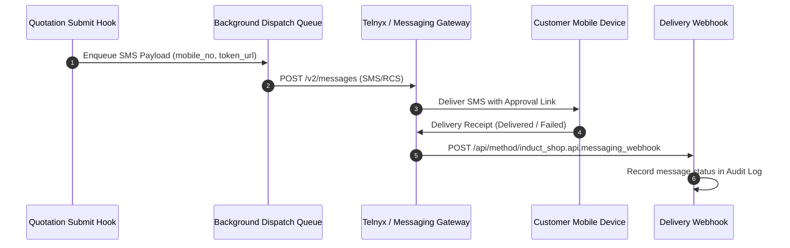

# Customer SMS/iMessage/RCS Messaging Dispatch Specification

## 1. Overview & Objective

Shop customers communicate primarily via mobile phone numbers rather than email addresses. This specification defines the deferred automated messaging dispatch system for delivering tokenized Quotation Approval links (`/quotation-approval?token=<access_token>`) directly to customer mobile devices via SMS, iMessage, and RCS messaging channels.

> [!NOTE]
> This feature is currently **DEFERRED** from the initial Quotation Approval System implementation cycle.
> **Originating Specification**: [Quotation Approval System Specification](/docs/development/quotation-approval-system-spec.md).

---

## 2. Channel Strategy & Phone Number Priority

In service shop workflows, phone numbers are significantly easier to communicate, collect, and verify than email addresses.

- **Primary Delivery Channel**: SMS / RCS messaging (integrated via Telnyx Python API / Twilio SMS gateway).
- **Secondary Channel**: Rich web link cards formatted for iOS iMessage / Android RCS rich preview.
- **Target Recipient**: `Quotation.contact_mobile` or `Customer.mobile_no`.

---

## 3. Architecture & Webhook Event Lifecycle

---

## 4. Current Interim Resolution (Phase 1)

While automated SMS/RCS dispatch is deferred:
1. The Quotation Approval System automatically generates the tokenized approval URL (`/quotation-approval?token=<access_token>`) upon `Quotation` submission.
2. The URL is populated into a read-only desk field `custom_approval_url` on the `Quotation` form.
3. A **"Copy Approval Link"** action button is rendered on the `Quotation` desk form, allowing shop staff and test users to copy the URL with a single click and test the portal flow directly.
