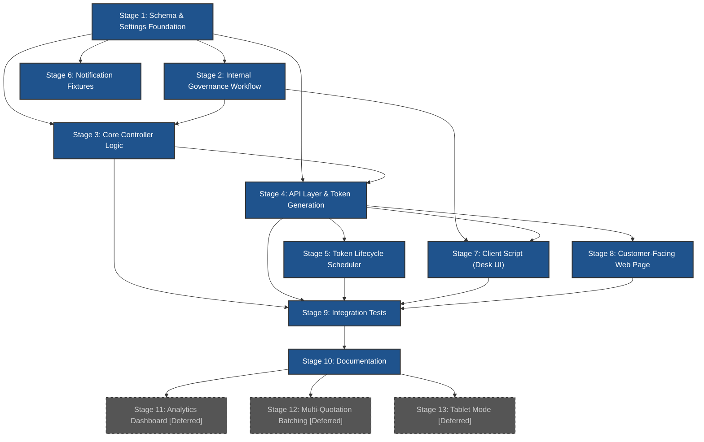

# Dual-Stage Quotation Approval System Implementation Checklist

This checklist tracks the staged implementation of the dual-stage quotation approval system combining internal staff governance (Frappe Workflow) with customer-facing tokenized line-item authorization (Quotation Approval Record), as specified in [quotation-approval-system-spec.md](./quotation-approval-system-spec.md).

---

## Stage 1: Schema & Settings Foundation

**Goal**: Create the new DocTypes, custom fields on existing DocTypes, and Shop Settings configuration fields that all subsequent stages depend on.
**Spec Reference**: §4.2 (Token Custom Fields), §4.3 (Quotation Approval Record DocType), §4.4 (Quotation Approval Item Child Table), §12 (Custom Fields Summary), §3.4 (Shop Settings Fields), §8.6 (Shop Settings Token Fields)
**Files**: `induct_shop/induct_shop/doctype/quotation_approval_record/`, `induct_shop/induct_shop/doctype/quotation_approval_item/`, `induct_shop/induct_shop/doctype/shop_settings/`, `induct_shop/fixtures/custom_field.json`

- [x] **1.1 Create `Quotation Approval Item` Child Table DocType**:
  - Create standard DocType in `induct_shop/induct_shop/doctype/quotation_approval_item/`.
  - Fields: `quotation_item` (Data, Read Only, Reqd), `item_code` (Link → Item, Read Only, Reqd), `item_name` (Data, Read Only), `qty` (Float, Read Only, Reqd), `rate` (Currency, Read Only, Reqd), `amount` (Currency, Read Only, Reqd), `decision` (Select: `Approved`, `Deferred`, `Rejected`, Reqd, Default: `Approved`), `customer_note` (Small Text).
  - Set `istable = 1` (child table), module = `Induct Shop`.

- [x] **1.2 Create `Quotation Approval Record` Standard DocType**:
  - Create submittable (`is_submittable = 1`) standard DocType in `induct_shop/induct_shop/doctype/quotation_approval_record/`.
  - Fields per §4.3: `naming_series` (`QAR-.#####`), `quotation` (Link → Quotation, Reqd), `quotation_owner` (Link → User, Read Only, Reqd), `approval_token` (Data, Read Only), `project` (Link → Project), `customer` (Link → Customer), `approval_channel` (Data, Read Only), `approver_name` (Data, Reqd), `approver_contact` (Data), `ip_address` (Data, Read Only), `user_agent` (Small Text, Read Only), `approval_type` (Select: `Full Approval` / `Partial Approval` / `Full Rejection`, Read Only, Reqd), `approval_datetime` (Datetime, Read Only, Reqd), `digital_signature` (Attach Image), `signature_method` (Select: `Touchscreen Canvas` / `Uploaded Image` / `Verbal Confirmation` / `None`), `customer_notes` (Small Text), `internal_notes` (Small Text), `items` (Table → `Quotation Approval Item`, Reqd), `quotation_pdf_snapshot` (Attach, Read Only).
  - Set module = `Induct Shop`.

- [x] **1.3 Set Permissions on `Quotation Approval Record`**:
  - `Sales User`: Read, Write (Draft only), Create, Submit.
  - `Sales Manager`: Read, Write (Draft only), Create, Submit, Cancel.
  - `Guest`: No permissions (API-only access via `ignore_permissions=True`).

- [x] **1.4 Add Custom Fields on `Quotation` via Fixtures**:
  - Update `induct_shop/fixtures/custom_field.json` to add: `requires_manager_approval` (Check, Hidden, `read_only: 1`), `approval_token` (Data, Hidden, `allow_on_submit: 1`, `search_index: 1`), `approval_token_status` (Select: `Active` / `Used` / `Expired`, Hidden, `allow_on_submit: 1`), `approval_token_expiry` (Datetime, Hidden, `allow_on_submit: 1`), `approval_link_sent_via` (Select: `SMS` / `Email` / `In-Person Tablet` / `Not Sent`, `allow_on_submit: 1`), `approval_reminder_sent` (Check, Hidden, `allow_on_submit: 1`), `approval_resend_count` (Int, Hidden, `allow_on_submit: 1`).

- [x] **1.5 Add Shop Settings Approval Fields**:
  - Add to Shop Settings schema: `approval_threshold_amount` (Currency, Default: `0`), `approval_threshold_discount_pct` (Percent, Default: `0`), `approval_token_expiry_hours` (Int, Default: `72`), `approval_reminder_hours_before` (Int, Default: `24`), `max_approval_resends` (Int, Default: `3`).
  - Group fields under an "Approval Settings" section.

- [x] **1.6 Run `bench migrate` and Verify Schema**:
  - Run `bench migrate` to apply DocType and Custom Field changes.
  - Verify all fields exist via Frappe Desk or `frappe.get_meta(...)`.

### Stage 1 Acceptance Criteria
- **Automated Testing Criteria**:
  - `docker exec -i devcontainer-frappe-1 bash -c "cd /workspace/development/frappe-bench && bench migrate"` completes without errors.
  - `frappe.get_meta("Quotation Approval Record")` returns schema with all specified fields.
  - `frappe.get_meta("Quotation Approval Item")` returns schema with all specified fields.
  - `frappe.get_meta("Quotation").has_field("approval_token")` returns `True` (plus all 6 other custom fields).
  - `frappe.get_meta("Shop Settings").has_field("approval_threshold_amount")` returns `True` (plus all 4 other settings fields).
- **Manual Review Criteria**:
  - Verify `Quotation Approval Record` form renders correctly in Frappe Desk with all field sections.
  - Verify `Shop Settings` form shows the "Approval Settings" section with all 5 configuration fields.

---

## Stage 2: Internal Governance Workflow (Frappe Workflow on Quotation)

**Goal**: Define and export the Frappe Workflow state machine with all transitions, auto-approval bypass logic, and the pre-computed `requires_manager_approval` flag.
**Spec Reference**: §3.2 (Workflow State Machine), §3.3 (Workflow Transitions), §3.4 (Auto-Approval Bypass Logic), §3.5 (Implementation Notes)
**Files**: `induct_shop/fixtures/workflow.json`, `induct_shop/fixtures/workflow_state.json`, `induct_shop/fixtures/workflow_action_master.json`, `induct_shop/hooks.py`, `induct_shop/induct_shop/doctype/quotation_approval_record/quotation_approval_record.py` (stub), `induct_shop/public/js/quotation.js`

- [x] **2.1 Create Custom Workflow State Fixtures**:
  - Create `induct_shop/fixtures/workflow_state.json` seeding states: `Sent to Customer`, `Customer Approved`, `Partially Approved`, `Customer Rejected`, `Customer No Response`.
  - Include `style` property for each state (e.g., Success, Warning, Danger, Info indicators).

- [x] **2.2 Create Workflow Action Master Fixtures**:
  - Create `induct_shop/fixtures/workflow_action_master.json` seeding actions: `Submit for Review`, `Quick Approve`, `Approve`, `Reject`, `Send to Customer`, `Log Manual Approval`, `Cancel Quotation`, `Re-send Approval`, `Revise Quote`.

- [x] **2.3 Create Workflow Definition Fixture**:
  - Create `induct_shop/fixtures/workflow.json` defining the `Quotation` workflow with:
    - All 9 states from §3.2 (Draft, Pending Manager Approval, Internally Approved, Sent to Customer, Customer Approved, Partially Approved, Customer Rejected, Customer No Response, Cancelled).
    - All transitions from §3.3 with correct `allowed`, `condition`, and `allow_self_approval` settings.
    - `update_after_submit = 1` to enable post-submission state transitions.
    - Condition expressions using `doc.requires_manager_approval == 1` / `== 0` for the Draft → Pending Manager Approval / Internally Approved split.

- [x] **2.4 Register Fixtures in `hooks.py`**:
  - Add `"Workflow"`, `"Workflow State"`, `"Workflow Action Master"` to the `fixtures` list in `hooks.py`.
  - Ensure `"Notification"` is also added to `fixtures` list (for Stage 6).

- [x] **2.5 Implement Auto-Approval Bypass Logic (Quotation Override)**:
  - Add a Quotation `validate` override (via `doc_events` hook or server script) that computes `requires_manager_approval` when `docstatus == 0`:
    - Reads `approval_threshold_amount` and `approval_threshold_discount_pct` from `Shop Settings`.
    - Sets `requires_manager_approval = 1` if `grand_total > threshold_amount` OR (discount threshold active AND max item discount pct > threshold).
    - Otherwise sets `requires_manager_approval = 0`.

- [x] **2.6 Implement Quotation `on_cancel` Token Invalidation Hook**:
  - On Quotation cancellation (`docstatus = 2`), set `approval_token_status = 'Expired'` to invalidate any active customer approval links.

- [x] **2.7 Run `bench migrate` and Verify Workflow Installation**:
  - Import fixtures and verify workflow states and transitions render correctly on the Quotation form.

### Stage 2 Acceptance Criteria
- **Automated Testing Criteria**:
  - `bench migrate` completes without errors.
  - `frappe.get_doc("Workflow", {"document_type": "Quotation"})` returns the workflow with all 9 states and correct transitions.
  - Creating a Draft Quotation with `grand_total` below threshold auto-sets `requires_manager_approval = 0`.
  - Creating a Draft Quotation with `grand_total` above threshold auto-sets `requires_manager_approval = 1`.
- **Manual Review Criteria**:
  - Open a Draft Quotation in Desk — correct action buttons appear based on `requires_manager_approval` value.
  - Walk through `Draft → Pending Manager Approval → Internally Approved` and `Draft → Internally Approved` (auto-bypass) transitions in Desk.
  - Verify `update_after_submit = 1` is set on the Workflow fixture.

---

## Stage 3: Core Controller Logic (Quotation Approval Record)

**Goal**: Implement the `validate()` and `on_submit()` controller hooks for `Quotation Approval Record` including concurrency locking, approval type computation, token lifecycle management, PDF snapshot generation, workflow state sync, Sales Order auto-generation, and deferred item logging.
**Spec Reference**: §4.5 (Controller Logic), §5.1 (Sales Order Auto-Generation), §5.2 (Deferred Item Tracking), §9 (PDF Snapshot)
**Files**: `induct_shop/induct_shop/doctype/quotation_approval_record/quotation_approval_record.py`

- [ ] **3.1 Implement `validate()` Method**:
  - **Concurrency lock**: Acquire `SELECT ... FOR UPDATE` lock on parent Quotation to prevent race conditions.
  - **Auto-derive channel**: Set `approval_channel = "Customer Digital Link"` if `frappe.session.user == "Guest"`, else `"Staff Manual Override"`.
  - **Populate `quotation_owner`**: Fetch and set from `frappe.db.get_value("Quotation", self.quotation, "owner")`.
  - **Compute `approval_type`**: All items `Approved` → `Full Approval`; mix → `Partial Approval`; all `Rejected`/`Deferred` → `Full Rejection`.
  - **Validate quotation state**: Linked Quotation must be in `Sent to Customer`, `Internally Approved`, or `Customer No Response`.
  - **Prevent double submission**: Ensure no other submitted `Quotation Approval Record` exists for this quotation.

- [ ] **3.2 Implement `on_submit()` Method — Token & State Sync**:
  - Set `approval_datetime = now()`.
  - If token linked: update parent Quotation `approval_token_status = 'Used'`.
  - Update parent Quotation `workflow_state` based on `approval_type` (`Full Approval` → `Customer Approved`, `Partial Approval` → `Partially Approved`, `Full Rejection` → `Customer Rejected`).

- [ ] **3.3 Implement `on_submit()` — PDF Snapshot Attachment (§9)**:
  - Call `_attach_quotation_pdf()` *before* workflow state transition to capture exact presentation state.
  - Use `frappe.get_print(doctype="Quotation", name=self.quotation, as_pdf=True)`.
  - Wrap in try/except — log errors via `frappe.log_error()`, do NOT rollback the approval transaction on PDF failure.
  - Store `file_url` in `quotation_pdf_snapshot` field.

- [ ] **3.4 Implement `on_submit()` — Sales Order Auto-Generation (§5.1)**:
  - For `Full Approval` or `Partial Approval`: create `Sales Order` with only `Approved` items.
  - Link `project` and `customer` from the Quotation.
  - Call `so.run_method("calculate_taxes_and_totals")` before saving.
  - Save SO in `Draft` status for advisor review.

- [ ] **3.5 Implement `on_submit()` — Deferred Item Logging (§5.2)**:
  - For `Partial Approval`: log deferred items to the Project (if linked) via `frappe.add_comment('Info', ...)` listing each deferred item's code, description, qty, amount, and customer note.

### Stage 3 Acceptance Criteria
- **Automated Testing Criteria**:
  - Unit test: Create and submit a `Quotation Approval Record` with all items approved → parent Quotation transitions to `Customer Approved`, `Sales Order` is created in Draft, PDF is attached.
  - Unit test: Create and submit with mixed decisions → parent transitions to `Partially Approved`, SO contains only approved items, deferred items logged to Project comment.
  - Unit test: Create and submit with all rejected → parent transitions to `Customer Rejected`, no SO created.
  - Unit test: Attempting to submit a second approval record for the same quotation raises `ValidationError`.
  - Unit test: `approval_channel` is auto-derived correctly based on session user.
- **Manual Review Criteria**:
  - N/A — fully automated.

---

## Stage 4: Whitelisted API Layer & Token Generation

**Goal**: Implement the guest-accessible API endpoints for token validation, approval submission, manual override, resend, and the token generation hook on the `Internally Approved → Sent to Customer` transition.
**Spec Reference**: §4.2 (Token Mechanism & Lifecycle), §6.3 (API Layer), §4.6 (Staff Manual Approval Override), §8.4 (Re-Send Approval Action)
**Files**: `induct_shop/api/quotation_approval.py`, `induct_shop/hooks.py`

- [ ] **4.1 Implement Token Generation on Workflow Transition**:
  - In a `before_update` hook on Quotation (or workflow action handler): when transitioning from `Internally Approved` to `Sent to Customer`, generate token via `secrets.token_urlsafe(32)`, set `approval_token_expiry` (now + configurable hours), set `approval_token_status = 'Active'`.
  - Reset `approval_reminder_sent = 0`.

- [ ] **4.2 Implement `validate_token(token)` API**:
  - Whitelisted (`@frappe.whitelist(allow_guest=True)`).
  - Validate: token exists, matches a Quotation, `approval_token_status == 'Active'`, real-time expiry check (`now_datetime() <= approval_token_expiry`), Quotation is in `Sent to Customer` state.
  - Return: quotation data, customer name, line items with rates/amounts, totals, shop info.
  - Apply rate limiting consideration (document in code comments for future implementation).

- [ ] **4.3 Implement `submit_approval(token, decisions, signature, approver_name, approver_contact)` API**:
  - Whitelisted (`@frappe.whitelist(allow_guest=True)`).
  - Validate token (reuse `validate_token` logic).
  - Decode base64 signature → create private `File` document → link `file_url` to `digital_signature`.
  - Construct `Quotation Approval Record` with all child items populated, auto-set `ip_address` and `user_agent` from request.
  - Insert with `ignore_permissions=True` and submit.
  - Return success response with `approval_record_name`, `approval_type`, `approved_total`.

- [ ] **4.4 Implement `get_approval_status(token)` API**:
  - Whitelisted (`@frappe.whitelist(allow_guest=True)`).
  - For tokens with status `Used`: return the submitted approval record summary (status, approval_type, items, submitted_at).
  - For expired/invalid tokens: return appropriate error.

- [ ] **4.5 Implement `create_manual_approval_record(args)` API**:
  - Whitelisted (`@frappe.whitelist()`), requires login (Sales User / Sales Manager).
  - Accepts: `quotation`, `approver_name`, `signature_method`, `internal_notes`, `items` (line-item decisions).
  - Constructs and submits a `Quotation Approval Record` with `approval_channel = "Staff Manual Override"`.
  - Handles token invalidation if `approval_token` exists on the Quotation; safely skips if `None`.

- [ ] **4.6 Implement `resend_approval_link(quotation)` API**:
  - Whitelisted (`@frappe.whitelist()`), requires login.
  - Validates `approval_resend_count < max_approval_resends`.
  - Generates fresh token, new expiry, sets `approval_token_status = 'Active'`, resets `approval_reminder_sent = 0`, increments `approval_resend_count`.
  - Ensures workflow state is `Sent to Customer`.
  - Returns new approval URL.

### Stage 4 Acceptance Criteria
- **Automated Testing Criteria**:
  - Unit test: `validate_token` returns correct data for a valid active token.
  - Unit test: `validate_token` returns error for expired, used, or non-existent tokens.
  - Unit test: `submit_approval` creates and submits a `Quotation Approval Record`, marks token as `Used`.
  - Unit test: `submit_approval` rejects duplicate submission for same quotation.
  - Unit test: `create_manual_approval_record` creates a record with `approval_channel = "Staff Manual Override"`.
  - Unit test: `resend_approval_link` generates a fresh token and increments `resend_count`.
  - Unit test: `resend_approval_link` rejects when `resend_count >= max_approval_resends`.
- **Manual Review Criteria**:
  - N/A — fully automated.

---

## Stage 5: Token Lifecycle Scheduler (Expiry Reminders & Expiry Handler)

**Goal**: Implement the scheduled background tasks for token expiry reminders and automatic expiry handling.
**Spec Reference**: §8.1 (Overview), §8.2 (Expiry Reminder Scheduler), §8.3 (Expiry Handler), §8.6 (Shop Settings Token Fields)
**Files**: `induct_shop/api/quotation_approval.py`, `induct_shop/hooks.py`

- [ ] **5.1 Implement `process_expiring_tokens()` Scheduled Task**:
  - Query quotations in `Sent to Customer` state with `approval_token_status = 'Active'`, `approval_link_sent_via` in `['SMS', 'Email']`, expiry within reminder window, and `approval_reminder_sent = 0`.
  - Skip tokens created less than `reminder_hours` ago (prevent immediate reminders on short-expiry tokens).
  - Stub `send_customer_reminder(quotation_name)` and `notify_advisor_expiring(quotation_name, owner)` for future channel integration.
  - Mark `approval_reminder_sent = 1` after processing.

- [ ] **5.2 Implement `process_expired_tokens()` Scheduled Task**:
  - Query quotations in `Sent to Customer` state with `approval_token_status = 'Active'` and `approval_token_expiry < now()`.
  - Update `approval_token_status = 'Expired'`, reset `approval_reminder_sent = 0`.
  - Transition `workflow_state` to `Customer No Response`.
  - Add info comment on Quotation documenting expiry.
  - Stub `notify_advisor_expired(quotation_name, owner)`.

- [ ] **5.3 Register Scheduled Tasks in `hooks.py`**:
  - Add `process_expiring_tokens` and `process_expired_tokens` to `scheduler_events.daily` in `hooks.py`.

### Stage 5 Acceptance Criteria
- **Automated Testing Criteria**:
  - Unit test: `process_expiring_tokens` identifies quotations within reminder window and sets `approval_reminder_sent = 1`.
  - Unit test: `process_expiring_tokens` skips quotations with recently created tokens (< reminder_hours old).
  - Unit test: `process_expired_tokens` transitions expired tokens to `Customer No Response` and sets `approval_token_status = 'Expired'`.
  - Unit test: Already-expired quotations (status != `Active`) are not re-processed.
- **Manual Review Criteria**:
  - N/A — fully automated.

---

## Stage 6: Notification Fixtures & Advisor Alerts

**Goal**: Create the Frappe Notification fixture for automatic advisor alerts on customer approval responses.
**Spec Reference**: §7 (Advisor Notification System), §7.2 (Notification Trigger), §7.3 (Notification Content Templates), §7.4 (Notification Fixture)
**Files**: `induct_shop/fixtures/notification.json`, `induct_shop/hooks.py`

- [ ] **6.1 Create Notification Fixture for Customer Response**:
  - Create `induct_shop/fixtures/notification.json` defining a Notification record:
    - `document_type`: `Quotation Approval Record`.
    - `event`: `Submit`.
    - `channel`: `Email` and `System` (dual-channel).
    - `recipients`: Dynamic — `doc.quotation_owner`.
    - `condition`: None (fires on every submission).
    - `subject`: `Quotation {{ doc.quotation }} — {{ doc.approval_type }}`.
    - `message`: Jinja template per §7.3 (includes approver name, decision, channel, datetime, item breakdown for partial approvals, link to approval record).

- [ ] **6.2 Register Notification Fixture in `hooks.py`**:
  - Ensure `"Notification"` is in the `fixtures` list in `hooks.py`.

- [ ] **6.3 Run `bench migrate` to Import Notification Fixture**:
  - Verify the Notification record appears in Frappe Desk under Setup → Notification.

### Stage 6 Acceptance Criteria
- **Automated Testing Criteria**:
  - `bench migrate` completes without errors.
  - `frappe.get_doc("Notification", {"document_type": "Quotation Approval Record"})` returns the fixture.
- **Manual Review Criteria**:
  - Verify Notification record in Frappe Desk has correct subject template, message template, recipients field, and event trigger.
  - Submit a test `Quotation Approval Record` and verify System Notification appears for the quotation owner.

---

## Stage 7: Quotation Client Script (Desk UI Buttons & Dialog)

**Goal**: Implement all Quotation form action buttons and the interactive Manual Approval Override dialog in the client-side script.
**Spec Reference**: §4.6 (Staff Manual Approval Override — Dialog Spec), §4.7 (Staff Approval Link Access & Preview UX), §8.4 (Re-Send Approval Action — Client Script), §3.3 (Workflow Transitions)
**Files**: `induct_shop/public/js/quotation.js`

- [ ] **7.1 Add "View Approval Page" & "Copy Approval Link" Buttons**:
  - When `frm.doc.approval_token` exists: add `View Approval Page` button (opens `/approve-quote?token=<TOKEN>` in new tab) and `Copy Approval Link` button (copies full URL to clipboard, shows green toast).
  - Per §4.7 code example.

- [ ] **7.2 Add "Re-send Approval Link" Button**:
  - When workflow state is `Sent to Customer` or `Customer No Response`: add button calling `induct_shop.api.quotation_approval.resend_approval_link`.
  - Show success toast and reload form on success.
  - Per §8.4 code example.

- [ ] **7.3 Implement "Log Manual Approval" Dialog**:
  - When workflow state is `Sent to Customer`, `Internally Approved`, or `Customer No Response`: add `Log Manual Approval` action button.
  - Opens `frappe.ui.Dialog` with auto-prepopulated fields per §4.6:
    - `quotation` (Read-Only), `customer` (Read-Only), `approver_name` (pre-filled with `customer_name`, editable), `signature_method` (Select, default: `Verbal Confirmation`), `internal_notes` (Small Text).
    - Line-item decision table populated from Quotation items: `item_code`, `item_name`, `qty`, `amount`, `decision` selector (default: `Approved`).
  - On submit: calls `induct_shop.api.quotation_approval.create_manual_approval_record`, reloads form on success.

- [ ] **7.4 Run `bench build` and Verify UI**:
  - Build assets and verify all buttons render correctly on the Quotation form in Desk.

### Stage 7 Acceptance Criteria
- **Automated Testing Criteria**:
  - `docker exec -i devcontainer-frappe-1 bash -c "cd /workspace/development/frappe-bench && bench build --app induct_shop"` completes without JS errors.
- **Manual Review Criteria**:
  - Open a Quotation in `Internally Approved` state → `Log Manual Approval` button visible under Actions.
  - Open a Quotation in `Sent to Customer` state → `View Approval Page`, `Copy Approval Link`, `Re-send Approval Link`, and `Log Manual Approval` buttons visible.
  - Click `Log Manual Approval` → dialog opens with pre-populated items and fields.
  - Click `Copy Approval Link` → URL in clipboard, green toast shown.

---

## Stage 8: Customer-Facing Approval Web Page

**Goal**: Build the guest-accessible Jinja-based approval page with modular JS components for line-item selection, signature capture, confirmation, and submission.
**Spec Reference**: §6 (Customer-Facing Approval Page), §6.1 (Architecture), §6.3 (API Layer), §6.4 (Page Flow), §6.5 (Frontend Module Structure), §6.6 (UI Requirements)
**Files**: `induct_shop/www/approve_quote/approve_quote.html`, `induct_shop/www/approve_quote/approve_quote.py`, `induct_shop/www/approve_quote/approve_quote.css`, `induct_shop/www/approve_quote/modules/line_item_selector.js`, `induct_shop/www/approve_quote/modules/signature_pad.js`, `induct_shop/www/approve_quote/modules/approval_summary.js`, `induct_shop/www/approve_quote/modules/approval_submit.js`

- [ ] **8.1 Create Route Handler (`approve_quote.py`)**:
  - Extract `token` from query params.
  - Call `validate_token(token)` to populate Jinja context.
  - If token invalid/expired: render error state with shop contact info (no redirect to login).
  - If token used: call `get_approval_status(token)` and render read-only confirmation summary.
  - Set `no_cache = 1` and `allow_guest = True`.

- [ ] **8.2 Create Jinja Shell Template (`approve_quote.html`)**:
  - Minimal layout shell, mobile-first responsive (320px+).
  - No Frappe Desk chrome or login redirects.
  - Loads JS modules and passes server-rendered JSON context into each `render()` call.
  - Three view states: loading, interactive approval form, post-submission confirmation.

- [ ] **8.3 Implement `line_item_selector.js` Module**:
  - Renders item table with each row showing: item name/description, qty, rate, amount.
  - Three-state toggle per row (`Approve` / `Defer` / `Reject`), defaulting to `Approve`.
  - Product Bundles rendered as grouped atomic units (component items cannot be independently toggled).
  - Dispatches `CustomEvent('items-decided', { detail: decisions })` on any change.
  - Exposes `render(container, data)` function.

- [ ] **8.4 Implement `approval_summary.js` Module**:
  - Listens for `items-decided` events.
  - Displays running totals: `Approved: $X / Total: $Y` updated in real-time.
  - Exposes `render(container, data)` function.

- [ ] **8.5 Implement `signature_pad.js` Module**:
  - HTML5 `<canvas>` element for touch/stylus signature input.
  - Clear/redo button.
  - Optional — system works without signature.
  - Exports signature as base64 data URL.
  - Exposes `render(container, data)` function.

- [ ] **8.6 Implement `approval_submit.js` Module**:
  - Collects decisions from `line_item_selector`, signature from `signature_pad`, and approver name/contact.
  - Renders pre-submit confirmation screen summarizing all decisions before final submission (no accidental one-click approvals).
  - On confirm: calls `submit_approval` API.
  - On success: renders confirmation with approval record reference number and "You may close this page" message.
  - Exposes `render(container, data)` function.

- [ ] **8.7 Create Minimal Functional Styles (`approve_quote.css`)**:
  - Mobile-first responsive layout (fluid, 320px+).
  - Standard HTML form controls — no custom component library.
  - Clean, readable typography. Functional over decorative.

### Stage 8 Acceptance Criteria
- **Automated Testing Criteria**:
  - Unit test: `approve_quote.py` context handler returns quotation data for valid token and error for invalid token.
- **Manual Review Criteria**:
  - Navigate to `/approve-quote?token=<VALID_TOKEN>` — page renders with line items, toggles, signature pad, and summary bar.
  - Toggle item decisions → running total updates in real-time.
  - Submit decisions → confirmation screen appears with reference number.
  - Navigate to `/approve-quote?token=<USED_TOKEN>` — read-only confirmation summary displayed.
  - Navigate to `/approve-quote?token=<INVALID_TOKEN>` — error message with shop contact info shown, no login redirect.
  - Test on mobile viewport (320px) — layout is usable and readable.

---

## Stage 9: Integration Tests & End-to-End Verification

**Goal**: Implement comprehensive integration tests covering the full dual-stage workflow from quotation creation through customer authorization and downstream processing.
**Spec Reference**: §3 (Stage 1), §4 (Stage 2), §5 (Stage 3), §5.3 (Revision Loop)
**Files**: `induct_shop/induct_shop/doctype/quotation_approval_record/test_quotation_approval_record.py`, `induct_shop/api/test_quotation_approval.py`

- [ ] **9.1 Create Test Fixtures for Quotation Approval**:
  - Add quotation approval test helpers to `test_fixtures.py`: `create_test_quotation()` (returns a Draft Quotation linked to `Test Customer` and `Test Project`).
  - Add helper: `submit_quotation_through_workflow(quotation)` to drive a quotation through internal governance to `Sent to Customer` with an active token.

- [ ] **9.2 Write `Quotation Approval Record` DocType Tests**:
  - Test `validate()`: approval type computation (full, partial, full rejection).
  - Test `validate()`: concurrency guard prevents double submission.
  - Test `validate()`: rejects approval for quotations not in allowed states.
  - Test `on_submit()`: workflow state sync for all three approval types.
  - Test `on_submit()`: Sales Order creation with only approved items.
  - Test `on_submit()`: deferred items logged to Project comment.
  - Test `on_submit()`: PDF snapshot attached (or gracefully logged on failure).

- [ ] **9.3 Write API Integration Tests**:
  - Test end-to-end: `validate_token` → `submit_approval` → verify Quotation state, Sales Order, PDF.
  - Test `create_manual_approval_record` end-to-end.
  - Test `resend_approval_link` with count enforcement.
  - Test token expiry validation (real-time check).

- [ ] **9.4 Write Workflow Transition Tests**:
  - Test Draft → Pending Manager Approval (threshold exceeded).
  - Test Draft → Internally Approved (auto-bypass).
  - Test Internally Approved → Sent to Customer (token generated).
  - Test Customer No Response → Sent to Customer (re-send).
  - Test Customer Rejected → Amendment flow.

- [ ] **9.5 Run Full Test Suite**:
  - `docker exec -i devcontainer-frappe-1 bash -c "cd /workspace/development/frappe-bench && bench --site development.localhost run-tests --app induct_shop"` — all tests pass.

### Stage 9 Acceptance Criteria
- **Automated Testing Criteria**:
  - All new quotation approval tests pass.
  - All existing tests continue to pass (no regressions).
  - Full test suite exit code 0.
- **Manual Review Criteria**:
  - N/A — fully automated.

---

## Stage 10: Documentation & Workflow Integration

**Goal**: Update existing documentation to reference the new approval system and create DocType reference docs.
**Spec Reference**: §14 (Integration with Primary Workflow), §15 (Related Documentation), §13 (File & Module Inventory)
**Files**: `docs/doctypes/quotation-approval-record.md` (new), `docs/doctypes/quotation.md`, `docs/workflow.md`, `docs/doctypes/shop-settings.md`, `docs/log.md`

- [ ] **10.1 Create `Quotation Approval Record` DocType Reference**:
  - Create `docs/doctypes/quotation-approval-record.md` with OKF frontmatter (`type: Reference`, `status: Implemented`).
  - Document all fields, child table structure, controller logic summary, and permission matrix.

- [ ] **10.2 Update Quotation DocType Documentation**:
  - Update `docs/doctypes/quotation.md` to document the 7 new custom fields and the Frappe Workflow integration.

- [ ] **10.3 Update Primary Workflow Documentation**:
  - Update `docs/workflow.md` to reference this specification and the new `Quotation Approval Record` DocType for Step 4 (Quote Approval / Rejection Loop).

- [ ] **10.4 Update Shop Settings Documentation**:
  - Update `docs/doctypes/shop-settings.md` to document the 5 new approval configuration fields.

- [ ] **10.5 Update `docs/log.md`**:
  - Record all documentation changes under the current date.

### Stage 10 Acceptance Criteria
- **Automated Testing Criteria**:
  - All new/updated markdown files have valid OKF frontmatter (verified by linting or manual check).
- **Manual Review Criteria**:
  - Cross-reference links between spec, checklist, DocType docs, and workflow doc are valid.
  - `docs/log.md` entry is accurate and complete.

---

## Stage 11 — [Deferred] Approval Analytics Dashboard (EXT-2)

**Goal**: Script Report with conversion rates, response times, revenue capture metrics, and advisor-level performance.
**Spec Reference**: §10 (Deferred Extensions — DEF-003)
**Files**: N/A

- [ ] *(Deferred)* **11.1 Implement Approval Analytics Script Report**

> [!NOTE]
> This stage is deferred to [Quotation Approval Extensions (EXT-2)](./deferred/quotation-approval-extensions-spec.md), tracked in the [Deferred Implementation Backlog](./deferred/index.md) as `DEF-003`.

### Stage 11 Acceptance Criteria
- **Automated Testing Criteria**:
  - N/A — deferred.
- **Manual Review Criteria**:
  - N/A — deferred.

---

## Stage 12 — [Deferred] Multi-Quotation Approval Batching (EXT-3)

**Goal**: Project-level approval token enabling customers to review and decide on all pending quotations in a single session.
**Spec Reference**: §10 (Deferred Extensions — DEF-004)
**Files**: N/A

- [ ] *(Deferred)* **12.1 Implement Multi-Quotation Approval Batching**

> [!NOTE]
> This stage is deferred to [Quotation Approval Extensions (EXT-3)](./deferred/quotation-approval-extensions-spec.md), tracked in the [Deferred Implementation Backlog](./deferred/index.md) as `DEF-004`.

### Stage 12 Acceptance Criteria
- **Automated Testing Criteria**:
  - N/A — deferred.
- **Manual Review Criteria**:
  - N/A — deferred.

---

## Stage 13 — [Deferred] In-Person Tablet Approval Mode (EXT-4)

**Goal**: Dedicated kiosk locking, hardware PIN, and auto-resetting session handler for shop tablets.
**Spec Reference**: §6.7 (In-Person Tablet Mode — Deferred), §10 (Deferred Extensions — DEF-005)
**Files**: N/A

- [ ] *(Deferred)* **13.1 Implement In-Person Tablet Approval Mode**

> [!NOTE]
> This stage is deferred to [Quotation Approval Extensions (EXT-4)](./deferred/quotation-approval-extensions-spec.md), tracked in the [Deferred Implementation Backlog](./deferred/index.md) as `DEF-005`.

### Stage 13 Acceptance Criteria
- **Automated Testing Criteria**:
  - N/A — deferred.
- **Manual Review Criteria**:
  - N/A — deferred.

---

## Dependency Map

