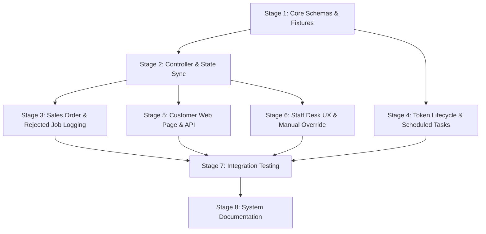

# Quotation Approval System Implementation Checklist

This checklist tracks the staged implementation of the Quotation Approval System, as specified in [quotation-approval-system-spec.md](./quotation-approval-system-spec.md).

> [!NOTE]
> Stage 1 (Internal Approval Governance) was removed from the initial spec to focus exclusively on customer authorization via `Quotation Approval Record` and Frappe Workflows.

> [!NOTE]
> **Deferred Features**: The following features are explicitly deferred to [Quotation Approval Extensions (EXT-1 to EXT-4)](./deferred/quotation-approval-extensions-spec.md) and tracked in the [Deferred Implementation Backlog](./deferred/index.md):
> - `DEF-002`: Deferred Recommendation Tracking (EXT-1)
> - `DEF-003`: Approval Analytics Dashboard (EXT-2)
> - `DEF-004`: Multi-Quotation Approval Batching (EXT-3)
> - `DEF-005`: In-Person Tablet Approval Kiosk Mode (EXT-4)

---

## Stage 1: Core Data Schemas, Custom Fields & Fixtures

**Goal**: Establish data models, custom fields on `Quotation` and `Shop Settings`, standard DocTypes (`Quotation Approval Record` & `Quotation Approval Item`), Workflow fixtures, and Notification fixtures.
**Spec Reference**: §3.2–3.4, §4.2–4.4, §7.4, §8.6, §11.2, §12, §13
**Files**: `induct_shop/fixtures/custom_field.json`, `induct_shop/fixtures/workflow.json`, `induct_shop/fixtures/workflow_state.json`, `induct_shop/fixtures/notification.json`, `induct_shop/induct_shop/doctype/quotation_approval_record/`, `induct_shop/induct_shop/doctype/quotation_approval_item/`, `induct_shop/induct_shop/doctype/shop_settings/`

- [x] **1.1 Custom Fields on `Quotation`**:
  - Add `approval_token` (Data, Hidden, `allow_on_submit: 1`, `search_index: 1`).
  - Add `approval_token_status` (Select: `Active`, `Used`, `Expired`, `allow_on_submit: 1`).
  - Add `approval_token_expiry` (Datetime, Hidden, `allow_on_submit: 1`).
  - Add `approval_link_sent_via` (Select: `SMS`, `Email`, `In-Person Tablet`, `Not Sent`, `allow_on_submit: 1`).
  - Add `approval_reminder_sent` (Check, Hidden, `allow_on_submit: 1`).
  - Add `approval_resend_count` (Int, Hidden, `allow_on_submit: 1`).
  - Export fixtures to `induct_shop/fixtures/custom_field.json`.

- [x] **1.2 Custom Fields on `Shop Settings`**:
  - Add `approval_token_expiry_hours` (Int, default `72`).
  - Add `approval_reminder_hours_before` (Int, default `24`).
  - Add `max_approval_resends` (Int, default `3`).
  - Add `quotation_approval_print_format` (Link to Print Format, default `"Standard"`).

- [x] **1.3 `Quotation Approval Record` Standard DocType**:
  - Create submittable standard DocType (`is_submittable = 1`) in `Induct Shop` module.
  - Set `naming_series` to `QAR-.#####`.
  - Fields: `quotation` (Link Quotation, Reqd), `quotation_owner` (Link User, Read Only), `approval_token` (Data, Read Only), `project` (Link Project), `customer` (Link Customer), `approval_channel` (Data, Read Only), `approver_name` (Data, Reqd), `approver_contact` (Data), `ip_address` (Data, Read Only), `user_agent` (Small Text, Read Only), `approval_type` (Select: `Full Approval`, `Partial Approval`, `Full Rejection`, Reqd), `approval_datetime` (Datetime, Read Only), `digital_signature` (Attach Image), `signature_method` (Select: `Touchscreen Canvas`, `Uploaded Image`, `Verbal Confirmation`, `None`), `customer_notes` (Small Text), `internal_notes` (Small Text), `quotation_pdf_snapshot` (Attach, Read Only), `items` (Table `Quotation Approval Item`, Reqd).
  - Permissions: Read/Write/Submit for `Sales User` and `Sales Manager`, Cancel for `Sales Manager`.

- [x] **1.4 `Quotation Approval Item` Child Table DocType**:
  - Create child table DocType (`istable = 1`) in `Induct Shop` module.
  - Fields: `quotation_item` (Data, Read Only, Reqd), `item_code` (Link Item, Read Only, Reqd), `item_name` (Data, Read Only), `qty` (Float, Read Only, Reqd), `rate` (Currency, Read Only, Reqd), `amount` (Currency, Read Only, Reqd), `decision` (Select: `Approved`, `Rejected`, Reqd, Default `Approved`), `customer_note` (Small Text).

- [x] **1.5 Workflow Definition & Fixtures**:
  - Define Workflow on `Quotation`: States `Draft` (docstatus 0), `Sent to Customer` (docstatus 1), `Customer Approved` (docstatus 1), `Partially Approved` (docstatus 1), `Customer Rejected` (docstatus 1), `Customer No Response` (docstatus 1), `Cancelled` (docstatus 2).
  - Set `update_after_submit = 1` on Workflow definition.
  - Export fixtures to `induct_shop/fixtures/workflow.json` and `induct_shop/fixtures/workflow_state.json`.

- [x] **1.6 Advisor Notification Fixture**:
  - Create `Notification` record on `Quotation Approval Record` for `Submit` event.
  - Target `doc.quotation_owner` via Email and System channels when `doc.approval_channel == 'Customer Digital Link'`.
  - Export fixture to `induct_shop/fixtures/notification.json`.

### Stage 1 Acceptance Criteria
- **Automated Testing Criteria**:
  - `bench migrate` completes with zero errors.
  - `frappe.get_doc("DocType", "Quotation Approval Record")` exists with `is_submittable == 1`.
  - `frappe.get_meta("Quotation").has_field("approval_token")` returns true with `allow_on_submit == 1`.
- **Manual Review Criteria**:
  - Custom fields visible on Desk forms for `Quotation`, `Quotation Approval Record`, and `Shop Settings`.

---

## Stage 2: Quotation Approval Record Controller & State Synchronization

**Goal**: Implement validation, database row locking, channel auto-tagging, status classification, workflow state synchronization, PDF snapshot generation, and cancellation token cleanup.
**Spec Reference**: §3.3–3.4, §4.5, §9.1–9.3
**Files**: `induct_shop/induct_shop/doctype/quotation_approval_record/quotation_approval_record.py`, `induct_shop/induct_shop/doctype/quotation/quotation.py`, `induct_shop/hooks.py`

- [ ] **2.1 Row Locking & Channel Tagging (`validate`)**:
  - Acquire database row lock on parent Quotation (`SELECT name FROM tabQuotation WHERE name=%s FOR UPDATE`).
  - Auto-set `approval_channel = "Customer Digital Link"` if `frappe.session.user == "Guest"` else `"Staff Manual Override"`.
  - Fetch and store `quotation_owner` from parent Quotation.

- [ ] **2.2 Decision Classification & Single Approval Validation (`validate`)**:
  - Compute `approval_type`: `Full Approval` (all items approved), `Partial Approval` (mixed), or `Full Rejection` (all items rejected).
  - Validate parent Quotation `workflow_state` is `Sent to Customer` or `Customer No Response` (`docstatus = 1`).
  - Enforce single submitted `Quotation Approval Record` per quotation version.

- [ ] **2.3 State Synchronization (`on_submit`)**:
  - Set `approval_datetime = now()`.
  - Update parent Quotation `approval_token_status = 'Used'` if token is linked.
  - Transition parent Quotation `workflow_state` to `Customer Approved`, `Partially Approved`, or `Customer Rejected` via `db_set` without re-triggering document submission hooks.

- [ ] **2.4 PDF Snapshot Artifact Generation (`on_submit`)**:
  - Implement `_attach_quotation_pdf()` using `frappe.get_print(doctype="Quotation", name=self.quotation, as_pdf=True)` *before* updating workflow state.
  - Save generated PDF as a private `File` document attached to `Quotation Approval Record`.
  - Update `quotation_pdf_snapshot` field with file URL.
  - Wrap PDF generation in try/except with `frappe.log_error()` so PDF rendering failures do not roll back authorization.

- [ ] **2.5 Cancellation Token Cleanup (`on_cancel` hook)**:
  - Attach `on_cancel` hook to `Quotation` DocType to update any active token status to `approval_token_status = 'Expired'` upon quotation cancellation (`docstatus = 2`).

### Stage 2 Acceptance Criteria
- **Automated Testing Criteria**:
  - Unit tests verifying `Quotation Approval Record` validation, `approval_type` calculation, and parent Quotation `workflow_state` transition.
  - Unit tests verifying token status updates to `Used` on submission and `Expired` on Quotation cancellation.
  - PDF snapshot file generated and URL attached to submitted record.
- **Manual Review Criteria**:
  - Submit approval record in Desk and confirm parent Quotation workflow state updates with attached PDF snapshot.

---

## Stage 3: Downstream Sales Order Auto-Generation & Rejected Job Logging

**Goal**: Automatically generate a draft Sales Order for approved service & parts job groups, recalculate taxes and totals, log rejected items to Project comments, and support revision loops.
**Spec Reference**: §5.1, §5.2, §5.3, §5.4
**Files**: `induct_shop/induct_shop/doctype/quotation_approval_record/quotation_approval_record.py`, `induct_shop/api/quotation_approval.py`

- [ ] **3.1 Sales Order Auto-Generation (`on_submit`)**:
  - For `Full Approval` or `Partial Approval`, execute ERPNext `make_sales_order` mapping containing only items where `decision == 'Approved'`.
  - Ensure parent service lines and linked child part lines (grouped sequentially or via `custom_parent_service_reference`) are included in the Sales Order.
  - Link Sales Order to parent `Project` and `Customer`.

- [ ] **3.2 Tax & Total Recalculation (`on_submit`)**:
  - Call `so.run_method("calculate_taxes_and_totals")` on the generated Sales Order before saving in `Draft` status.

- [ ] **3.3 Rejected Job Logging (`on_submit`)**:
  - For `Partial Approval` or `Full Rejection`, post a comment to parent `Project` (via `frappe.add_comment('Info', ...)`) listing each rejected item code, description, quantity, rate, total amount, and customer note.

- [ ] **3.4 Revision Loop Support (Amendment Flow)**:
  - Verify that `make_amendment` flow creates a new draft version (`Quotation-1-1`) while preserving the original Quotation in `Customer Rejected` or `Customer No Response` state and maintaining original approval record links.

### Stage 3 Acceptance Criteria
- **Automated Testing Criteria**:
  - Unit test verifying `Sales Order` created in `Draft` status containing only approved line items with recalculated net totals and taxes.
  - Unit test verifying structured project comment posted on partial or full rejection.
- **Manual Review Criteria**:
  - Submit a partial approval and verify generated draft Sales Order items and Project comment history.

---

## Stage 4: Token Lifecycle Management & Scheduled Tasks

**Goal**: Implement token re-sending API, scheduled expiry reminder task, scheduled token expiry handler, and guest endpoint rate limiting.
**Spec Reference**: §4.2, §8.1–8.6
**Files**: `induct_shop/api/quotation_approval.py`, `induct_shop/hooks.py`

- [ ] **4.1 Re-Send Approval Link API (`resend_approval_link`)**:
  - Implement whitelisted method `resend_approval_link(quotation)`.
  - Validate `approval_resend_count < max_approval_resends` (from `Shop Settings`).
  - Generate fresh token (`secrets.token_urlsafe(32)`), update `approval_token_expiry`, reset `approval_reminder_sent = 0`, increment `approval_resend_count`, and set `workflow_state = 'Sent to Customer'`.

- [ ] **4.2 Scheduled Expiry Reminder Task (`process_expiring_tokens`)**:
  - Query active tokens expiring within `approval_reminder_hours_before` (default 24h) for SMS/Email channels.
  - Send customer reminder, notify advisor, and set `approval_reminder_sent = 1`.
  - Register in `hooks.py` under `scheduler_events.daily`.

- [ ] **4.3 Scheduled Token Expiry Handler (`process_expired_tokens`)**:
  - Query active tokens past `approval_token_expiry`.
  - Transition Quotation `workflow_state` to `Customer No Response`, set `approval_token_status = 'Expired'`, and notify advisor.
  - Register in `hooks.py` under `scheduler_events.daily`.

- [ ] **4.4 Guest API Rate Limiting**:
  - Apply Frappe `@rate_limit(limit=10, seconds=60)` decorator to all guest-accessible API endpoints in `quotation_approval.py`.

### Stage 4 Acceptance Criteria
- **Automated Testing Criteria**:
  - Unit tests executing `process_expiring_tokens` and `process_expired_tokens` against test records.
  - Unit tests verifying `resend_approval_link` generates a fresh token and enforces `max_approval_resends`.
- **Manual Review Criteria**:
  - N/A — fully automated.

---

## Stage 5: Customer-Facing Approval Web Page & Modular Frontend API

**Goal**: Build guest-accessible Jinja web page (`/approve-quote`), whitelisted API backend (`validate_token`, `submit_approval`, `get_approval_status`), and modular JavaScript components.
**Spec Reference**: §4.2, §6.1–6.6, §6.8
**Files**: `induct_shop/www/approve_quote/approve_quote.html`, `induct_shop/www/approve_quote/approve_quote.py`, `induct_shop/www/approve_quote/approve_quote.css`, `induct_shop/www/approve_quote/modules/line_item_selector.js`, `induct_shop/www/approve_quote/modules/signature_pad.js`, `induct_shop/www/approve_quote/modules/approval_summary.js`, `induct_shop/www/approve_quote/modules/approval_submit.js`, `induct_shop/api/quotation_approval.py`

- [ ] **5.1 Public API Endpoints**:
  - Implement `@frappe.whitelist(allow_guest=True)` methods `validate_token(token)`, `submit_approval(token, decisions, signature, approver_name, approver_contact)`, and `get_approval_status(token)`.
  - Decode base64 signature into a public `File` document linked to `digital_signature`.
  - Support status re-visitation for `Used` tokens returning submitted approval summary via `get_approval_status(token)`.

- [ ] **5.2 Jinja Web Page Shell & Route (`/approve-quote`)**:
  - Implement route handler in `approve_quote.py` and Jinja HTML template `approve_quote.html` with mobile-first CSS styling.
  - Render clean error message block with shop contact details if token is invalid or expired.

- [ ] **5.3 Line Item Selector Module (`line_item_selector.js`)**:
  - Render grouped service and child part line items with binary `Approve`/`Reject` toggles defaulting to `Approve`.
  - Emit CustomEvent (`items-decided`) on selection changes.

- [ ] **5.4 Canvas Signature Module (`signature_pad.js`)**:
  - Implement HTML5 `<canvas>` touchscreen/stylus signature pad with clear button and base64 export.

- [ ] **5.5 Approval Summary & Submit Modules (`approval_summary.js`, `approval_submit.js`)**:
  - Update real-time summary bar (`Approved: $X / Total: $Y`).
  - Render pre-submission confirmation modal displaying choices before dispatching API request.
  - Display post-submit confirmation screen with approval record reference.

### Stage 5 Acceptance Criteria
- **Automated Testing Criteria**:
  - API unit tests for `validate_token`, `submit_approval`, and `get_approval_status` with active, expired, and used tokens.
  - Verify signature image file attached and `Quotation Approval Record` submitted via guest API.
- **Manual Review Criteria**:
  - Open `/approve-quote?token=<TOKEN>` in incognito window. Test item toggles, signature canvas, pre-submit modal, and post-submit confirmation summary.

---

## Stage 6: Staff Desk UX & Manual Approval Override Workflow

**Goal**: Add Quotation form desk buttons ("View Approval Page", "Copy Approval Link", "Re-send Approval Link", "Log Manual Approval") and interactive staff override dialog.
**Spec Reference**: §4.6, §4.7
**Files**: `induct_shop/public/js/quotation.js`, `induct_shop/api/quotation_approval.py`

- [ ] **6.1 Desk Link Actions (`quotation.js`)**:
  - When `approval_token` exists, add custom buttons under `Actions`: **"View Approval Page"** (opens `/approve-quote?token=<TOKEN>` in new tab) and **"Copy Approval Link"** (copies URL to clipboard with alert toast).

- [ ] **6.2 Staff Manual Override API (`create_manual_approval_record`)**:
  - Implement whitelisted method allowing staff (`Sales User`, `Sales Manager`) to submit manual override decisions.
  - Auto-set `approval_channel = 'Staff Manual Override'`, insert and submit `Quotation Approval Record`, and trigger standard downstream logic.

- [ ] **6.3 Interactive Staff Override Dialog (`quotation.js`)**:
  - Render `frappe.ui.Dialog` when staff clicks **"Log Manual Approval"** on Quotation in `Sent to Customer` or `Customer No Response` state (`docstatus = 1`).
  - Pre-fill `customer_name`, signature method (`Verbal Confirmation`), internal notes, and grouped line-item decision table.
  - Call `create_manual_approval_record` on submit and reload form.

- [ ] **6.4 Staff Re-Send Link Action (`quotation.js`)**:
  - Add **"Re-send Approval Link"** button under `Actions` calling `induct_shop.api.quotation_approval.resend_approval_link`.

### Stage 6 Acceptance Criteria
- **Automated Testing Criteria**:
  - Unit test for `create_manual_approval_record` API verifying record creation with `Staff Manual Override` channel tag.
- **Manual Review Criteria**:
  - Test "Log Manual Approval" button on submitted Quotation form in Desk. Open dialog, modify decisions, submit, and verify Quotation state and Sales Order creation.
  - Test "View Approval Page" and "Copy Approval Link" actions on Desk form.

---

## Stage 7: Comprehensive Integration Testing & Verification

**Goal**: Validate end-to-end quotation approval lifecycle across digital customer flows, staff manual overrides, scheduled tasks, concurrency locking, and site reinstall resilience.
**Spec Reference**: §3, §4, §5, §6, §8, §9
**Files**: `induct_shop/induct_shop/doctype/quotation_approval_record/test_quotation_approval_record.py`, `induct_shop/tests/test_quotation_approval_system.py`

- [ ] **7.1 DocType Unit Tests (`test_quotation_approval_record.py`)**:
  - Test DocType creation, `is_submittable`, required fields, single-record restriction, and `approval_type` calculation.

- [ ] **7.2 End-to-End Digital Flow Integration Test**:
  - Test Quotation submit → token generation → guest API submission → state transition → Sales Order creation with tax recalculation → PDF snapshot attachment.

- [ ] **7.3 Staff Override & Concurrency Lock Integration Test**:
  - Test `create_manual_approval_record` API, row locking (`FOR UPDATE`), and `Staff Manual Override` channel tagging.

- [ ] **7.4 Token Lifecycle & Scheduled Task Integration Test**:
  - Test `process_expiring_tokens`, `process_expired_tokens`, re-send count limits, and token invalidation on Quotation cancellation.

### Stage 7 Acceptance Criteria
- **Automated Testing Criteria**:
  - Execute test suite via `docker exec -i devcontainer-frappe-1 bash -c "cd /workspace/development/frappe-bench && bench --site development.localhost run-tests --app induct_shop"`.
  - All tests pass with 100% success rate.
- **Manual Review Criteria**:
  - N/A — fully automated.

---

## Stage 8: System Documentation & Workflow Integration

**Goal**: Update primary repair workflow documentation, DocType references, and directory log.
**Spec Reference**: §14, §15
**Files**: `induct_shop/docs/workflow.md`, `induct_shop/docs/doctypes/quotation.md`, `induct_shop/docs/doctypes/quotation-approval-record.md`, `induct_shop/docs/doctypes/shop-settings.md`, `induct_shop/docs/log.md`

- [ ] **8.1 Primary Repair Workflow (`workflow.md`)**:
  - Update Step 4 (Quote Approval / Rejection Loop) to reference `Quotation Approval Record` customer authorization, state transitions, and Sales Order auto-creation.

- [ ] **8.2 DocType Reference Documentation**:
  - Create OKF Reference document `docs/doctypes/quotation-approval-record.md`.
  - Update `docs/doctypes/quotation.md` and `docs/doctypes/shop-settings.md` with new custom fields and token settings.

- [ ] **8.3 Directory Log Update (`docs/log.md`)**:
  - Log creation of `quotation-approval-system-checklist.md` under `## 2026-08-11`.

### Stage 8 Acceptance Criteria
- **Automated Testing Criteria**:
  - Verify all modified and new markdown files contain valid OKF YAML frontmatter.
- **Manual Review Criteria**:
  - Review documentation links and cross-references for accuracy.

---

## Stage Dependency Graph

