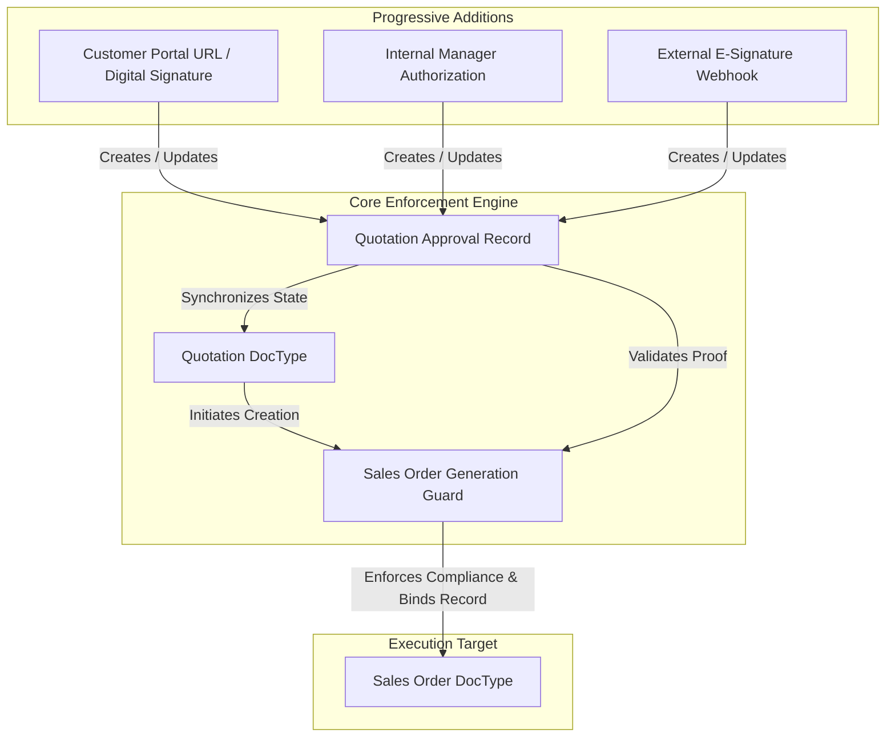
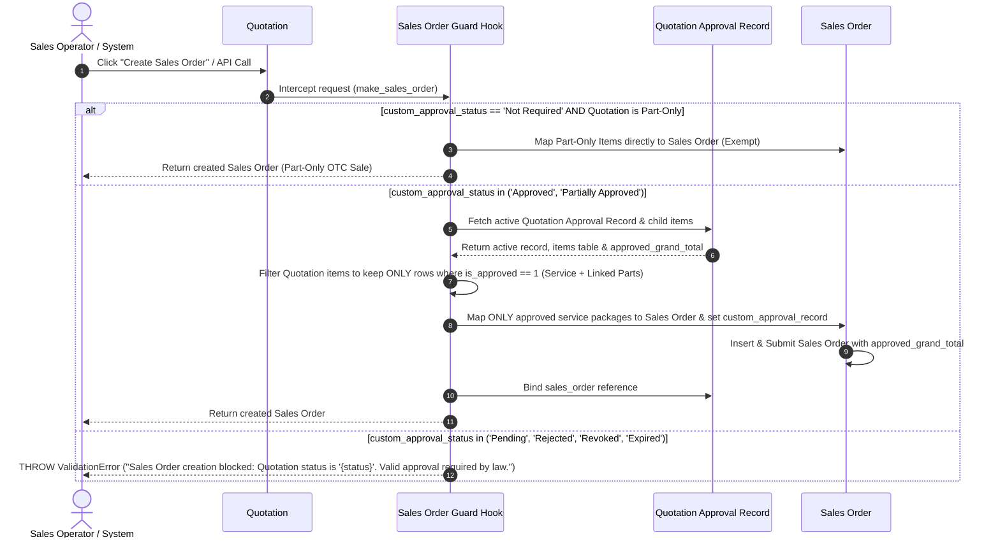
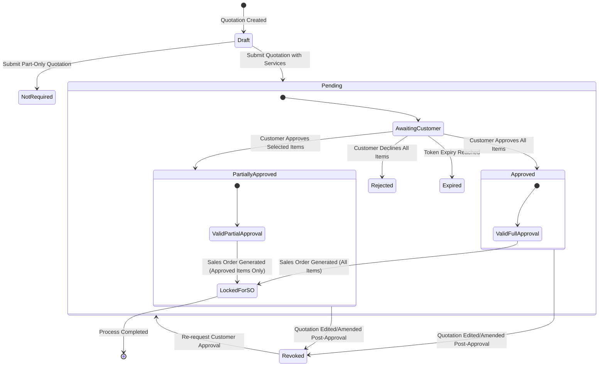
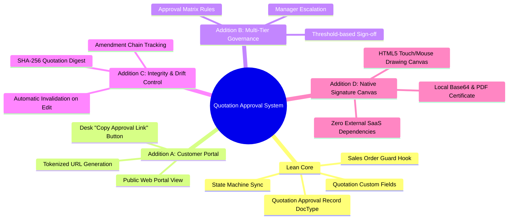
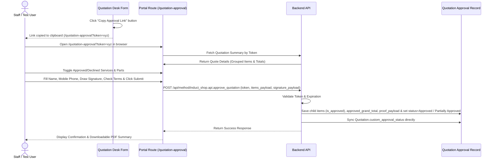
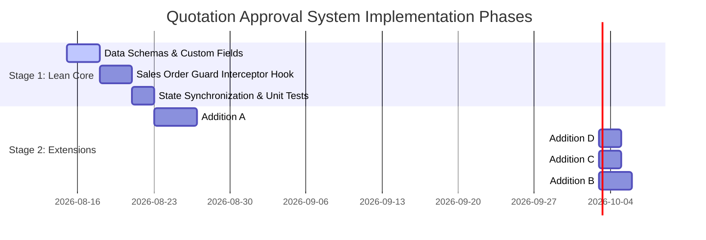

# Quotation Approval System Specification

## 1. Executive Summary & Objective

Legal compliance requires that **every Sales Order generated in the system must be backed by an explicit, verifiable customer approval of the originating Quotation**. Creating a Sales Order without documented approval exposes the business to legal non-compliance, financial liability, and billing disputes.

This specification defines an approval system for the interface between `Quotation` and `Sales Order` within the `induct_shop` app. The design prioritizes:

1. **Lean Core First**: A lightweight, non-intrusive validation guard enforcing legal compliance without adding bloated workflows or complex dependencies.
2. **Scalability**: High-throughput execution using native Frappe event hooks, lightweight docstatus transitions, and minimal database locks.
3. **Flexibility & Modularity**: A decoupled architecture starting with a lean core, supporting progressive additions (customer portal sign-off, internal multi-tier authorization, cryptographic integrity hashing, and external e-signature webhooks) as independent modules.

---

## 2. Architecture Overview & Modular Blueprint

The system separates the **Enforcement Engine (Lean Core)** from **Approval Sources (Progressive Additions)**.



---

## 3. Stage 1: Lean Core Architecture

The Lean Core establishes the minimum viable data structures and server hooks required to guarantee that no `Sales Order` can be inserted or submitted without a valid `Quotation Approval Record`.

### 3.1 Core Data Model

#### 1. Standard DocType: `Quotation Approval Record`
A dedicated, lightweight DocType serving as the legally binding audit record.

| Field Name | Type | Options / Properties | Description |
| :--- | :--- | :--- | :--- |
| `quotation` | Link | `Quotation` (Required, Searchable) | Target Quotation being approved. |
| `status` | Select | `Pending`, `Approved`, `Partially Approved`, `Rejected`, `Revoked`, `Expired` | Single source of truth for approval state. Automatically determined based on customer action & items table. |
| `approval_type` | Select | `Customer Portal`, `Internal Sign-Off`, `E-Signature`, `Manual Override` | Method used to grant approval. |
| `approved_by_name` | Data | Mandatory if status in (Approved, Partially Approved) | Name of the approving individual (Customer or Internal User). |
| `approved_by_phone` | Data | Phone/Mobile number validation | Mobile phone number of the approver (Primary communication identifier). |
| `approval_timestamp` | Datetime | Read-only | Exact datetime when approval was granted. |
| `quotation_grand_total` | Currency | Read-only | Original grand total of the Quotation. |
| `approved_grand_total` | Currency | Read-only | Net total of customer-approved items/services. |
| `items_digest` | Data | SHA-256 string | Cryptographic digest of approved items/rates. |
| `items` | Table | `Quotation Approval Item` | Child table storing per-item / per-group approval decisions. |
| `proof_payload` | Long Text | JSON payload | Captures signature canvas, IP address, user agent, or token metadata. |
| `sales_order` | Link | `Sales Order` (Read-only) | Reference to the Sales Order generated from this approval. |

#### 2. Child DocType: `Quotation Approval Item`
Tracks individual line-item and grouped service/part approval decisions.

| Field Name | Type | Options / Properties | Description |
| :--- | :--- | :--- | :--- |
| `quotation_item` | Data | Read-only | Name identifier of originating Quotation Item row. |
| `custom_parent_service_reference` | Data | Read-only | Row reference to parent Service Item. Parts link to the service above them. |
| `group_name` | Data | Read-only | Grouping header (e.g. "Brake Service", "Oil & Inspection"). |
| `item_code` | Link | `Item` | Item code for part or service. |
| `item_name` | Data | Read-only | Descriptive item/service title. |
| `is_service` | Check | Read-only | Flag (`1` = Service/Labor item, `0` = Physical Part item). |
| `qty` | Float | Read-only | Quantity quoted. |
| `rate` | Currency | Read-only | Unit price/rate. |
| `amount` | Currency | Read-only | Total line amount (`qty * rate`). |
| `is_approved` | Check | Default 1 | `1` = Approved by customer, `0` = Declined. Bound to parent Service Item. |
| `decline_reason` | Data | Optional | Customer feedback when unchecking a service package. |

#### 3. Service-Parts Package Coupling Rules
In accordance with the shop's Service & Parts Selector architecture ([service-parts-selector.md](file:///home/real2/projects/.project/frappe_docker/development/frappe-bench/apps/induct_shop/docs/systems/service-parts-selector.md)):
1. **Hierarchical Association**: Physical parts added beneath a Service Item are linked to it via `custom_parent_service_reference`.
2. **Coupled Approval / Rejection**: Associated parts **must be approved or rejected together as a package with their parent Service Item**.
3. **UI Enforcement**: On the customer approval portal, toggling off a parent Service Item automatically unchecks and declines all associated parts linked via `custom_parent_service_reference`. Customers cannot approve replacement parts without authorizing the corresponding service labor.

#### 4. Custom Fields on `Quotation`
- `custom_approval_status` (Select: `Not Required`, `Pending`, `Approved`, `Partially Approved`, `Rejected`, `Revoked`, `Expired`): **Direct mirror of `Quotation Approval Record.status`**.
  * **Unified Status Enum**: Uses the exact same status values as `Quotation Approval Record`.
  * **Strict Part-Only Exemption**: The status `Not Required` is **ONLY valid for Over-The-Counter Part-Only Quotations** where zero service/labor items exist (`all(not item.is_service for item in quotation.items)`).
  * **Mandatory Approval for Services**: If a quotation contains **ANY service or labor item** (`any(item.is_service for item in quotation.items)`), `Not Required` is invalid.
- `custom_latest_approval_record` (Link: `Quotation Approval Record`): Direct pointer to the active approval record.
- `custom_approval_url` (Data, Read-Only): Generated public URL (`/quotation-approval?token=<access_token>`) for approval portal access.

#### 5. Custom Fields on `Sales Order`
- `custom_approval_record` (Link: `Quotation Approval Record`, Read-Only, Mandatory on Submit unless Part-Only Exempt): Permanent reference snapshot ensuring 1-to-1 legal traceability.

---

### 3.2 Sales Order Guard & Partial Mapping Engine

The guard executes during `Sales Order` creation (`make_sales_order`), insertion (`before_insert`), and submission (`on_submit`).



#### Guard & Partial Mapping Rules
1. **Part-Only Sales Order Exemption Check**:
   - If `custom_approval_status == 'Not Required'` and `any(item.is_service for item in quotation.items) == False`:
     - Allows direct `make_sales_order` execution without requiring a `Quotation Approval Record`.
2. **Unified Status Enforcement**:
   - Allows `make_sales_order` ONLY if `custom_approval_status` is in `('Approved', 'Partially Approved')`.
   - Blocks `make_sales_order` for any other status (`Pending`, `Rejected`, `Revoked`, `Expired`).
3. **Server-Side Interception (`induct_shop.overrides.quotation.make_sales_order`)**:
   - Intercepts `frappe.model.mapper.make_mapped_doc("Quotation", ...)`.
   - **Package Filtering**: Excludes all quotation item rows where `is_approved == 0`. If a parent service item is rejected (`is_approved == 0`), all child parts referencing it via `custom_parent_service_reference` are automatically excluded.
   - Re-calculates mapped Sales Order totals to match `Quotation Approval Record.approved_grand_total`.
4. **Document Hook (`Sales Order.validate` / `Sales Order.before_submit`)**:
   - Verifies `doc.custom_approval_record` is populated for all non-exempt Sales Orders.
   - Asserts `frappe.db.get_value("Quotation Approval Record", doc.custom_approval_record, "status") in ("Approved", "Partially Approved")`.

---

### 3.3 Quotation State Machine (Lean Core)



---

### 3.4 Quotation Approval State Synchronization Engine

#### Direct Status Mirroring (Zero Mapping Overhead)
`Quotation.custom_approval_status` directly displays the `status` of the active `Quotation Approval Record`. There are no translation tables or dual-status mappings.

#### Event Hooks & Triggers
1. **On `Quotation Approval Record` Save / Status Update**:
   - Sets `status` on `Quotation Approval Record`:
     - `Approved` if 100% of items have `is_approved == 1`.
     - `Partially Approved` if `0 < approved_items < total_items`.
     - `Rejected` if `approved_items == 0`.
   - Instantly updates `Quotation.custom_approval_status = self.status`.
   - Sets `Quotation.custom_latest_approval_record = self.name`.
2. **On `Quotation` Submit / Cancel / Amend**:
   - On `on_submit`:
     - If Part-Only OTC Sale: Sets `custom_approval_status = Not Required`.
     - If contains $\ge 1$ Service Item: Provisions `Quotation Approval Record` (`status = Pending`) and sets `custom_approval_status = Pending`.
   - On `on_cancel` / `on_amend`: Sets active approval record `status = Revoked` and syncs `Quotation.custom_approval_status = Revoked`.

#### Atomic Update & Real-Time Socket Event
```python
frappe.db.set_value("Quotation", quotation_name, {
    "custom_approval_status": approval_record.status,
    "custom_latest_approval_record": approval_record.name
})

frappe.publish_realtime(
    event="quotation_approval_status_changed",
    message={
        "quotation": quotation_name,
        "status": approval_record.status,
        "approval_record": approval_record.name
    },
    doctype="Quotation",
    docname=quotation_name
)
```

---

## 4. Progressive Additions (Modular Extensions)

Once the Lean Core is deployed and validated, optional enhancement modules can be added incrementally without modifying the core enforcement guard.



---

### 4.1 Addition A: Tokenized Customer Portal Sign-Off & Desk Link Access

#### Purpose
Allows customers to view, partially or fully approve, and legally sign off on quotations online without needing an ERP user account.

#### Messaging Priority & Deferred Dispatch Notice
> [!IMPORTANT]
> **Customer Communication Channel Priority**: In service shop operations, customer phone numbers (SMS, iMessage, RCS) are the primary communication channel. Automated dispatch via SMS/iMessage/RCS is currently **DEFERRED** out of scope for initial core implementation (tracked in [customer-messaging-dispatch-spec.md](/docs/development/deferred/customer-messaging-dispatch-spec.md)).

#### Interim Resolution for Testing & Staff Workflow
1. When a `Quotation` is submitted, a cryptographically secure, random 32-character `access_token` is generated on the `Quotation Approval Record` with an expiration window (e.g., 14 days).
2. The backend constructs the full web portal URL (`/quotation-approval?token=<access_token>`) and populates the read-only field `Quotation.custom_approval_url`.
3. A desk form button **"Copy Approval Link"** is rendered on the `Quotation` view, allowing shop staff and test users to copy the URL with a single click to open and test the portal page directly.
4. The public web route presents:
   - **Service Package Cards (Coupled Grouping)**: Items rendered as Service Packages using `custom_parent_service_reference`. Each Service Item card contains its required child replacement parts nested beneath it.
   - **Coupled Service Package Toggles**: Checkbox on the Service Item package header enables/disables the entire package (the service labor and all its associated parts together). Parts cannot be approved independently without approving their parent service.
   - **Live Financial Summary**: Displays original total ($1,250.00), customer approved total ($850.00), and declined total ($400.00) in real time.
   - **Approver Identity**: Input fields for `Full Name` and `Mobile Phone Number`.
   - **Interactive Signature Canvas**: HTML5 touch/mouse drawing pad.
   - **Legal Terms Acknowledgment**: Mandatory checkbox (*"I authorize the selected services and parts above as a binding agreement."*).
5. Submitting the form:
   - Saves item-by-item approval decisions (`is_approved = 1 / 0`) in the `Quotation Approval Item` child table.
   - Calculates `approved_grand_total`.
   - Captures signature image (PNG Base64), client IP address, and browser User-Agent.
   - Transitions `Quotation Approval Record` status to `Approved` or `Partially Approved` and updates `Quotation.custom_approval_status` directly.



---

### 4.2 Addition B: Multi-Tier Internal Governance & Threshold Matrix

#### Purpose
Enforces internal management sign-off for quotations exceeding specific financial limits or discount percentages before external approval or order generation.

#### Configuration Schema (`Quotation Approval Matrix Rule`)
- `min_amount` (Currency)
- `max_amount` (Currency)
- `max_discount_percentage` (Percent)
- `required_role` (Link: `Role`, e.g., `Sales Manager`, `Regional Director`)

#### Flow
1. If `Quotation.grand_total > threshold` or `max_discount > allowed`:
   - System sets `custom_approval_status = Pending Internal Approval`.
   - Blocks customer notification dispatch until designated manager approves internally.
2. Manager clicks "Approve Quotation Internally" in Frappe UI.
3. System creates an internal `Quotation Approval Record` (`approval_type = Internal Sign-Off`), enabling customer dispatch or direct Sales Order generation.

---

### 4.3 Addition C: Cryptographic Integrity Hash & Drift Invalidation

#### Purpose
Guarantees that a customer-approved quote cannot be altered after approval without invalidating the legal record.

#### Mechanism
1. At the moment of approval, the system constructs a canonical JSON representation of key financial terms:
   ```json
   {
     "quotation": "QTN-2026-00042",
     "grand_total": 4500.00,
     "currency": "USD",
     "items": [
       {"item_code": "PART-001", "qty": 2, "rate": 1500.00},
       {"item_code": "SERV-002", "qty": 1, "rate": 1500.00}
     ]
   }
   ```
2. Computes `items_digest = sha256(canonical_json)`.
3. When `make_sales_order` is triggered:
   - Re-computes current `Quotation` SHA-256 digest.
   - If current digest != `Quotation Approval Record.items_digest`:
     - System automatically marks record as `Revoked`.
     - Sets `Quotation.custom_approval_status = Pending Approval`.
     - Throws actionable error requesting re-approval.

---

### 4.4 Addition D: Native Canvas Signature & Offline PDF Verification

#### Purpose
Provides a simple, self-contained drawing canvas for customers to draw their signature directly on screen (desktop mouse or mobile touch), eliminating external SaaS e-signature providers (e.g. DocuSign, HelloSign) and external API dependencies.

#### Mechanism & Component Design
1. **Lightweight HTML5 Canvas Signature Component**:
   - Built directly into the portal approval web page with standard JavaScript.
   - Supports touch gestures for phones/tablets and pointer events for desktop devices.
   - Includes user controls: `Clear Canvas`, `Undo Line`, and `Confirm Signature`.
   - Exports signature as a standard PNG Base64 data string upon form submission.
2. **Local Storage & PDF Audit Certificate**:
   - The Base64 signature image is saved directly into the `Quotation Approval Record` (`proof_payload`) and attached as a PNG file.
   - A native Frappe print format dynamically embeds the customer's drawn signature image alongside the approval timestamp, full name, role, and IP address.
3. **Zero Third-Party Vendor Dependencies**:
   - Operates 100% locally within Frappe/`induct_shop`.
   - No monthly API fees, no external webhooks, no third-party data privacy exposure.

---

## 5. Non-Functional & Security Requirements

1. **Immutability**: Once a `Quotation Approval Record` reaches `Approved`, `Rejected`, or `Revoked`, its payload and core fields are read-only. Standard users cannot delete or edit approval records.
2. **Audit Trail**: Every state change records `modified_by`, `timestamp`, and previous status in Frappe's audit log.
3. **Performance Target**: Guard validation check adds less than 15ms overhead to `make_sales_order` execution.
4. **Idempotency**: Retrying `make_sales_order` multiple times with the same approved record does not create duplicate approval logs.

---

## 6. Implementation Roadmap & Phased Checklist



### Phase 1 (Lean Core Implementation)
- [ ] Create `Quotation Approval Record` Standard DocType in `induct_shop`.
- [ ] Add custom fields to `Quotation` and `Sales Order` via fixtures / Python hook setup.
- [ ] Implement `induct_shop.overrides.quotation.make_sales_order` guard.
- [ ] Add `validate` and `before_submit` hooks on `Sales Order` to block unapproved orders.
- [ ] Write unit tests verifying that Sales Order creation fails without approval and succeeds with approval.

### Phase 2 (Modular Additions)
- [ ] Build tokenized WWW route `/quotation-approval` for customer self-service.
- [ ] Integrate native HTML5 drawing canvas component for customer digital signature capture.
- [ ] Implement SHA-256 digest computation and drift detection.
- [ ] Add approval threshold rules for internal manager escalation.
