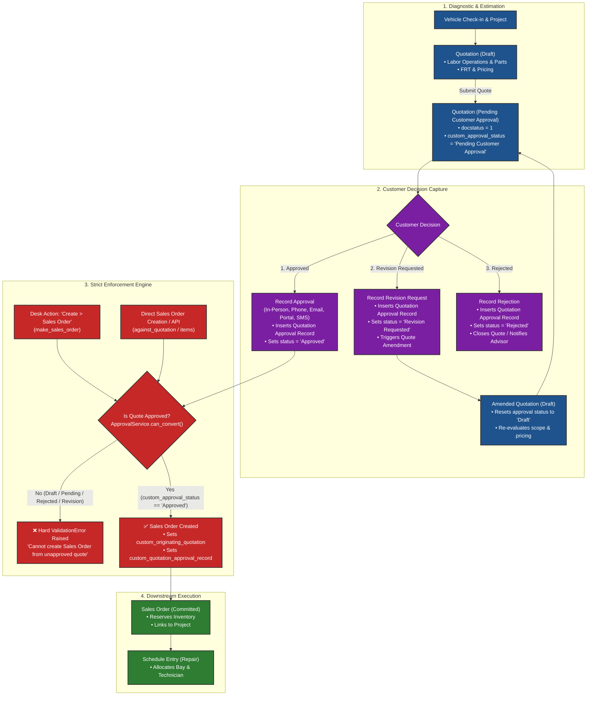
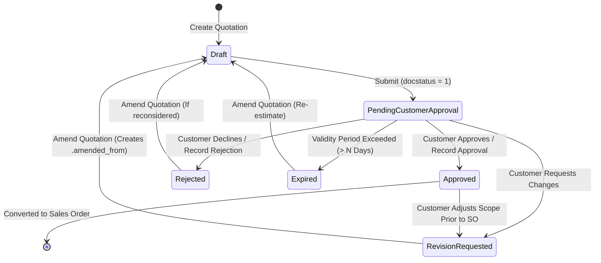
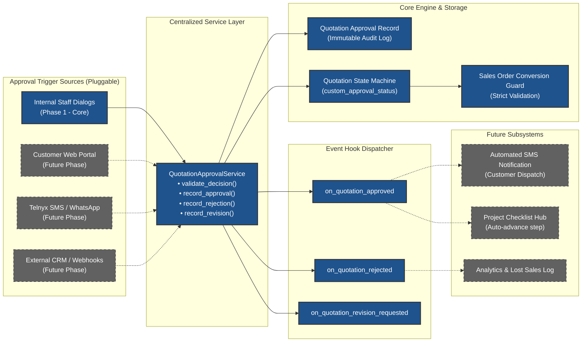

# Quotation Approval System Specification

## 1. Executive Summary

In the standard Induct Shop workflow ([Primary Vehicle Repair Workflow](/workflow.md), Steps 3–5), service advisors construct detailed **Quotations** encompassing diagnostic labor, repair operations, Flat Rate Time (FRT) estimates, and required replacement parts. 

Prior to committing shop resources, placing inventory parts on hold, or scheduling technician bay time, the customer must formally approve the proposed scope of work.

### 1.1 Problem Statement
In default ERPNext configurations, any submitted Quotation can be immediately converted into a `Sales Order` via standard desk actions or direct document linking. This lack of governance presents significant operational risks:
1. **Premature Work Execution**: Technicians or advisors can generate Sales Orders and commence repairs before the customer has authorized the expense.
2. **Billing Disputes**: Without a structured, immutable audit record of who approved what amount, when, and via which communication channel, shops are vulnerable to customer pushback on final invoices.
3. **Bypassed Revisions**: If a customer requests revisions or rejects specific services, unapproved quote lines can accidentally flow into downstream production documents.

### 1.2 Core Objectives
This specification designs the **Core Quotation Approval Subsystem** with an emphasis on **hard server-side enforcement** and **modular architectural decoupling**:
* **Strict Sales Order Gating**: Enforce at the database, backend controller, mapper, and UI layers that no `Sales Order` can be created from or reference a `Quotation` unless the quote is explicitly in an **`Approved`** state.
* **Structured Approval Recording**: Provide standard, auditable recording of customer authorization decisions (channel, decision-maker identity, timestamp, approved total amount, and notes).
* **Quotation Lifecycle State Machine**: Formalize clear quote lifecycle states (`Draft`, `Pending Customer Approval`, `Approved`, `Rejected`, `Revision Requested`, `Expired`) and handle quote amendment/revision resets.
* **Extensible & Pluggable Architecture**: Isolate the core validation and state engine from intake channels so future extension modules—such as a **Customer Approval Web Portal**, **SMS / Telnyx 1-Click Approvals**, **Line-Item Granular Approvals**, and **Manager Value Thresholds**—can plug in without refactoring core enforcement logic.

---

## 2. Architecture & Domain Model



---

## 3. Detailed Data Schemas

To ensure full persistence across reinstallation and standard migration cycles (as required by [Feature Requests Rule](/.agents/rules/feature-requests.md)), all new DocTypes are defined as **Standard DocTypes** (`custom=0`, `module="Induct Shop"`).

### 3.1 `Quotation Approval Record` DocType (New Standard DocType)

Represents an immutable, timestamped decision record associated with a specific version of a Quotation.

| Field Name | Field Type | Options / Target | Reqd | Description |
| :--- | :--- | :--- | :--- | :--- |
| `naming_series` | Select | `QAR-.#####` | Yes | Autoname series. |
| `quotation` | Link | `Quotation` | Yes | Target Quotation document name. Indexed. |
| `project` | Link | `Project` | No | Associated Project (fetched from Quotation). |
| `customer` | Link | `Customer` | Yes | Customer receiving the quote. |
| `approval_status` | Select | `Approved`<br>`Rejected`<br>`Revision Requested` | Yes | Decision recorded. |
| `approval_channel` | Select | `In-Person / Counter`<br>`Phone Call`<br>`Email / Written`<br>`Internal Manager Override`<br>`Customer Web Portal`<br>`SMS / Messaging` | Yes | Channel through which approval or rejection was obtained. |
| `customer_decision_maker` | Data | — | Yes | Full name of the person giving authorization. |
| `contact_phone` | Data | — | No | Contact phone number used for authorization. |
| `contact_email` | Data | — | No | Contact email used for authorization. |
| `approved_amount` | Currency | — | No | Snapshot of quote `grand_total` at time of decision. |
| `recorded_by` | Link | `User` | Yes | Internal user recording the decision (Default: `session.user`). |
| `recorded_at` | Datetime | — | Yes | Exact timestamp when decision was registered. |
| `decision_notes` | Small Text | — | No | Operational details or verbal notes. |
| `rejection_reason_category` | Select | `Cost / Too Expensive`<br>`Timing / Shop Backlog`<br>`Service Not Needed`<br>`Going to Another Shop`<br>`Vehicle Sold / Scrapped`<br>`Other` | No | Mandatory if `approval_status == 'Rejected'`. |
| `revision_details` | Small Text | — | No | Customer requested scope modifications (Mandatory if `Revision Requested`). |
| `is_manager_override` | Check | — | No | Checked if approved via managerial override without direct customer sign-off. |
| `override_reason` | Small Text | — | No | Mandatory explanation if `is_manager_override == 1`. |
| `authorization_reference` | Data | — | No | External reference (e.g. Email ID, phone call log ID, message ID). |
| `ip_address` | Data | — | No | Reserved for future Customer Web Portal approvals. |
| `user_agent` | Small Text | — | No | Reserved for future Customer Web Portal approvals. |

---

### 3.2 `Quotation Approval Item` DocType (New Standard Child DocType)

A child table DocType (`istable=1`, `custom=0`, `module="Induct Shop"`) enabling granular line-item decision tracking. While Phase 1 evaluates whole-quote approvals, this table lays the architectural foundation for item-level customer deferrals and approvals.

| Field Name | Field Type | Options / Target | Description |
| :--- | :--- | :--- | :--- |
| `quotation_item` | Data | — | Row name/ID from `Quotation Item` child table. |
| `item_code` | Link | `Item` | Service operation or replacement part item code. |
| `item_name` | Data | — | Description / label of the item. |
| `qty` | Float | — | Quoted quantity. |
| `rate` | Currency | — | Quoted unit rate. |
| `amount` | Currency | — | Quoted row total amount. |
| `decision` | Select | `Approved`, `Deferred`, `Rejected` | Customer line-level decision (Default: `Approved`). |
| `line_notes` | Data | — | Specific notes regarding this line item. |

---

### 3.3 Custom Fields on Standard `Quotation`

The following custom fields will be added to the standard `Quotation` DocType and exported via `fixtures` in `hooks.py`:

| Field Name | Field Type | Options / Target | Insert After | Description |
| :--- | :--- | :--- | :--- | :--- |
| `custom_approval_section` | Section Break | — | `terms` | Section break labeled "Approval & Governance". Collapsible: 0. |
| `custom_approval_status` | Select | `Draft`<br>`Pending Customer Approval`<br>`Approved`<br>`Rejected`<br>`Revision Requested`<br>`Expired` | `custom_approval_section` | Primary workflow status. Default: `Draft`. In List View: 1. In Standard Filter: 1. Allow on Submit: 1. |
| `custom_latest_approval_record` | Link | `Quotation Approval Record` | `custom_approval_status` | Link to most recent decision record. Read-only: 1. Allow on Submit: 1. |
| `custom_approved_at` | Datetime | — | `custom_latest_approval_record` | Timestamp of latest approval. Read-only: 1. Allow on Submit: 1. |
| `custom_approved_by` | Data | — | `custom_approved_at` | Name of approver and channel summary. Read-only: 1. Allow on Submit: 1. |
| `custom_approval_channel` | Data | — | `custom_approved_by` | Capture channel. Read-only: 1. Allow on Submit: 1. |

---

### 3.4 Custom Fields on Standard `Sales Order`

The following custom fields will be added to the standard `Sales Order` DocType and exported via `fixtures` in `hooks.py`:

| Field Name | Field Type | Options / Target | Insert After | Description |
| :--- | :--- | :--- | :--- | :--- |
| `custom_originating_quotation` | Link | `Quotation` | `customer` | Explicit link to originating Quotation. Read-only: 1. |
| `custom_quotation_approval_record` | Link | `Quotation Approval Record` | `custom_originating_quotation` | Traceable link to approval authorization record. Read-only: 1. |

---

### 3.5 `Shop Settings` Configuration Additions

Add the following governance controls to the `Shop Settings` single DocType:

| Field Name | Field Type | Default | Label | Description |
| :--- | :--- | :--- | :--- | :--- |
| `sb_approval_governance` | Section Break | — | **Quotation Approval Governance** | Settings section for quote approvals. |
| `enforce_quote_approval_for_sales_order` | Check | `1` | **Enforce Quote Approval for Sales Order** | When enabled, prevents creating or submitting Sales Orders without an Approved quote. |
| `allow_manager_approval_override` | Check | `1` | **Allow Manager Override** | Permits authorized managerial roles to approve quotes directly. |
| `manager_approval_role` | Link (`Role`) | `Shop Manager` | **Manager Override Role** | Role required to execute manager overrides (System Manager always permitted). |
| `quote_validity_days` | Int | `30` | **Quote Validity Period (Days)** | Number of days before a submitted quote is flagged as `Expired`. |

---

## 4. Quotation Lifecycle & State Machine



### 4.1 State Transition Rules

1. **`Draft` (`docstatus = 0`)**:
   - Initial quotation drafting by service advisor.
   - `custom_approval_status` is locked to `Draft`.
   - Cannot be converted to a Sales Order.
2. **`Pending Customer Approval` (`docstatus = 1`)**:
   - Triggered automatically on `Quotation.on_submit`.
   - Quotation is locked against ad-hoc edits.
   - Ready for presentation to the customer.
   - Sales Order conversion remains **strictly blocked**.
3. **`Approved` (`docstatus = 1`, `custom_approval_status = "Approved"`)**:
   - Triggered only when a valid `Quotation Approval Record` (`approval_status = "Approved"`) is inserted.
   - Unlocks the **"Create > Sales Order"** button in Desk UI.
   - Passes server-side Sales Order conversion validation.
4. **`Rejected` (`docstatus = 1`, `custom_approval_status = "Rejected"`)**:
   - Triggered when a `Quotation Approval Record` (`approval_status = "Rejected"`) is inserted.
   - Sales Order conversion is blocked.
   - Quotation is flagged as Lost/Rejected; advisor is prompted to record follow-up notes.
5. **`Revision Requested` (`docstatus = 1`, `custom_approval_status = "Revision Requested"`)**:
   - Triggered when customer requests adjustments (e.g. remove cabin filter, defer suspension work).
   - Sales Order conversion is blocked.
   - Provides a one-click action to **Amend Quotation**.
6. **`Expired` (`docstatus = 1`, `custom_approval_status = "Expired"`)**:
   - Evaluated by daily scheduled job if `creation` or `transaction_date` exceeds `Shop Settings.quote_validity_days`.
   - Sales Order conversion is blocked until re-estimated or refreshed via amendment.

### 4.2 Amendment & Reset Behavior
When an `Approved`, `Rejected`, or `Revision Requested` Quotation is amended (via standard ERPNext Amend flow where `doc.amended_from` is populated):
* The new draft quotation initializes with `custom_approval_status = "Draft"`.
* `custom_latest_approval_record`, `custom_approved_at`, and `custom_approved_by` are cleared on the new document.
* Historical approval records remain linked to the previous quotation version (`doc.amended_from`) for audit integrity.

---

## 5. Strict Sales Order Conversion Blocking Engine

Enforcement occurs across **four distinct defensive layers** to prevent bypass via UI, mappers, custom scripts, or standard REST APIs.

### 5.1 Layer 1: Centralized Validation Service (`ApprovalService`)

A dedicated service class in `induct_shop/approval/service.py` provides the single source of truth for approval verification:

```python
class QuotationApprovalService:
    @staticmethod
    def can_convert_to_sales_order(quotation_name: str) -> tuple[bool, str]:
        """
        Evaluates whether a Quotation can be converted into a Sales Order.
        Returns: (is_allowed: bool, reason_message: str)
        """
        # 1. Check Shop Settings toggle
        shop_settings = frappe.get_cached_doc("Shop Settings")
        if not getattr(shop_settings, "enforce_quote_approval_for_sales_order", 1):
            return True, ""

        # 2. Defensive column check
        if not frappe.db.has_column("Quotation", "custom_approval_status"):
            return True, ""

        if not quotation_name or not frappe.db.exists("Quotation", quotation_name):
            return False, _("Quotation {0} does not exist.").format(quotation_name)

        quote = frappe.db.get_value(
            "Quotation",
            quotation_name,
            ["docstatus", "custom_approval_status", "name"],
            as_dict=True
        )

        if quote.docstatus != 1:
            return False, _("Quotation {0} must be submitted before converting to Sales Order.").format(quotation_name)

        if quote.custom_approval_status != "Approved":
            status_display = quote.custom_approval_status or _("Unapproved")
            return False, _(
                "Quotation {0} cannot be converted to a Sales Order because its approval status is '{1}'. "
                "The quotation must be Approved by the customer first."
            ).format(quotation_name, status_display)

        return True, ""
```

---

### 5.2 Layer 2: Server-Side Document Event Hooks (`Sales Order`)

Registered in `hooks.py` under `doc_events["Sales Order"]["validate"]` and `doc_events["Sales Order"]["before_insert"]`:

```python
def validate_sales_order_quotation_approval(doc, method=None):
    """
    Validates that any Quotation linked in the Sales Order header or child items
    is in an 'Approved' state.
    """
    linked_quotes = set()
    
    # Check header link
    if getattr(doc, "custom_originating_quotation", None):
        linked_quotes.add(doc.custom_originating_quotation)
        
    # Check item lines (against_quotation / prevdoc_docname)
    for item in getattr(doc, "items", []):
        if getattr(item, "against_quotation", None):
            linked_quotes.add(item.against_quotation)
        elif getattr(item, "prevdoc_docname", None) and getattr(item, "prevdoc_doctype", None) == "Quotation":
            linked_quotes.add(item.prevdoc_docname)
            
    for q_name in linked_quotes:
        can_convert, msg = QuotationApprovalService.can_convert_to_sales_order(q_name)
        if not can_convert:
            frappe.throw(msg, title=_("Quotation Approval Required"))
```

---

### 5.3 Layer 3: Mapper Interceptor (`make_sales_order`)

Override or hook the standard whitelisted mapper `erpnext.selling.doctype.quotation.quotation.make_sales_order`:

```python
@frappe.whitelist()
def make_sales_order_with_approval_check(source_name, target_doc=None):
    """
    Pre-flight validator for the 'Create > Sales Order' action button.
    """
    can_convert, msg = QuotationApprovalService.can_convert_to_sales_order(source_name)
    if not can_convert:
        frappe.throw(msg, title=_("Action Blocked"))
        
    from erpnext.selling.doctype.quotation.quotation import make_sales_order
    doc = make_sales_order(source_name, target_doc)
    doc.custom_originating_quotation = source_name
    
    latest_rec = frappe.db.get_value("Quotation", source_name, "custom_latest_approval_record")
    if latest_rec:
        doc.custom_quotation_approval_record = latest_rec
        
    return doc
```

---

### 5.4 Layer 4: Client-Side Desk UI Gating (`quotation.js` & `sales_order.js`)

#### Quotation Form Controller (`public/js/quotation.js`):
1. **Dynamic Button Management**:
   - If `doc.docstatus === 1` and `doc.custom_approval_status !== "Approved"`:
     - Remove the standard `Create > Sales Order` button.
     - Add prominent action buttons under an **"Approval"** menu:
       - **"Record Customer Approval"** (Primary / Green)
       - **"Request Revision"** (Orange)
       - **"Record Rejection"** (Red)
   - If `doc.custom_approval_status === "Approved"`:
     - Restore `Create > Sales Order` button.
     - Display a success status badge and summary alert.
2. **Visual Status Banners**:
   - Render a custom HTML banner below the dashboard header indicating:
     - Current approval status pill (`Pending Customer Approval`, `Approved`, `Rejected`, `Revision Requested`).
     - Details of the approver, approval channel, approved amount, and timestamp.

---

## 6. Core Approval Capture Flows & Modals

### 6.1 "Record Customer Approval" Dialog

When staff click **"Record Customer Approval"** on a submitted quotation, an interactive dialog collects:

```json
{
  "dialog_title": "Record Customer Quotation Approval",
  "fields": [
    { "fieldname": "customer_decision_maker", "fieldtype": "Data", "label": "Decision Maker Name", "reqd": 1, "default": "Customer Primary Contact" },
    { "fieldname": "approval_channel", "fieldtype": "Select", "label": "Approval Channel", "options": "In-Person / Counter\nPhone Call\nEmail / Written\nInternal Manager Override", "reqd": 1, "default": "Phone Call" },
    { "fieldname": "contact_phone", "fieldtype": "Data", "label": "Contact Phone", "depends_on": "eval:in_list(['Phone Call', 'SMS / Messaging'], doc.approval_channel)" },
    { "fieldname": "contact_email", "fieldtype": "Data", "label": "Contact Email", "depends_on": "eval:doc.approval_channel=='Email / Written'" },
    { "fieldname": "authorization_reference", "fieldtype": "Data", "label": "Reference / Call Notes", "description": "e.g. Call recording time, email subject/ID" },
    { "fieldname": "approved_amount_display", "fieldtype": "Currency", "label": "Approved Total", "read_only": 1, "default": "Quotation Grand Total" },
    { "fieldname": "is_manager_override", "fieldtype": "Check", "label": "Manager Override (Skip Customer Sign-off)", "permlevel": 0 },
    { "fieldname": "override_reason", "fieldtype": "Small Text", "label": "Override Justification", "mandatory_depends_on": "eval:doc.is_manager_override==1" },
    { "fieldname": "decision_notes", "fieldtype": "Small Text", "label": "Internal Operational Notes" }
  ]
}
```

#### On Submission of Approval Dialog:
1. Validates user permissions (if Manager Override is selected, checks user has `Shop Manager` or `System Manager` role).
2. Inserts `Quotation Approval Record` linked to the Quotation and Project.
3. Updates `Quotation`:
   - `custom_approval_status = "Approved"`
   - `custom_latest_approval_record = record.name`
   - `custom_approved_at = frappe.utils.now_datetime()`
   - `custom_approved_by = customer_decision_maker`
   - `custom_approval_channel = approval_channel`
4. Adds timeline comment to Quotation and linked Project:
   > 🟢 **Quotation Approved**: Authorized by **{decision_maker}** via **{channel}** for **{grand_total}**.
5. Dispatches `on_quotation_approved` event hook.
6. Refreshes Quotation form, revealing the unlocked "Create > Sales Order" button.

---

### 6.2 "Request Revision" Dialog

When the customer requests modifications:
1. Modal collects:
   - `revision_details` (Text describing what to change, e.g. "Customer wants aftermarket brake pads instead of OEM").
   - `customer_decision_maker`.
2. Inserts `Quotation Approval Record` with `approval_status = "Revision Requested"`.
3. Updates `Quotation.custom_approval_status = "Revision Requested"`.
4. Adds timeline comment.
5. Provides prompt: *"Would you like to amend this Quotation now?"* with a direct shortcut to generate the amended draft.

---

### 6.3 "Record Rejection" Dialog

When the customer declines the estimate:
1. Modal collects:
   - `rejection_reason_category` (Required Select).
   - `decision_notes` (Explanation).
   - `customer_decision_maker`.
2. Inserts `Quotation Approval Record` with `approval_status = "Rejected"`.
3. Updates `Quotation.custom_approval_status = "Rejected"`.
4. Adds timeline alert and notifies assigned advisor.

---

## 7. Modular Extension Points & Future-Proofing

To ensure the requirements are modular and future additions can be made effortlessly, the architecture separates the core state engine from external triggers via **event hooks** and **service adapters**.



### 7.1 Event Hook Architecture

The core approval service dispatches Python-level events that external modules can subscribe to via `hooks.py`:

```python
# Event Hook Definitions in induct_shop/approval/events.py
def dispatch_approval_event(event_name: str, quotation_doc, approval_record):
    """
    Dispatches approval lifecycle events to registered app callbacks.
    """
    callbacks = frappe.get_hooks().get(event_name, [])
    for callback in callbacks:
        frappe.get_attr(callback)(quotation_doc, approval_record)
```

Registered hooks in `hooks.py`:
```python
# induct_shop/hooks.py
on_quotation_approved = [
    # Future listeners plug in here:
    # "induct_shop.notifications.messaging.send_approval_confirmation_sms",
    # "induct_shop.project.checklist.advance_project_to_repair_phase"
]
on_quotation_rejected = [
    # "induct_shop.analytics.lost_sales.record_lost_opportunity"
]
on_quotation_revision_requested = [
    # "induct_shop.notifications.messaging.notify_advisor_revision_needed"
]
```

---

### 7.2 Extension Blueprints (Prepared Interfaces)

1. **Customer Approval Web Portal**:
   - *Design Readiness*: `Quotation Approval Record` includes `ip_address`, `user_agent`, `authorization_reference`, and digital signature image fields.
   - *Integration*: A public route `/portal/quote/<token>` simply calls `QuotationApprovalService.record_approval(quote_name, portal_payload)` with `approval_channel = "Customer Web Portal"`. The core validation engine requires zero modifications.
2. **Telnyx SMS / Messaging 1-Click Approvals**:
   - *Design Readiness*: `approval_channel` supports `SMS / Messaging`.
   - *Integration*: Webhook dispatcher from Telnyx calls `record_approval()` upon receiving an inbound confirmation code.
3. **Granular Line-Item / Scope Approval**:
   - *Design Readiness*: `Quotation Approval Item` child table tracks line-level decisions (`Approved`, `Deferred`, `Rejected`).
   - *Integration*: When partial approvals are enabled, the service generates a Sales Order containing only approved lines and auto-creates a revised Quotation for deferred lines.
4. **Managerial Threshold Governance**:
   - *Design Readiness*: `Shop Settings` defines `allow_manager_approval_override` and role constraints.
   - *Integration*: Configurable threshold rules (e.g. quotes > $5,000 require Secondary Manager Approval) can be plugged directly into `QuotationApprovalService.can_convert_to_sales_order()`.

---

## 8. Test Matrix & Verification Plan

Following the repository's [Test Conventions Rule](/.agents/rules/test-conventions.md) and [Testing Methodology](docs/development/archive/testing-methodology-spec.md), all tests will use centralized fixtures from `test_fixtures.py` with `Test ` prefixes and strict transactional cleanup.

### 8.1 Automated Test Cases (`tests/test_quotation_approval.py`)

| Test Case ID | Description | Expected Outcome |
| :--- | :--- | :--- |
| `TEST-QAP-001` | Attempt to create Sales Order from `Draft` Quotation via `make_sales_order`. | ❌ Throws `ValidationError` (Quote must be submitted and approved). |
| `TEST-QAP-002` | Attempt to create Sales Order from `Submitted` (`Pending Approval`) Quotation. | ❌ Throws `ValidationError` (Quote status is Pending Customer Approval). |
| `TEST-QAP-003` | Attempt to insert Sales Order directly via `frappe.get_doc({"items": [{"against_quotation": ...}]})` pointing to unapproved quote. | ❌ Throws `ValidationError` during `Sales Order.validate()`. |
| `TEST-QAP-004` | Record customer approval via `ApprovalService.record_approval()` and verify quote fields and `Quotation Approval Record`. | ✅ `custom_approval_status` set to `Approved`, audit record created with timestamp and snapshot amount. |
| `TEST-QAP-005` | Create and submit Sales Order from an `Approved` Quotation. | ✅ Sales Order successfully created and submitted; links back to Quotation and Approval Record. |
| `TEST-QAP-006` | Record customer rejection. Verify Sales Order conversion is blocked. | ❌ Quote status `Rejected`; Sales Order conversion blocked. |
| `TEST-QAP-007` | Record revision request and verify quote status and amendment reset. | ✅ Quote status `Revision Requested`. When amended, new draft resets to `custom_approval_status = 'Draft'`. |
| `TEST-QAP-008` | Manager override permission check (Authorized manager vs. Unauthorized user). | ✅ Authorized role succeeds; unauthorized role throws `PermissionError`. |
| `TEST-QAP-009` | Toggle `enforce_quote_approval_for_sales_order = 0` in `Shop Settings`. | ✅ Conversion permitted without approval when governance setting is explicitly disabled. |
| `TEST-QAP-010` | Reinstall & Migration Resilience. | ✅ All schemas, custom fields, and fixtures persist cleanly across `bench migrate`. |

---

## 9. Implementation Roadmap & Staged Rollout

1. **Stage 1: Schemas & Fixtures**:
   - Create `Quotation Approval Record` and `Quotation Approval Item` Standard DocTypes in `induct_shop/doctype/`.
   - Export Custom Fields for `Quotation` and `Sales Order` to `induct_shop/fixtures/custom_field.json`.
   - Add approval governance fields to `Shop Settings`.
2. **Stage 2: Core Service Layer**:
   - Implement `induct_shop/approval/service.py` with state machine transitions, record creators, and event dispatchers.
3. **Stage 3: Server-Side Enforcement Layer**:
   - Implement `Sales Order` validation hook in `induct_shop/api/quotation_approval_hooks.py`.
   - Implement whitelisted `make_sales_order` override / wrapper.
   - Register hooks in `hooks.py`.
4. **Stage 4: Client-Side Desk UI & Action Modals**:
   - Implement action dialogs and dynamic button management in `public/js/quotation.js`.
   - Implement visual status banners and indicators.
5. **Stage 5: Test Suite & Verification**:
   - Create `induct_shop/tests/test_quotation_approval.py` covering all test cases in the matrix.
   - Validate clean test execution and migration survival inside Docker bench (`docker exec devcontainer-frappe-1`).
