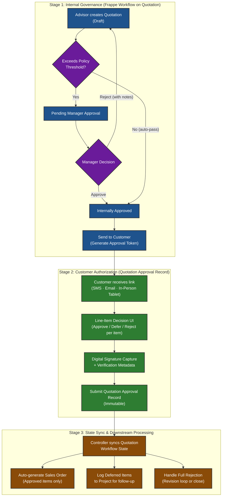
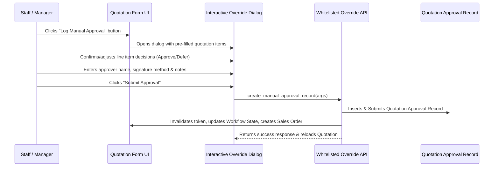
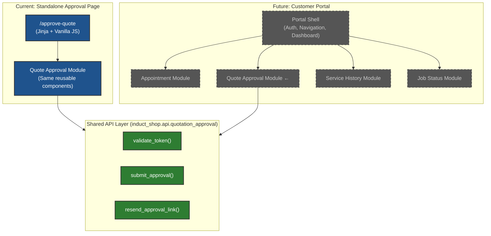
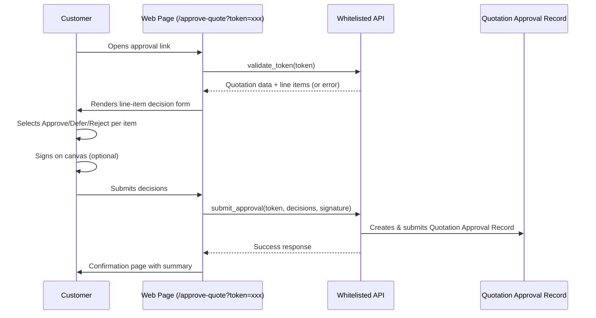
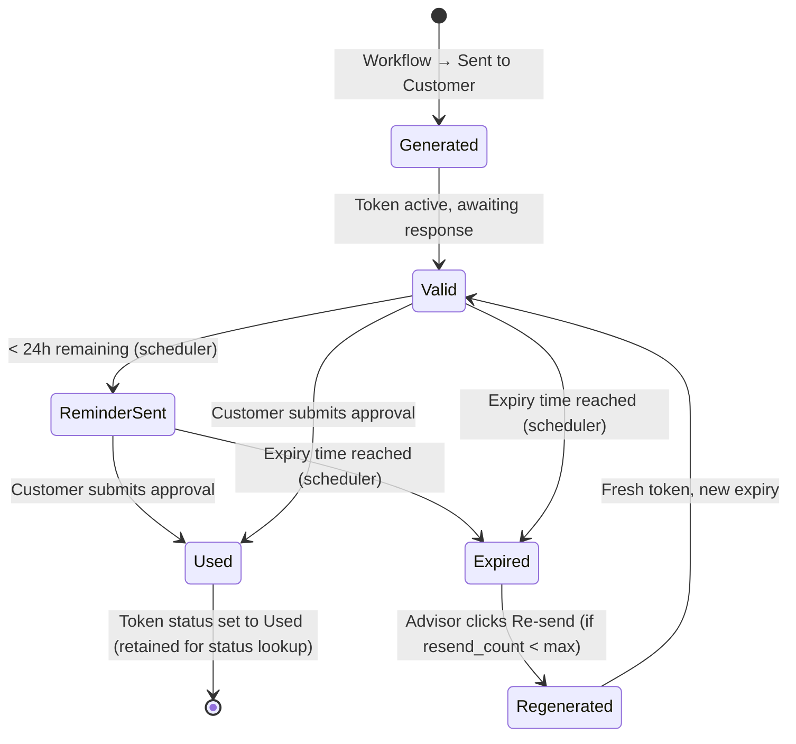
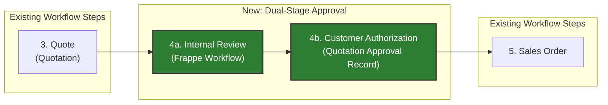

# Dual-Stage Quotation Approval System

## 1. Executive Summary

This specification defines a **Dual-Stage Quotation Approval System** for Induct Shop that cleanly separates two distinct authorization concerns:

1. **Stage 1 — Internal Governance**: Uses Frappe's native `Workflow` engine on the `Quotation` DocType to enforce internal business policy (margin checks, discount thresholds, manager sign-off) before any estimate reaches a customer.
2. **Stage 2 — Customer Authorization**: Introduces a new **`Quotation Approval Record`** standard DocType (with child table **`Quotation Approval Item`**) to capture immutable, line-item-level customer decisions with signature, verification metadata, and legal compliance artifacts.

The two stages operate in series: a quotation must pass internal governance before a customer authorization token is generated. Upon customer response, the system auto-synchronizes the quotation workflow state and conditionally generates a `Sales Order` containing only approved line items.

> [!IMPORTANT]
> This system replaces the currently unimplemented **Step 4 (Quote Approval / Rejection Loop)** defined in the [Primary Vehicle Repair Workflow](/workflow.md#L89-L93).

---

## 2. Architecture & Domain Model



---

## 3. Stage 1: Internal Governance (Frappe Workflow)

### 3.1 Overview

A standard Frappe `Workflow` (document type: `Quotation`) provides role-gated state transitions for internal staff review. This uses Frappe's built-in workflow engine — no custom DocType is required for this stage.

### 3.2 Workflow State Machine

| State | Doc Status | Allowed Roles | Description |
| :--- | :--- | :--- | :--- |
| `Draft` | `0` (Draft) | Sales User, Sales Manager | Quotation being composed by service advisor. |
| `Pending Manager Approval` | `0` (Draft) | Sales User | Advisor has submitted for internal review. Quotation is locked for editing by non-managers. |
| `Internally Approved` | `1` (Submitted) | Sales Manager | Manager has approved the estimate. Ready for customer presentation. |
| `Sent to Customer` | `1` (Submitted) | Sales User, Sales Manager | Approval token generated; customer has been notified. |
| `Customer Approved` | `1` (Submitted) | System (via controller) | All line items approved by customer. |
| `Partially Approved` | `1` (Submitted) | System (via controller) | Customer approved some items, deferred/rejected others. |
| `Customer Rejected` | `1` (Submitted) | System (via controller) | Customer rejected all items or explicitly declined. |
| `Customer No Response` | `1` (Submitted) | System (via scheduler) | Token expired without customer action. Eligible for re-send. |
| `Cancelled` | `2` (Cancelled) | Sales Manager | Quotation voided. |

### 3.3 Workflow Transitions

| From State | Action | To State | Allowed Role | Condition / Description |
| :--- | :--- | :--- | :--- | :--- |
| `Draft` | **Submit for Review** | `Pending Manager Approval` | Sales User | Exceeds auto-approval thresholds (`grand_total > threshold` OR `discount_pct > threshold`) |
| `Draft` | **Submit for Review** | `Internally Approved` | Sales User | Auto-approve bypass (`grand_total <= threshold` AND `discount_pct <= threshold`) |
| `Draft` | **Quick Approve** | `Internally Approved` | Sales Manager | Manager direct submit (bypasses threshold review) |
| `Pending Manager Approval` | **Approve** | `Internally Approved` | Sales Manager | Manager sign-off |
| `Pending Manager Approval` | **Reject** | `Draft` | Sales Manager | Adds rejection comment |
| `Internally Approved` | **Send to Customer** | `Sent to Customer` | Sales User, Sales Manager | Token generated via controller |
| `Internally Approved` | **Log Manual Approval** | `Customer Approved` / `Partially Approved` | Sales User, Sales Manager | Direct staff/manager manual override before sending link (§4.6) |
| `Sent to Customer` | *(System)* | `Customer Approved` | System | All items approved |
| `Sent to Customer` | *(System)* | `Partially Approved` | System | Mixed decisions |
| `Sent to Customer` | *(System)* | `Customer Rejected` | System | All items rejected |
| `Sent to Customer` | *(System)* | `Customer No Response` | System | Token expired (see §8) |
| `Sent to Customer` | **Log Manual Approval** | `Customer Approved` / `Partially Approved` | Sales User, Sales Manager | Staff/Manager manual override dialog (see §4.6) |
| `Customer No Response` | **Log Manual Approval** | `Customer Approved` / `Partially Approved` | Sales User, Sales Manager | Staff/Manager manual override dialog (see §4.6) |
| `Customer No Response` | **Re-send Approval** | `Sent to Customer` | Sales User, Sales Manager | Generates fresh token if `resend_count < max_resends` (see §8.4) |
| `Customer No Response` | **Revise Quote** | *(New Draft)* | Sales User | Triggers Frappe Amendment (`make_amendment`), creating a new `Draft` Quotation version |
| `Customer Rejected` | **Revise Quote** | *(New Draft)* | Sales User | Triggers Frappe Amendment (`make_amendment`), creating a new `Draft` Quotation version |

### 3.4 Auto-Approval Bypass Logic

To avoid slowing down low-risk estimates, the workflow supports a **configurable auto-approval bypass**. When a quotation's `grand_total` and discount percentage fall at or below configurable thresholds (stored in `Shop Settings`), the submission action transitions directly from `Draft` to `Internally Approved`, bypassing the manager review queue.

Because standard Frappe Workflow `condition` strings inside `safe_eval` context cannot execute `frappe.db.get_single_value`, the auto-approval check is evaluated programmatically in a Python `before_workflow_action` / `validate` hook that sets a computed boolean flag on the document prior to transition.

#### Shop Settings Fields (New)

| Field Name | Field Type | Default | Description |
| :--- | :--- | :--- | :--- |
| `approval_threshold_amount` | Currency | `0` | Quotations **at or below** this amount auto-approve to `Internally Approved`. Set `0` to require manager review for all. |
| `approval_threshold_discount_pct` | Percent | `0` | Quotations with discount **exceeding** this % always require manager review regardless of amount. Set `0` to disable discount checking. |

### 3.5 Implementation Notes

- The Workflow definition will be exported as a fixture (`hooks.py` → `fixtures` list includes `"Workflow"`, `"Workflow State"`, `"Workflow Action Master"`).
- Custom Workflow States (`Sent to Customer`, `Customer Approved`, `Partially Approved`, `Customer Rejected`, `Customer No Response`) must be seeded as `Workflow State` records.
- The `update_after_submit = 1` flag must be set on the Workflow to allow post-submission state transitions by the Stage 2 controller and the token expiry scheduler.
- **`allow_on_submit = 1` Flag**: All custom approval fields on `Quotation` (`approval_token`, `approval_token_status`, `approval_token_expiry`, `approval_link_sent_via`, `approval_reminder_sent`, `approval_resend_count`) MUST have `allow_on_submit = 1` set in their Custom Field property definitions to allow programmatic writes after `docstatus = 1`.

---

## 4. Stage 2: Customer Authorization

### 4.1 Overview

When a quotation transitions to `Sent to Customer`, the system generates a unique, time-limited approval token and delivers a link to the customer. The customer reviews line items and submits a per-item decision. This response is captured in a **`Quotation Approval Record`** — a submittable (immutable after submission) standard DocType.

### 4.2 Token Mechanism

#### Custom Fields on `Quotation` (New)

| Field Name | Field Type | Options / Flags | Description |
| :--- | :--- | :--- | :--- |
| `approval_token` | Data | Hidden, `allow_on_submit: 1` | Cryptographically random token (`secrets.token_urlsafe(32)`, 43 characters). |
| `approval_token_status` | Select | Options: `Active`, `Used`, `Expired` | State of the approval token (`allow_on_submit: 1`). |
| `approval_token_expiry` | Datetime | Hidden, `allow_on_submit: 1` | Expiry timestamp. Default: 72 hours from generation. Configurable via `Shop Settings.approval_token_expiry_hours`. |
| `approval_link_sent_via` | Select | `SMS`, `Email`, `In-Person Tablet`, `Not Sent` | Channel used to deliver approval link (`allow_on_submit: 1`). |
| `approval_reminder_sent` | Check | Hidden, `allow_on_submit: 1` | Flag to prevent duplicate expiry reminders for the current token. |
| `approval_resend_count` | Int | Hidden, `allow_on_submit: 1` | Counter tracking the number of times an approval link has been re-sent for this quotation. |

#### Token Lifecycle

1. **Generation**: On `Internally Approved → Sent to Customer` transition, a `before_update` hook generates the token + expiry, sets `approval_token_status = 'Active'`, and stores them on the Quotation.
2. **Delivery**: A whitelisted API constructs the approval URL (`/approve-quote?token=<TOKEN>`) and delivers it via the selected channel.
3. **Validation**: The public API endpoint validates: token exists, token matches a Quotation, token is not expired (`approval_token_status == 'Active'`), and Quotation is in `Sent to Customer` state.
4. **Single-Use with Re-visitation Support**: Upon submission of a `Quotation Approval Record`, the token is NOT wiped; its status is updated to `approval_token_status = 'Used'`. This prevents submitting duplicate approvals while allowing customers who re-open `/approve-quote?token=<TOKEN>` to view their submitted confirmation summary via `get_approval_status(token)`.

> [!WARNING]
> The approval token endpoint is a **guest-accessible (no-login) API**. It MUST validate token integrity and expiry on every request. Rate limiting should be applied to prevent brute-force enumeration.

### 4.3 `Quotation Approval Record` DocType (New Standard DocType)

A submittable (`is_submittable = 1`) standard DocType in the `Induct Shop` module. Once submitted, the record becomes read-only, forming an immutable audit trail.

| Field Name | Field Type | Options | Reqd | Description |
| :--- | :--- | :--- | :--- | :--- |
| `naming_series` | Select | `QAR-.#####` | Yes | Autoname series. |
| `quotation` | Link | `Quotation` | Yes | Parent quotation being approved. |
| `quotation_owner` | Link (Read Only) | `User` | Yes | Advisor/Owner of parent quotation (fetched on validate for Notification fixture targeting). |
| `approval_token` | Data (Read Only) | — | No | Token used for authorization (retained for audit & status lookup). |
| `project` | Link | `Project` | No | Linked project (fetched from Quotation). |
| `customer` | Link | `Customer` | No | Customer (fetched from Quotation). |
| **Authorization Metadata** | | | | |
| `approval_channel` | Data (Read Only) | — | No | Auto-derived context tag (`Customer Digital Link` for guest link submissions, `Staff Manual Override` for staff-assisted entries). |
| `approver_name` | Data | — | Yes | Full name of person authorizing. |
| `approver_contact` | Data | — | No | Phone or email of the approver (for audit). |
| `ip_address` | Data (Read Only) | — | No | Auto-captured from request (for remote channels). |
| `user_agent` | Small Text (Read Only) | — | No | Auto-captured browser user-agent string. |
| **Decision** | | | | |
| `approval_type` | Select (Read Only) | `Full Approval`, `Partial Approval`, `Full Rejection` | Yes | Computed from child table decisions on validate. |
| `approval_datetime` | Datetime (Read Only) | — | Yes | Timestamp of customer decision. Auto-set on submit. |
| **Signature** | | | | |
| `digital_signature` | Attach Image | — | No | Canvas-captured or uploaded signature image. |
| `signature_method` | Select | `Touchscreen Canvas`, `Uploaded Image`, `Verbal Confirmation`, `None` | No | Method used for signature capture. |
| **Notes** | | | | |
| `customer_notes` | Small Text | — | No | Optional free-text notes from the customer. |
| `internal_notes` | Small Text | — | No | Internal staff notes (e.g., verbal approval context). |
| **Child Table** | | | | |
| `items` | Table | `Quotation Approval Item` | Yes | Per-line-item decisions (see §4.4). |

### 4.4 `Quotation Approval Item` Child Table (New Standard DocType)

| Field Name | Field Type | Options | Reqd | Description |
| :--- | :--- | :--- | :--- | :--- |
| `quotation_item` | Data (Read Only) | — | Yes | Reference name of the original `Quotation Item` row. |
| `item_code` | Link (Read Only) | `Item` | Yes | Item code from the quotation line. |
| `item_name` | Data (Read Only) | — | No | Human-readable item description. |
| `qty` | Float (Read Only) | — | Yes | Quantity from quotation line. |
| `rate` | Currency (Read Only) | — | Yes | Per-unit rate from quotation line. |
| `amount` | Currency (Read Only) | — | Yes | Line total from quotation line. |
| `decision` | Select | `Approved`, `Deferred`, `Rejected` | Yes | Customer's decision for this line item. Default: `Approved`. |
| `customer_note` | Small Text | — | No | Per-item note from customer (e.g., "do this next visit"). |

### 4.5 Controller Logic (`quotation_approval_record.py`)

#### `validate(self)`

1. **Concurrency Lock**: Acquire a database row lock on parent Quotation (`frappe.db.sql("SELECT name FROM tabQuotation WHERE name=%s FOR UPDATE", self.quotation)`) to prevent race conditions during concurrent link/manual submissions.
2. **Auto-Derive Channel Tag**: Automatically set `self.approval_channel = "Customer Digital Link"` if `frappe.session.user == "Guest"` else `"Staff Manual Override"`.
3. Populate `quotation_owner = frappe.db.get_value("Quotation", self.quotation, "owner")` for notification fixture targeting.
4. Compute `approval_type` from child table decisions:
   - All items `Approved` → `Full Approval`
   - Mix of decisions → `Partial Approval`
   - All items `Rejected` or `Deferred` → `Full Rejection`
5. Validate that the linked `Quotation` is in `Sent to Customer`, `Internally Approved`, or `Customer No Response` state.
6. Validate that no other submitted `Quotation Approval Record` exists for this quotation version (prevent double submission).

#### `on_submit(self)`

1. Set `approval_datetime = now()`.
2. Mark approval token as used on parent `Quotation` (set `approval_token_status = 'Used'`).
3. Update `Quotation` workflow state:
   - `Full Approval` → `Customer Approved`
   - `Partial Approval` → `Partially Approved`
   - `Full Rejection` → `Customer Rejected`
4. **If `Full Approval` or `Partial Approval`**: Auto-generate `Sales Order` containing only items where `decision == 'Approved'`, linked to the same `Project`. Call `so.run_method("calculate_taxes_and_totals")` before saving (§5.1).
5. **If `Partial Approval`**: Log deferred items to the `Project` via `frappe.add_comment('Info', ...)` on the Project document, listing each deferred item code, description, and customer note. This serves as the interim resolution; structured deferred recommendation tracking is specified in the [Quotation Approval Extensions (EXT-1)](file:///home/real2/projects/.project/frappe_docker/development/frappe-bench/apps/induct_shop/docs/development/deferred/quotation-approval-extensions-spec.md).
6. **Generate PDF Snapshot**: Attach a point-in-time PDF of the Quotation to the submitted `Quotation Approval Record` using `frappe.get_print(..., as_pdf=True)` (see §9).
7. **Trigger Advisor Notification**: The Frappe `Notification` framework automatically dispatches alerts to `doc.quotation_owner` on submit (see §7).
8. **If `Full Rejection`**: No Sales Order generated. Quotation remains submitted in `Customer Rejected` state. Advisor can initiate an amended version (`Revise Quote`).

---

### 4.6 Staff / Manager Manual Approval Override

#### Overview & Fallback Scenarios

In real-world shop operations, automated digital approvals (SMS/Email token link) may fail or be bypassed due to operational edge cases:
- SMS/MMS gateway outage, API failure, or carrier delivery issues.
- Customer calling the shop directly to approve over the phone ("Phone Verbal").
- Customer visiting the shop in person and granting verbal authorization ("Walk-In").
- Customer unable or unwilling to open a web link on their personal device.

To ensure shop operations are never blocked by gateway failures, the system provides a **Staff / Manager Manual Approval Override** workflow directly on the `Quotation` form.

#### "Log Manual Approval" Action Button & Interactive Dialog

When a Quotation is in `Sent to Customer`, `Internally Approved`, or `Customer No Response` state, authorized staff (`Sales User`, `Sales Manager`) see an action button on the Quotation form: **"Log Manual Approval"** (under `Actions`).



#### Dialog Specification & Auto-Prepopulation

Clicking **"Log Manual Approval"** opens an interactive Frappe dialog (`frappe.ui.Dialog`):

1. **Auto-Prepopulated Fields**:
   - `quotation`: Current Quotation ID (Read-Only)
   - `customer`: Linked Customer (Read-Only)
   - `approver_name`: Pre-filled with `customer_name` (Editable, e.g. if an authorized proxy approved)
   - `signature_method`: Select dropdown defaulting to `Verbal Confirmation` (Options: `Verbal Confirmation`, `Paper Document`, `Touchscreen Canvas`, `None`)
   - `internal_notes`: Small Text for staff justification (e.g. "SMS provider down; customer called in at 2:30 PM to approve verbally")
   - *(Note: `approval_channel` is not requested from staff; it is set automatically to `Staff Manual Override` by the backend).*
2. **Pre-Filled Line-Item Decision Table**:
   - Renders a child table populated with all lines from the Quotation.
   - Each row displays: `item_code`, `item_name`, `qty`, `amount`, and a `decision` selector (`Approved` / `Deferred` / `Rejected`), defaulting to `Approved`.
   - Allows line-item customization if the customer verbally approved a subset of work over the phone.
3. **Submission Endpoint**:
   - Submitting the dialog calls `induct_shop.api.quotation_approval.create_manual_approval_record`.
   - The API constructs, inserts, and submits the `Quotation Approval Record` (`ignore_permissions=False` using staff permissions).
   - Triggers the standard `on_submit` downstream logic (§4.5): token invalidation, workflow state sync, PDF snapshot (§9), and Sales Order auto-creation (§5.1).

#### Audit & Security Safeguards

- **No Bypass of Audit Log**: The manual override **does not** simply set fields on Quotation. It programmatically creates and submits an immutable `Quotation Approval Record`, maintaining 100% audit trail parity with remote customer link approvals.
- **Operator Attribution**: The `owner` field of the created `Quotation Approval Record` records the exact staff member (`frappe.session.user`) who logged the manual override.
- **Auto-Derived Channel Tagging**: The `approval_channel` field is automatically derived as `Staff Manual Override` to distinguish staff entries from customer self-service link submissions (`Customer Digital Link`) in audit logs and reports.

---

### 4.7 Staff Approval Link Access & Preview UX

#### Overview & Use Cases

Staff members (service advisors, shop managers, QA testers) need direct access to open and copy the tokenized customer approval page URL (`/approve-quote?token=<TOKEN>`) for operational and testing purposes:

1. **Manual Testing & QA**: Testing line-item toggles, responsive layouts, signature pad behavior, and submit flows directly in browser tabs or incognito windows during development or pre-release verification.
2. **Staff Preview & Double Checking**: Enabling advisors to review *exactly* what the customer will see (pricing, descriptions, line items) before or while discussing the estimate with the customer over the phone or at the counter.
3. **In-Shop Presentation**: Opening the live approval page directly on a shop tablet or workstation browser for walk-in customers to review and sign in person.
4. **Manual Sharing**: Copying the full approval link to share manually via internal chat, custom email messages, or customer support tools.

#### Quotation Form Desk Actions (`quotation.js`)

When a Quotation has an generated `approval_token` (when in state `Sent to Customer`, `Internally Approved`, `Customer Approved`, `Partially Approved`, or `Customer Rejected`), the following action buttons are available under the **Actions** dropdown menu on the `Quotation` form:

1. **`View Approval Page` Button**:
   - Opens `/approve-quote?token=<TOKEN>` directly in a new browser window/tab (`window.open(url, '_blank')`).
   - Because authentication is token-based, staff immediately see the live customer-facing web page.
   - If the token status is `Active`, it presents the interactive authorization UI. If `Used`, it displays the submitted approval summary (`get_approval_status(token)`).
2. **`Copy Approval Link` Button**:
   - Copies the full absolute URL (`https://<domain>/approve-quote?token=<TOKEN>`) to the user's clipboard using `navigator.clipboard.writeText(...)`.
   - Displays a Frappe feedback toast (`frappe.show_alert({ message: __('Approval link copied to clipboard'), indicator: 'green' })`).

```javascript
// In quotation.js
if (frm.doc.approval_token) {
    var approval_url = frappe.urllib.get_full_url('/approve-quote?token=' + frm.doc.approval_token);

    frm.add_custom_button(__('View Approval Page'), function() {
        window.open(approval_url, '_blank');
    }, __('Actions'));

    frm.add_custom_button(__('Copy Approval Link'), function() {
        navigator.clipboard.writeText(approval_url).then(function() {
            frappe.show_alert({
                message: __('Approval link copied to clipboard'),
                indicator: 'green'
            });
        });
    }, __('Actions'));
}
```

---

## 5. Stage 3: State Synchronization & Downstream Processing

### 5.1 Sales Order Auto-Generation

When the `Quotation Approval Record` is submitted with approved items, the controller programmatically calls ERPNext's `make_sales_order` mapping (or constructs the `Sales Order` directly) with:

- Only `Approved` line items from the approval record
- `project` linked from the Quotation
- `customer` from the Quotation
- Standard ERPNext quotation→SO field mapping

After populating the approved line items, the controller MUST call `so.run_method("calculate_taxes_and_totals")` to recalculate taxes, charges, and header grand totals dynamically based on the filtered line items before saving. The generated `Sales Order` is saved in `Draft` status to allow advisor review before submission.

### 5.2 Deferred Item Tracking

Items marked `Deferred` represent future revenue opportunities and customer care follow-ups. In the initial implementation, these are logged to the parent `Project` as structured comments listing each deferred item's code, description, quantity, amount, and the customer's note.

> [!NOTE]
> **Deferred Feature**: Structured `Deferred Recommendation` tracking (queryable child table on Project with follow-up workflow and next-visit surfacing) is specified in the [Quotation Approval Extensions (EXT-1)](file:///home/real2/projects/.project/frappe_docker/development/frappe-bench/apps/induct_shop/docs/development/deferred/quotation-approval-extensions-spec.md), tracked in the [Deferred Implementation Backlog](file:///home/real2/projects/.project/frappe_docker/development/frappe-bench/apps/induct_shop/docs/development/deferred/index.md) as `DEF-002`.

### 5.3 Revision Loop (Amendment Flow)

If a customer rejects or requests changes:

1. Advisor clicks **"Revise Quote"** on the `Customer Rejected` quotation.
2. Frappe creates an **amended** Quotation (`Quotation-1` → `Quotation-1-1`).
3. The amended quotation enters `Draft` state and follows the full Stage 1 → Stage 2 cycle again.
4. The original `Quotation Approval Record` remains linked to the original quotation version, preserving full revision history.

---

## 6. Customer-Facing Approval Page

### 6.1 Architecture & Design Philosophy

> [!IMPORTANT]
> The approval page is the **first customer-facing web surface** in `induct_shop`. Its architecture must be designed as a **modular foundation** for a future **Customer Portal** that will include appointment management, job status tracking, and service history. All design decisions prioritize composability and API isolation over standalone polish.

The approval page is delivered via a Frappe Web Page (route: `/approve-quote`) backed by a Jinja template and whitelisted Python APIs. No login is required — authentication is token-based.

**Design Constraints**:
- **Functional over decorative**: Clean, readable, mobile-friendly — but no premium UI framework, custom animations, or design system investment at this stage.
- **API-first**: The web page is a **thin rendering layer** consuming the same JSON APIs that the future customer portal (and potential mobile app) will use. No business logic lives in the template.
- **Module isolation**: Each UI concern (line-item display, signature capture, confirmation) is a self-contained JS module that can be lifted into the portal without refactoring.

### 6.2 Layered Architecture



### 6.3 API Layer (Shared, Portal-Ready)

All customer-facing interactions go through whitelisted API methods. These are designed to be consumed by any frontend — the current Jinja page, a future Vue/React portal, or a mobile app.

| API Method | Auth | Input | Output | Description |
| :--- | :--- | :--- | :--- | :--- |
| `validate_token(token)` | Guest (token) | `token: str` | `{ quotation, customer_name, items[], totals, shop_info }` | Validates token, returns quotation data for rendering. |
| `submit_approval(token, decisions, signature, approver_name, approver_contact)` | Guest (token) | Token + line-item decisions array + optional signature base64 | `{ success, approval_record_name, approval_type, approved_total }` | Creates and submits the `Quotation Approval Record` (`approval_channel` is automatically derived as `Customer Digital Link`). |
| `get_approval_status(token)` | Guest (token) | `token: str` | `{ status, submitted_at, approval_type, items[] }` or `{ error }` | Allows re-checking status and viewing summary if customer revisits the link post-submission. |


> [!NOTE]
> The API methods are intentionally stateless and token-scoped. They do not rely on session cookies, `frappe.session.user`, or Frappe's standard web context. This makes them portable to any authentication scheme the future portal adopts (e.g., customer login, OAuth, magic links).

### 6.4 Page Flow



### 6.5 Frontend Module Structure

The page's JavaScript is organized as isolated modules. Each module exposes a `render(container, data)` function and emits events, making them liftable into a future component framework.

```
induct_shop/www/approve_quote/
├── approve_quote.html          # Jinja shell template (minimal layout, loads modules)
├── approve_quote.py            # Route handler (calls validate_token, passes context)
├── approve_quote.css           # Minimal functional styles (no design system)
└── modules/
    ├── line_item_selector.js   # Renders item table with Approve/Defer/Reject toggles
    ├── signature_pad.js        # Canvas-based signature capture (thin wrapper)
    ├── approval_summary.js     # Pre-submit confirmation: approved vs. total amounts
    └── approval_submit.js      # Handles form submission to API + confirmation display
```

**Module contract**:
- Each module is a plain JS file (no build step, no bundler dependency).
- Modules communicate via a simple `CustomEvent` bus on `document` (e.g., `document.dispatchEvent(new CustomEvent('items-decided', { detail: decisions }))`).
- Modules receive data via function arguments, not by querying the DOM or globals.
- The Jinja template initializes modules by passing server-rendered JSON context into each `render()` call.

### 6.6 UI Requirements (Minimal Functional)

The approval page prioritizes clarity and usability over visual sophistication:

- **Mobile-first responsive**: Fluid layout that works on phone screens (320px+). Uses standard HTML form controls — no custom component library.
- **No-login**: Token-only authentication. Must not redirect to a Frappe login page. If token is invalid or expired, shows a clear error message with the shop's contact information.
- **Line-item display**: Each quotation line shows item name/description, quantity, rate, and amount. Each row has a three-state toggle (`Approve` / `Defer` / `Reject`) defaulting to `Approve`.
- **Running totals**: A summary bar at the bottom updates in real-time showing `Approved: $X / Total: $Y` as the customer makes selections.
- **Signature capture**: HTML5 `<canvas>` element for touch/stylus input. Clear/redo button. Optional — the system works without a signature (controlled by `signature_method` on the approval record).
- **Confirmation step**: Before final submission, a summary screen shows the customer's decisions and asks for explicit confirmation. No accidental one-click approvals.
- **Post-submission**: Simple confirmation with the approval record reference number and a "You may close this page" message.

### 6.7 In-Person Tablet Mode (Deferred)

> [!NOTE]
> **Deferred Feature**: Dedicated "In-Person Tablet Mode" (kiosk locking, hardware PIN, auto-resetting sessions) is deferred to [Quotation Approval Extensions (EXT-4)](file:///home/real2/projects/.project/frappe_docker/development/frappe-bench/apps/induct_shop/docs/development/deferred/quotation-approval-extensions-spec.md), tracked in the [Deferred Implementation Backlog](file:///home/real2/projects/.project/frappe_docker/development/frappe-bench/apps/induct_shop/docs/development/deferred/index.md) as `DEF-005`.

**Interim MVP Resolution**: Walk-in customers utilize the **exact same customer-initiated token approval flow** as remote customers. When a walk-in customer needs to review an estimate, the advisor sends the standard approval link via text/email or opens the token URL directly on a shop device. A single customer approval mechanism handles both remote and in-shop scenarios seamlessly without needing a separate tablet-only channel.

### 6.8 Future Portal Integration Path

When the Customer Portal is built, the approval page modules transition as follows:

| Current (Standalone) | Future (Portal) | Migration Effort |
| :--- | :--- | :--- |
| `approve_quote.html` (Jinja shell) | Portal route `/portal/approvals/:token` | Replace shell only; modules unchanged |
| `line_item_selector.js` | Portal component `<QuoteLineItems>` | Wrap as component; same render logic |
| `signature_pad.js` | Shared component `<SignaturePad>` | Zero changes — already isolated |
| `approval_summary.js` | Portal component `<ApprovalSummary>` | Wrap as component; same render logic |
| API layer (`quotation_approval.py`) | Same API layer | Zero changes — portal calls same endpoints |
| Token auth | Customer session auth + token fallback | API gains optional session check; token path preserved |


---

## 7. Advisor Notification System

### 7.1 Overview

When a customer responds to a remote approval link, the service advisor who owns the quotation must be notified immediately so they can act on the decision — generate a Sales Order, schedule service, or initiate a revision. This is implemented via Frappe's built-in `Notification` DocType framework.

### 7.2 Notification Trigger & Recipients

| Event | DocType | Trigger | Recipient | Channel |
| :--- | :--- | :--- | :--- | :--- |
| Customer responds to approval link | `Quotation Approval Record` | `on Submit` | Quotation owner (advisor) | System Notification + Email |
| Token expiring (reminder sent) | `Quotation` | Scheduled task (§8.2) | Quotation owner (advisor) | System Notification |
| Token expired (no response) | `Quotation` | Scheduled task (§8.3) | Quotation owner (advisor) | System Notification |

### 7.3 Notification Content Templates

#### Customer Response Notification

**Subject**: `Quotation {{ doc.quotation }} — {{ doc.approval_type }}`

**Body** (Jinja template):
```
{{ doc.approver_name }} has responded to Quotation {{ doc.quotation }}.

Decision: {{ doc.approval_type }}
Channel: {{ doc.approval_channel }}
Time: {{ doc.approval_datetime }}


Approved Items:


  • {{ item.item_name }} ({{ item.qty }} × {{ item.rate | currency }}) ✓



Deferred / Rejected Items:




  • {{ item.item_name }} — {{ item.decision }}: "{{ item.customer_note }}"




View approval record: {{ frappe.utils.get_url_to_form("Quotation Approval Record", doc.name) }}
```

#### Token Expiring Reminder (to Advisor)

**Subject**: `Approval link expiring soon — {{ doc.name }}`

**Body**: Notifies the advisor that the customer has not yet responded and the token expires in < 24 hours. Includes a link to the Quotation for re-sending.

### 7.4 Notification Fixture

The `Notification` record is exported as a fixture (`hooks.py` → `fixtures` list includes `"Notification"`). The fixture defines:
- `document_type`: `Quotation Approval Record`
- `event`: `Submit`
- `channel`: `Email` and `System` (dual-channel)
- `recipients`: Dynamic — `doc.quotation_owner` (Read-only Link field on `Quotation Approval Record` populated during `validate()`)
- `condition`: None (fires on every submission)
- `message`: Jinja template per §7.3

### 7.5 Implementation Details

```python
# In quotation_approval_record.py on_submit()
def on_submit(self):
    # ... existing logic ...

    # Notification is handled automatically by the Notification DocType framework
    # because the fixture defines a Submit event trigger on this DocType and targets doc.quotation_owner.
    # No manual frappe.sendmail() call is needed.
    pass
```

The Frappe Notification engine evaluates the fixture definition on every `Quotation Approval Record` submission and dispatches notifications automatically. No custom notification code is required in the controller.

---

## 8. Token Lifecycle Management

### 8.1 Overview

Approval tokens have a finite validity window to prevent stale links and encourage timely customer responses. The token lifecycle includes generation, validation, expiry reminders, expiry handling, and re-generation.

### 8.2 Expiry Reminder Scheduler

A **daily scheduled task** checks for quotations approaching token expiry and sends a reminder to the customer before the link dies.

#### Scheduler Configuration

```python
# In hooks.py
scheduler_events = {
    "daily": [
        "induct_shop.api.quotation_approval.process_expiring_tokens"
    ]
}
```

#### Reminder Logic (`process_expiring_tokens`)

```python
def process_expiring_tokens():
    """
    Finds quotations in 'Sent to Customer' state whose approval token
    expires within the configured reminder window and sends a reminder.
    Restricted to remote delivery channels (SMS, Email).
    """
    now = frappe.utils.now_datetime()
    reminder_hours = frappe.db.get_single_value("Shop Settings", "approval_reminder_hours_before") or 24
    reminder_window = frappe.utils.add_to_date(now, hours=reminder_hours)

    expiring_quotations = frappe.get_all(
        "Quotation",
        filters={
            "workflow_state": "Sent to Customer",
            "approval_token_status": "Active",
            "approval_link_sent_via": ["in", ["SMS", "Email"]],
            "approval_token_expiry": ["between", [now, reminder_window]],
            "approval_reminder_sent": 0
        },
        fields=["name", "owner", "party_name", "creation", "approval_token_expiry"]
    )

    for q in expiring_quotations:
        # Skip if token was created less than reminder_hours ago (prevents immediate reminders on short expiry tokens)
        if frappe.utils.time_diff_in_hours(now, q.creation) < reminder_hours:
            continue

        # Send reminder to customer (via original SMS/Email channel)
        send_customer_reminder(q.name)

        # Notify advisor that customer hasn't responded
        notify_advisor_expiring(q.name, q.owner)

        # Mark reminder as sent to prevent duplicates
        frappe.db.set_value(
            "Quotation", q.name,
            "approval_reminder_sent", 1,
            update_modified=False
        )

    frappe.db.commit()
```

### 8.3 Expiry Handler

A **second daily scheduled task** (or combined with §8.2) handles quotations whose tokens have fully expired without a customer response.

#### Expiry Logic

```python
def process_expired_tokens():
    """
    Transitions quotations with expired tokens to 'Customer No Response' state.
    """
    now = frappe.utils.now_datetime()

    expired_quotations = frappe.get_all(
        "Quotation",
        filters={
            "workflow_state": "Sent to Customer",
            "approval_token_status": "Active",
            "approval_token_expiry": ["<", now]
        },
        fields=["name", "owner"]
    )

    for q in expired_quotations:
        doc = frappe.get_doc("Quotation", q.name)

        # Update token status to Expired
        doc.approval_token_status = "Expired"
        doc.approval_reminder_sent = 0

        # Transition workflow state
        doc.workflow_state = "Customer No Response"
        doc.add_comment(
            "Info",
            "Approval token expired without customer response. "
            "Use 'Re-send Approval' to generate a new link."
        )
        doc.save(ignore_permissions=True)

        # Notify advisor
        notify_advisor_expired(q.name, q.owner)

    frappe.db.commit()
```

### 8.4 Re-Send Approval Action

When a quotation is in `Customer No Response` state, the advisor can click **"Re-send Approval"** from the Quotation form. This workflow transition:

1. Validates that `approval_resend_count` is less than `max_approval_resends` (configured in `Shop Settings`).
2. Generates a **fresh token** (`secrets.token_urlsafe(32)`) and a new expiry timestamp.
3. Sets `approval_token_status = 'Active'` and resets `approval_reminder_sent = 0`.
4. Increments `approval_resend_count += 1`.
5. Transitions the workflow state back to `Sent to Customer`.
6. Delivers the new link via the advisor's selected channel.

The client script adds the button conditionally:

```javascript
// In quotation.js
if (frm.doc.workflow_state === 'Customer No Response') {
    frm.add_custom_button(__('Re-send Approval Link'), function() {
        frappe.call({
            method: 'induct_shop.api.quotation_approval.resend_approval_link',
            args: { quotation: frm.doc.name },
            callback: function(r) {
                if (r.message) {
                    frappe.show_alert({
                        message: __('New approval link sent.'),
                        indicator: 'green'
                    });
                    frm.reload_doc();
                }
            }
        });
    }, __('Actions'));
}
```

### 8.5 Token Lifecycle State Diagram



### 8.6 Shop Settings Fields (Token Lifecycle)

| Field Name | Field Type | Default | Description |
| :--- | :--- | :--- | :--- |
| `approval_token_expiry_hours` | Int | `72` | Token validity period in hours from generation. |
| `approval_reminder_hours_before` | Int | `24` | Hours before expiry to send reminder. Set `0` to disable reminders. |
| `max_approval_resends` | Int | `3` | Maximum number of times an advisor can re-send an approval link for the same quotation version. `0` for unlimited. |

---

## 9. PDF Snapshot Audit Artifact

### 9.1 Overview

To create a legally defensible audit trail, the system automatically generates a **point-in-time PDF snapshot** of the Quotation at the exact moment the customer submits their approval decision. This PDF is permanently attached to the `Quotation Approval Record`, ensuring that even if the original Quotation is later amended or cancelled, the authorized version is preserved.

### 9.2 Implementation

The PDF is generated in the `on_submit` hook of the `Quotation Approval Record` controller using Frappe's `frappe.get_print` utility:

```python
# In quotation_approval_record.py on_submit()
def _attach_quotation_pdf(self):
    """Attach a PDF snapshot of the approved Quotation to this record."""
    pdf_content = frappe.get_print(
        doctype="Quotation",
        name=self.quotation,
        print_format=None,  # Uses default print format
        as_pdf=True
    )

    file_name = f"Quotation_{self.quotation}_approved_{self.approval_datetime.strftime('%Y%m%d_%H%M%S')}.pdf"

    _file = frappe.get_doc({
        "doctype": "File",
        "file_name": file_name,
        "attached_to_doctype": self.doctype,
        "attached_to_name": self.name,
        "content": pdf_content,
        "is_private": 1
    })
    _file.save(ignore_permissions=True)

    frappe.db.set_value(
        self.doctype, self.name,
        "quotation_pdf_snapshot", _file.file_url,
        update_modified=False
    )
```

### 9.3 Additional Field on `Quotation Approval Record`

| Field Name | Field Type | Description |
| :--- | :--- | :--- |
| `quotation_pdf_snapshot` | Attach (Read Only) | Auto-populated URL to the PDF snapshot file attached on submission (§9). |

### 9.4 Legal & Compliance Value

- **Immutability**: The PDF is attached to a submitted (read-only) DocType. Neither the PDF nor the record can be modified post-submission.
- **Point-in-Time Accuracy**: Captures exact pricing, terms, and line items as presented to the customer.
- **Dispute Resolution**: Provides a printable artifact for customer disputes, warranty claims, or insurance documentation.
- **Regulatory Compliance**: Satisfies record-keeping requirements for automotive repair authorization in jurisdictions requiring written customer consent.

---

## 10. Deferred Extensions

The following enhancements were identified during design and deferred to the [Quotation Approval Extensions](file:///home/real2/projects/.project/frappe_docker/development/frappe-bench/apps/induct_shop/docs/development/deferred/quotation-approval-extensions-spec.md) specification, tracked in the [Deferred Implementation Backlog](file:///home/real2/projects/.project/frappe_docker/development/frappe-bench/apps/induct_shop/docs/development/deferred/index.md):

| Backlog ID | Extension | Summary |
| :--- | :--- | :--- |
| `DEF-002` | **Deferred Recommendation Tracking (EXT-1)** | Structured child table on `Project` for deferred line items with next-visit surfacing and follow-up workflow. |
| `DEF-003` | **Approval Analytics Dashboard (EXT-2)** | Script Report with conversion rates, response times, revenue capture metrics, and advisor-level performance. |
| `DEF-004` | **Multi-Quotation Approval Batching (EXT-3)** | Project-level approval token enabling customers to review and decide on all pending quotations in a single session. |
| `DEF-005` | **In-Person Tablet Approval Mode (EXT-4)** | Dedicated kiosk locking, hardware PIN, and auto-resetting session handler for shop tablets. |

---

## 11. Roles & Permission Governance

> [!NOTE]
> **Deferred Feature Requirement**: Dedicated custom shop roles (`Shop Manager`, `Service Advisor`, `Shop Technician`) have been deferred to a standalone specification. See [User Roles & Permissions Management Specification](file:///home/real2/projects/.project/frappe_docker/development/frappe-bench/apps/induct_shop/docs/development/deferred/user-roles-and-permissions-spec.md), tracked in the [Deferred Implementation Backlog](file:///home/real2/projects/.project/frappe_docker/development/frappe-bench/apps/induct_shop/docs/development/deferred/index.md) as `DEF-001`.

### 11.1 Active Role Mapping (Phase 1 Implementation)

To minimize implementation friction and ensure immediate compatibility, Stage 1 Internal Governance uses standard native ERPNext roles:

| Workflow Action | Internal Function | Mapped Native ERPNext Role |
| :--- | :--- | :--- |
| Create / Submit Quotation | Service Advisor | `Sales User` |
| Internal Approval / Override | Shop Manager Review | `Sales Manager` |
| Customer Link Generation | Service Advisor / Controller | `Sales User` |
| Re-send Approval Link | Service Advisor / Shop Manager | `Sales User`, `Sales Manager` |
| Log Manual Approval | Staff / Manager Manual Override | `Sales User`, `Sales Manager` |

### 11.2 Quotation Approval Record Permissions

| Role | Read | Write | Create | Submit | Cancel |
| :--- | :--- | :--- | :--- | :--- | :--- |
| `Sales User` | ✓ | ✓ (Draft only) | ✓ | ✓ | ✗ |
| `Sales Manager` | ✓ | ✓ (Draft only) | ✓ | ✓ | ✓ |
| `Guest` | ✗ | ✗ | ✗ | ✗ | ✗ |

> [!IMPORTANT]
> Guest users interact with approval records exclusively through the whitelisted API (`induct_shop.api.quotation_approval`). The API creates and submits the record using `frappe.get_doc(...).insert(ignore_permissions=True)` after validating the token. Guests never have direct DocType-level access.

---

## 12. Custom Fields Summary

### On `Quotation` (via fixtures)

| Field Name | Type | Section | Flags | Description |
| :--- | :--- | :--- | :--- | :--- |
| `approval_token` | Data | Hidden | `allow_on_submit: 1` | Secure token (`secrets.token_urlsafe(32)`, 43 chars) for customer approval link. |
| `approval_token_status` | Select | Hidden | `allow_on_submit: 1` | Token lifecycle status (`Active`, `Used`, `Expired`). |
| `approval_token_expiry` | Datetime | Hidden | `allow_on_submit: 1` | Token expiration timestamp. |
| `approval_link_sent_via` | Select | Approval Status | `allow_on_submit: 1` | Channel used to deliver approval link (`SMS`, `Email`, `In-Person Tablet`, `Not Sent`). |
| `approval_reminder_sent` | Check | Hidden | `allow_on_submit: 1` | Flag to prevent duplicate expiry reminders for the same token. |
| `approval_resend_count` | Int | Hidden | `allow_on_submit: 1` | Counter tracking the number of times an approval link has been re-sent. |

### On `Quotation Approval Record`

| Field Name | Type | Options / Flags | Description |
| :--- | :--- | :--- | :--- |
| `quotation_owner` | Link (Read Only) | Options: `User` | Advisor/Owner of parent quotation (fetched on validate for Notification fixture targeting). |
| `approval_token` | Data (Read Only) | — | Secure token reference retained for audit and post-submit status lookup. |
| `approval_channel` | Data (Read Only) | — | Auto-derived context tag (`Customer Digital Link` vs `Staff Manual Override`). |
| `quotation_pdf_snapshot` | Attach (Read Only) | — | Auto-populated URL to the PDF snapshot file attached on submission (§9). |

### On `Shop Settings`

| Field Name | Type | Default | Description |
| :--- | :--- | :--- | :--- |
| `approval_threshold_amount` | Currency | `0` | Quotations at or below this amount auto-approve to `Internally Approved`. Set `0` to require manager review for all. |
| `approval_threshold_discount_pct` | Percent | `0` | Discount % that always requires manager review regardless of amount. Set `0` to disable. |
| `approval_token_expiry_hours` | Int | `72` | Token validity period in hours from generation. |
| `approval_reminder_hours_before` | Int | `24` | Hours before expiry to send customer reminder. Set `0` to disable. |
| `max_approval_resends` | Int | `3` | Maximum re-sends per quotation version. `0` for unlimited. |


---

## 13. File & Module Inventory

| Component | Path | Type |
| :--- | :--- | :--- |
| `Quotation Approval Record` DocType | `induct_shop/induct_shop/doctype/quotation_approval_record/` | Standard DocType (Submittable) |
| `Quotation Approval Item` DocType | `induct_shop/induct_shop/doctype/quotation_approval_item/` | Child Table DocType |
| Quotation Approval API | `induct_shop/api/quotation_approval.py` | Whitelisted API (`validate_token`, `submit_approval`, `resend_approval_link`, `create_manual_approval_record`) |
| Token Lifecycle Scheduler | `induct_shop/api/quotation_approval.py` | Scheduled tasks (`process_expiring_tokens`, `process_expired_tokens`) |
| Approval Web Page (Shell) | `induct_shop/www/approve_quote/approve_quote.html` + `.py` + `.css` | Guest-accessible Jinja page + route handler |
| Approval Page Modules | `induct_shop/www/approve_quote/modules/` | Isolated JS modules (line_item_selector, signature_pad, approval_summary, approval_submit) |
| Workflow Fixture | `induct_shop/fixtures/workflow.json` | Frappe Workflow definition |
| Workflow State Fixtures | `induct_shop/fixtures/workflow_state.json` | Custom workflow states (incl. `Customer No Response`) |
| Custom Field Fixtures | `induct_shop/fixtures/custom_field.json` | Updated with approval + token fields on Quotation |
| Shop Settings Fields | `induct_shop/induct_shop/doctype/shop_settings/` | Updated schema (thresholds, token config) |
| Notification Fixture | `induct_shop/fixtures/notification.json` | Advisor notifications (customer response, token expiry) |
| Client Script (Quotation) | `induct_shop/public/js/quotation.js` | Updated with "Send to Customer", "View Approval Page", "Copy Approval Link", "Re-send Approval", and "Log Manual Approval" UX |

---

## 14. Integration with Primary Workflow

This system directly implements **Step 4 (Quote Approval / Rejection Loop)** from the [Primary Vehicle Repair Workflow](/workflow.md). Upon implementation, the workflow documentation should be updated to reference this specification and the new `Quotation Approval Record` DocType.



---

## 15. Related Documentation

- [Primary Vehicle Repair Workflow](/workflow.md)
- [Quotation Customizations](/doctypes/quotation.md)
- [Shop Settings](/doctypes/shop-settings.md)
- [Project DocType](/doctypes/project.md)
- [Quotation Approval Extensions (Deferred)](file:///home/real2/projects/.project/frappe_docker/development/frappe-bench/apps/induct_shop/docs/development/deferred/quotation-approval-extensions-spec.md)
- [Deferred Implementation Backlog](file:///home/real2/projects/.project/frappe_docker/development/frappe-bench/apps/induct_shop/docs/development/deferred/index.md)
