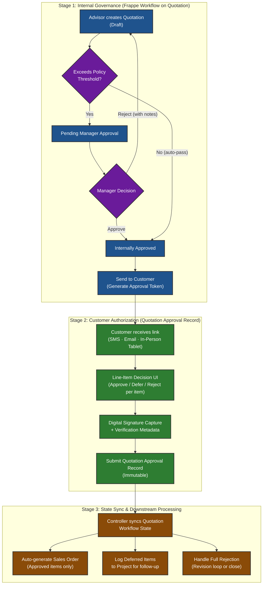
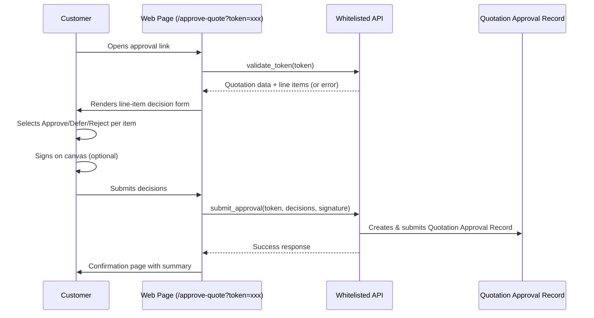
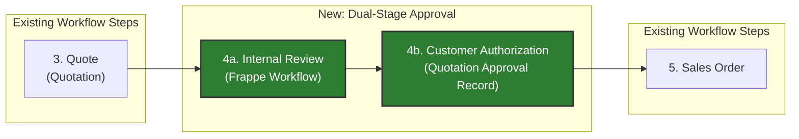

# Dual-Stage Quotation Approval System

## 1. Executive Summary

This specification defines a **Dual-Stage Quotation Approval System** for Induct Shop that cleanly separates two distinct authorization concerns:

1. **Stage 1 — Internal Governance**: Uses Frappe's native `Workflow` engine on the `Quotation` DocType to enforce internal business policy (margin checks, discount thresholds, manager sign-off) before any estimate reaches a customer.
2. **Stage 2 — Customer Authorization**: Introduces a new **`Quotation Approval Record`** standard DocType (with child table **`Quotation Approval Item`**) to capture immutable, line-item-level customer decisions with signature, verification metadata, and legal compliance artifacts.

The two stages operate in series: a quotation must pass internal governance before a customer authorization token is generated. Upon customer response, the system auto-synchronizes the quotation workflow state and conditionally generates a `Sales Order` containing only approved line items.

> [!IMPORTANT]
> This system replaces the currently unimplemented **Step 4 (Quote Approval / Rejection Loop)** defined in the [Primary Vehicle Repair Workflow](/workflow.md#L89-L93).

---

## 2. Architecture & Domain Model

---

## 3. Stage 1: Internal Governance (Frappe Workflow)

### 3.1 Overview

A standard Frappe `Workflow` (document type: `Quotation`) provides role-gated state transitions for internal staff review. This uses Frappe's built-in workflow engine — no custom DocType is required for this stage.

### 3.2 Workflow State Machine

| State | Doc Status | Allowed Roles | Description |
| :--- | :--- | :--- | :--- |
| `Draft` | `0` (Draft) | Sales User, Sales Manager | Quotation being composed by service advisor. |
| `Pending Manager Approval` | `0` (Draft) | Sales User | Advisor has submitted for internal review. Quotation is locked for editing by non-managers. |
| `Internally Approved` | `1` (Submitted) | Sales Manager | Manager has approved the estimate. Ready for customer presentation. |
| `Sent to Customer` | `1` (Submitted) | Sales User, Sales Manager | Approval token generated; customer has been notified. |
| `Customer Approved` | `1` (Submitted) | System (via controller) | All line items approved by customer. |
| `Partially Approved` | `1` (Submitted) | System (via controller) | Customer approved some items, deferred/rejected others. |
| `Customer Rejected` | `1` (Submitted) | System (via controller) | Customer rejected all items or explicitly declined. |
| `Cancelled` | `2` (Cancelled) | Sales Manager | Quotation voided. |

### 3.3 Workflow Transitions

| From State | Action | To State | Allowed Role | Condition |
| :--- | :--- | :--- | :--- | :--- |
| `Draft` | **Submit for Review** | `Pending Manager Approval` | Sales User | `grand_total > 0` |
| `Draft` | **Quick Approve** | `Internally Approved` | Sales Manager | No threshold exceeded (manager self-submits) |
| `Pending Manager Approval` | **Approve** | `Internally Approved` | Sales Manager | — |
| `Pending Manager Approval` | **Reject** | `Draft` | Sales Manager | Adds rejection comment |
| `Internally Approved` | **Send to Customer** | `Sent to Customer` | Sales User, Sales Manager | Token generated via controller |
| `Sent to Customer` | *(System)* | `Customer Approved` | System | All items approved |
| `Sent to Customer` | *(System)* | `Partially Approved` | System | Mixed decisions |
| `Sent to Customer` | *(System)* | `Customer Rejected` | System | All items rejected |
| `Customer Rejected` | **Revise Quote** | `Draft` | Sales User | Creates amended version |

### 3.4 Auto-Approval Bypass

To avoid slowing down low-risk estimates, the workflow supports a **configurable auto-approval bypass**. When a quotation's `grand_total` falls below a configurable threshold (stored in `Shop Settings`), the `Submit for Review` action skips directly from `Draft` to `Internally Approved`, bypassing the manager review queue.

#### Shop Settings Fields (New)

| Field Name | Field Type | Default | Description |
| :--- | :--- | :--- | :--- |
| `approval_threshold_amount` | Currency | `0` | Quotations **at or below** this amount auto-approve to `Internally Approved`. Set `0` to require manager review for all. |
| `approval_threshold_discount_pct` | Percent | `0` | Quotations with discount **exceeding** this % always require manager review regardless of amount. Set `0` to disable discount checking. |

### 3.5 Implementation Notes

- The Workflow definition will be exported as a fixture (`hooks.py` → `fixtures` list includes `"Workflow"`, `"Workflow State"`, `"Workflow Action Master"`).
- Custom Workflow States (`Sent to Customer`, `Customer Approved`, `Partially Approved`, `Customer Rejected`) must be seeded as `Workflow State` records.
- The `update_after_submit = 1` flag must be set on the Workflow to allow post-submission state transitions by the Stage 2 controller.

---

## 4. Stage 2: Customer Authorization

### 4.1 Overview

When a quotation transitions to `Sent to Customer`, the system generates a unique, time-limited approval token and delivers a link to the customer. The customer reviews line items and submits a per-item decision. This response is captured in a **`Quotation Approval Record`** — a submittable (immutable after submission) standard DocType.

### 4.2 Token Mechanism

#### Custom Fields on `Quotation` (New)

| Field Name | Field Type | Description |
| :--- | :--- | :--- |
| `approval_token` | Data (Hidden, Read Only) | Cryptographically random token (UUID4 or `secrets.token_urlsafe(32)`). |
| `approval_token_expiry` | Datetime (Hidden, Read Only) | Expiry timestamp. Default: 72 hours from generation. Configurable via `Shop Settings.approval_token_expiry_hours`. |
| `approval_link_sent_via` | Select (Read Only) | Channel used: `SMS`, `Email`, `In-Person Tablet`, `Not Sent`. |

#### Token Lifecycle

1. **Generation**: On `Internally Approved → Sent to Customer` transition, a `before_update` hook generates the token + expiry and stores them on the Quotation.
2. **Delivery**: A whitelisted API constructs the approval URL (`/api/method/induct_shop.api.quotation_approval.get_approval_page?token=<TOKEN>`) and delivers it via the selected channel.
3. **Validation**: The public API endpoint validates: token exists, token matches a Quotation, token is not expired, and Quotation is in `Sent to Customer` state.
4. **Single-Use**: After a `Quotation Approval Record` is submitted for a given token, the token is invalidated (set to `None`) to prevent re-use.

> [!WARNING]
> The approval token endpoint is a **guest-accessible (no-login) API**. It MUST validate token integrity and expiry on every request. Rate limiting should be applied to prevent brute-force enumeration.

### 4.3 `Quotation Approval Record` DocType (New Standard DocType)

A submittable (`is_submittable = 1`) standard DocType in the `Induct Shop` module. Once submitted, the record becomes read-only, forming an immutable audit trail.

| Field Name | Field Type | Options | Reqd | Description |
| :--- | :--- | :--- | :--- | :--- |
| `naming_series` | Select | `QAR-.#####` | Yes | Autoname series. |
| `quotation` | Link | `Quotation` | Yes | Parent quotation being approved. |
| `project` | Link | `Project` | No | Linked project (fetched from Quotation). |
| `customer` | Link | `Customer` | No | Customer (fetched from Quotation). |
| **Authorization Metadata** | | | | |
| `approval_channel` | Select | `SMS Link`, `Email Link`, `In-Person Tablet`, `Phone Verbal`, `Walk-In` | Yes | How the customer was presented the quotation. |
| `approver_name` | Data | — | Yes | Full name of person authorizing. |
| `approver_contact` | Data | — | No | Phone or email of the approver (for audit). |
| `ip_address` | Data (Read Only) | — | No | Auto-captured from request (for remote channels). |
| `user_agent` | Small Text (Read Only) | — | No | Auto-captured browser user-agent string. |
| **Decision** | | | | |
| `approval_type` | Select (Read Only) | `Full Approval`, `Partial Approval`, `Full Rejection` | Yes | Computed from child table decisions on validate. |
| `approval_datetime` | Datetime (Read Only) | — | Yes | Timestamp of customer decision. Auto-set on submit. |
| **Signature** | | | | |
| `digital_signature` | Attach Image | — | No | Canvas-captured or uploaded signature image. |
| `signature_method` | Select | `Touchscreen Canvas`, `Uploaded Image`, `Verbal Confirmation`, `None` | No | Method used for signature capture. |
| **Notes** | | | | |
| `customer_notes` | Small Text | — | No | Optional free-text notes from the customer. |
| `internal_notes` | Small Text | — | No | Internal staff notes (e.g., verbal approval context). |
| **Child Table** | | | | |
| `items` | Table | `Quotation Approval Item` | Yes | Per-line-item decisions (see §4.4). |

### 4.4 `Quotation Approval Item` Child Table (New Standard DocType)

| Field Name | Field Type | Options | Reqd | Description |
| :--- | :--- | :--- | :--- | :--- |
| `quotation_item` | Data (Read Only) | — | Yes | Reference name of the original `Quotation Item` row. |
| `item_code` | Link (Read Only) | `Item` | Yes | Item code from the quotation line. |
| `item_name` | Data (Read Only) | — | No | Human-readable item description. |
| `qty` | Float (Read Only) | — | Yes | Quantity from quotation line. |
| `rate` | Currency (Read Only) | — | Yes | Per-unit rate from quotation line. |
| `amount` | Currency (Read Only) | — | Yes | Line total from quotation line. |
| `decision` | Select | `Approved`, `Deferred`, `Rejected` | Yes | Customer's decision for this line item. Default: `Approved`. |
| `customer_note` | Small Text | — | No | Per-item note from customer (e.g., "do this next visit"). |

### 4.5 Controller Logic (`quotation_approval_record.py`)

#### `validate(self)`

1. Compute `approval_type` from child table decisions:
   - All items `Approved` → `Full Approval`
   - Mix of decisions → `Partial Approval`
   - All items `Rejected` or `Deferred` → `Full Rejection`
2. Validate that the linked `Quotation` is in `Sent to Customer` state.
3. Validate that no other submitted `Quotation Approval Record` exists for this quotation version (prevent double submission).

#### `on_submit(self)`

1. Set `approval_datetime = now()`.
2. Invalidate the approval token on the parent `Quotation` (set `approval_token = None`).
3. Update `Quotation` workflow state:
   - `Full Approval` → `Customer Approved`
   - `Partial Approval` → `Partially Approved`
   - `Full Rejection` → `Customer Rejected`
4. **If `Full Approval` or `Partial Approval`**: Auto-generate `Sales Order` containing only items where `decision == 'Approved'`, linked to the same `Project`.
5. **If `Partial Approval`**: Log deferred items to the `Project` (via a comment, custom child table, or dedicated `Deferred Recommendation` record — see §7.2 for proposed improvement).
6. **If `Full Rejection`**: No Sales Order generated. Quotation remains submitted in `Customer Rejected` state. Advisor can initiate a revision (Frappe amendment).

---

## 5. Stage 3: State Synchronization & Downstream Processing

### 5.1 Sales Order Auto-Generation

When the `Quotation Approval Record` is submitted with approved items, the controller programmatically calls ERPNext's `make_sales_order` mapping (or constructs the `Sales Order` directly) with:

- Only `Approved` line items from the approval record
- `project` linked from the Quotation
- `customer` from the Quotation
- Standard ERPNext quotation→SO field mapping

The generated `Sales Order` is saved in `Draft` status to allow advisor review before submission.

### 5.2 Deferred Item Tracking

Items marked `Deferred` represent future revenue opportunities and customer care follow-ups. These are logged to the parent `Project` so advisors can reference them on the customer's next visit. See §7.2 for the proposed `Deferred Recommendation` enhancement.

### 5.3 Revision Loop (Amendment Flow)

If a customer rejects or requests changes:

1. Advisor clicks **"Revise Quote"** on the `Customer Rejected` quotation.
2. Frappe creates an **amended** Quotation (`Quotation-1` → `Quotation-1-1`).
3. The amended quotation enters `Draft` state and follows the full Stage 1 → Stage 2 cycle again.
4. The original `Quotation Approval Record` remains linked to the original quotation version, preserving full revision history.

---

## 6. Customer-Facing Approval Page

### 6.1 Architecture

The customer approval experience is delivered via a **Frappe Web Page** (route: `/approve-quote`) backed by a Jinja template and a whitelisted Python API. No login is required — authentication is token-based.

### 6.2 Page Flow

### 6.3 UI Requirements

The approval page must be:

- **Mobile-first responsive**: Most customers will open the link on their phone.
- **No-login**: Token-only authentication. Must not redirect to a Frappe login page.
- **Clear line-item display**: Each quotation line shows item description, quantity, rate, and amount with a toggle/button for `Approve` / `Defer` / `Reject`.
- **Signature capture**: HTML5 `<canvas>` element for touch/stylus signature (optional based on approval channel).
- **Summary before submit**: Confirmation modal showing total approved amount vs. total quoted amount before final submission.
- **Thank you page**: Post-submission confirmation with reference number.

### 6.4 In-Person Tablet Mode

For walk-in customers, the advisor loads the approval page on a shop tablet:

1. Advisor selects `In-Person Tablet` as the approval channel.
2. The system generates the token but does not send SMS/Email.
3. Advisor navigates to the approval URL on the tablet and hands it to the customer.
4. Customer reviews, makes line-item decisions, signs on the touchscreen, and submits.
5. The system captures the tablet's IP and user-agent for audit.

---

## 7. Proposed Additional Improvements

### 7.1 Approval Notification System

**Problem**: Advisors currently have no automated notification when a customer responds to a remote approval link.

**Proposal**: On `Quotation Approval Record` submission, trigger a Frappe `Notification` (Email/System) to the quotation owner (advisor) with:
- Customer decision summary (Approved / Partial / Rejected)
- Link to the `Quotation Approval Record`
- If partial: list of deferred/rejected items

Implementation: Use Frappe's standard `Notification` DocType with event trigger `on Submit` for `Quotation Approval Record`.

### 7.2 Deferred Recommendation Tracking

**Problem**: When customers defer line items ("do this next visit"), there's no structured way to surface these recommendations on the customer's next check-in.

**Proposal**: Create a lightweight **`Deferred Recommendation`** child table on the `Project` DocType (or a standalone link DocType) that captures:
- `item_code`, `item_name`, `description`
- `original_quotation` (link)
- `deferred_date`, `customer_reason`
- `status`: `Pending Follow-Up`, `Completed on Next Visit`, `Cancelled`

When the customer returns for their next service (new `Vehicle Check-in` linked to the same `Repair Vehicle`), the advisor sees a banner: *"This vehicle has 3 deferred recommendations from visit on [date]."*

### 7.3 Approval Analytics Dashboard

**Problem**: Shop management lacks visibility into approval conversion rates, average response times, and common rejection reasons.

**Proposal**: Create a **Quotation Approval Report** (Frappe Report Builder or Script Report) providing:
- Approval rate by period (% of quotations fully approved vs. partially vs. rejected)
- Average time from `Sent to Customer` to customer response
- Most frequently deferred item categories (labor vs. parts)
- Revenue impact: approved amount vs. total quoted amount
- Advisor-level performance metrics

### 7.4 Token Expiry Reminder & Auto-Follow-Up

**Problem**: Customers may not respond to the initial approval link, and tokens expire silently.

**Proposal**:
- **Reminder Scheduler**: A scheduled task (`scheduler_events.daily`) checks for quotations in `Sent to Customer` state where `approval_token_expiry` is within 24 hours. Sends a reminder SMS/Email to the customer with the same link.
- **Expiry Handler**: When a token expires, auto-transition the quotation to a `Customer No Response` state (or back to `Internally Approved` to allow re-sending).
- **Re-Send Action**: Advisor can click "Re-send Approval Link" to generate a fresh token with a new expiry window.

### 7.5 Multi-Quotation Approval Batching

**Problem**: Complex jobs may produce multiple quotations (e.g., initial diagnostic quote + teardown discovery quote). Customers must approve each independently.

**Proposal**: Allow the approval page to accept a `project` parameter instead of a single `token`, displaying all pending quotations for that project in a single approval session. The customer makes line-item decisions across all quotations and submits once, generating individual `Quotation Approval Record` entries per quotation.

### 7.6 PDF Snapshot Attachment

**Problem**: The quotation content may be amended after customer approval, creating audit discrepancies.

**Proposal**: On `Quotation Approval Record` submission, automatically generate a **PDF snapshot** of the Quotation at the moment of approval (using Frappe's `frappe.attach_print`) and attach it to the approval record. This creates a legally defensible point-in-time artifact.

---

## 8. Roles & Permission Governance

> [!NOTE]
> **Deferred Feature Requirement**: Dedicated custom shop roles (`Shop Manager`, `Service Advisor`, `Shop Technician`) have been deferred to a standalone specification. See [User Roles & Permissions Management Specification](file:///home/real2/projects/.project/frappe_docker/development/frappe-bench/apps/induct_shop/docs/development/deferred/user-roles-and-permissions-spec.md), tracked in the [Deferred Implementation Backlog](file:///home/real2/projects/.project/frappe_docker/development/frappe-bench/apps/induct_shop/docs/development/deferred/index.md).

### 8.1 Active Role Mapping (Phase 1 Implementation)

To minimize implementation friction and ensure immediate compatibility, Stage 1 Internal Governance uses standard native ERPNext roles:

| Workflow Action | Internal Function | Mapped Native ERPNext Role |
| :--- | :--- | :--- |
| Create / Submit Quotation | Service Advisor | `Sales User` |
| Internal Approval / Override | Shop Manager Review | `Sales Manager` |
| Customer Link Generation | Service Advisor / Controller | `Sales User` |

---

## 9. Custom Fields Summary

### On `Quotation` (via fixtures)

| Field Name | Type | Section | Description |
| :--- | :--- | :--- | :--- |
| `approval_token` | Data | Hidden | Secure token for customer approval link. |
| `approval_token_expiry` | Datetime | Hidden | Token expiration timestamp. |
| `approval_link_sent_via` | Select | Approval Status | Channel used to deliver approval link. |

### On `Shop Settings`

| Field Name | Type | Description |
| :--- | :--- | :--- |
| `approval_threshold_amount` | Currency | Auto-approval bypass threshold. |
| `approval_threshold_discount_pct` | Percent | Discount % that always requires manager review. |
| `approval_token_expiry_hours` | Int | Token validity period (default: 72 hours). |

---

## 10. File & Module Inventory

| Component | Path | Type |
| :--- | :--- | :--- |
| `Quotation Approval Record` DocType | `induct_shop/induct_shop/doctype/quotation_approval_record/` | Standard DocType (Submittable) |
| `Quotation Approval Item` DocType | `induct_shop/induct_shop/doctype/quotation_approval_item/` | Child Table DocType |
| Quotation Approval API | `induct_shop/api/quotation_approval.py` | Whitelisted API (token validation, submission) |
| Approval Web Page (Jinja) | `induct_shop/www/approve_quote.html` + `.py` | Guest-accessible web page |
| Workflow Fixture | `induct_shop/fixtures/workflow.json` | Frappe Workflow definition |
| Workflow State Fixtures | `induct_shop/fixtures/workflow_state.json` | Custom workflow states |
| Custom Field Fixtures | `induct_shop/fixtures/custom_field.json` | Updated with approval fields on Quotation |
| Shop Settings Fields | `induct_shop/induct_shop/doctype/shop_settings/` | Updated schema |
| Notification Template | `induct_shop/fixtures/notification.json` | Advisor notification on customer response |
| Client Script (Quotation) | `induct_shop/public/js/quotation.js` | Updated with "Send to Customer" UX |

---

## 11. Integration with Primary Workflow

This system directly implements **Step 4 (Quote Approval / Rejection Loop)** from the [Primary Vehicle Repair Workflow](/workflow.md). Upon implementation, the workflow documentation should be updated to reference this specification and the new `Quotation Approval Record` DocType.

---

## 12. Related Documentation

- [Primary Vehicle Repair Workflow](/workflow.md)
- [Quotation Customizations](/doctypes/quotation.md)
- [Shop Settings](/doctypes/shop-settings.md)
- [Project DocType](/doctypes/project.md)
