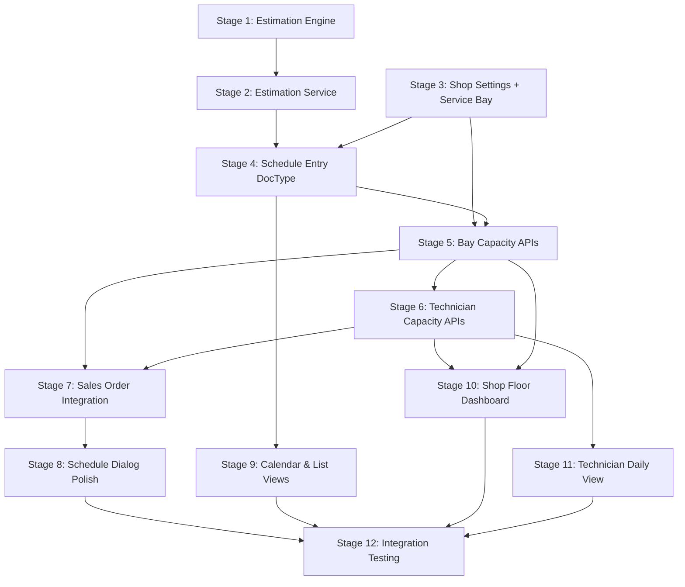

# Scheduling System – Staged Implementation Checklist

> [!IMPORTANT]
> This is a **build-and-verify** checklist. Complete and test each stage before starting the next. For detailed schemas, API signatures, and behavioral requirements, refer to [scheduling-system.md](file:///home/real2/projects/.project/frappe_docker/development/frappe-bench/apps/induct_shop/docs/development/scheduling-system.md).

> [!NOTE]
> All DocTypes must be **Standard DocTypes** (`custom=0`) with JSON schemas and Python controllers exported to the codebase. Custom fields on existing DocTypes must be declared in `hooks.py` (via `custom_fields` or `fixtures`) and queries must defensively check column existence with `frappe.db.has_column()`.

---

## Stage 1 — Estimation Engine (Pure Python)

**Goal**: Implement the log-normal estimation math with zero Frappe dependencies.

**Spec Reference**: §2 (Estimation Engine)

**Files**: `induct_shop/scheduling/estimation_light.py`

- [x] Implement `estimate_duration(flat_rate_minutes, sigma=0.30)` → returns P80 in minutes (integer, rounded up)
- [x] Implement `estimate_total_duration(flat_rate_list, sigma=0.30)` → Fenton-Wilkinson multi-operation summation, returns total P80 in minutes
- [x] Handle edge cases: empty list returns 0, single-item list bypasses summation, zero/negative FRT raises ValueError

### Stage 1 — Acceptance Criteria

- [x] **Unit tests pass** — pure-Python tests (no Frappe test runner needed) covering:
  - Single FRT: 60 min → ~77 min P80
  - Multi-FRT summation produces a tighter total than naively summing individual P80s
  - Edge cases (empty list, single item, zero FRT)
- [x] Module is importable independently (`python -c "from induct_shop.scheduling.estimation_light import estimate_duration"`)

---

## Stage 2 — Estimation Service (Frappe Integration)

**Goal**: Wrap the estimation engine with Frappe data access (Item → `custom_frt` lookup).

**Spec Reference**: §3 (Frappe Integration Layer)

**Files**: `induct_shop/api/estimation_service.py`

- [x] Implement `get_estimate(item_code, **kwargs)` — fetches `custom_frt` from Item, calls `estimate_duration()`, returns P80
- [x] Implement `get_total_estimate(item_codes, **kwargs)` — fetches FRT for all items, calls `estimate_total_duration()`, returns total P80
- [x] Defensive check: `frappe.db.has_column("Item", "custom_frt")` before querying `custom_frt`
- [x] Graceful handling of missing FRT: items with no `custom_frt` are skipped (or use a configurable fallback)
- [x] Expose as whitelisted methods if needed for client-side calls

### Stage 2 — Acceptance Criteria

- [x] **Frappe test** — call `get_estimate()` with a known item code that has `custom_frt` set and verify the returned P80
- [x] **Frappe test** — call `get_total_estimate()` with multiple item codes and verify summation result
- [x] **Defensive check test** — verify no crash when `custom_frt` column doesn't exist

---

## Stage 3 — Foundation DocTypes (Shop Settings + Service Bay)

**Goal**: Create the configuration and physical-resource DocTypes that the scheduling layer depends on.

**Spec Reference**: §4 (Service Bay), §8 (Shop Settings)

**Files**:
- `induct_shop/induct_shop/doctype/shop_settings/` (singleton)
- `induct_shop/induct_shop/doctype/service_bay/`
- `induct_shop/induct_shop/doctype/service_bay_equipment/` (child table)

### Shop Settings (Singleton)

- [x] Create singleton DocType with fields: `operating_hours_start`, `operating_hours_end`, `break_start`, `break_end`, `default_slot_interval`, `holiday_list`, `scheduling_horizon_days`, `technician_designation`, `enable_technician_capacity`
- [x] Set sensible defaults (see §8 for values)

### Service Bay + Equipment Tags

- [x] Create Service Bay DocType with fields: `bay_name` (naming/title field), `equipment` (child table), `is_active`, `description`
- [x] Create `Service Bay Equipment` child table DocType with an equipment tag field
- [x] Verify `bay_name` is the naming field and title field

### Stage 3 — Acceptance Criteria

- [x] `bench migrate` succeeds without errors
- [x] Shop Settings singleton can be created and saved via the UI
- [x] Multiple Service Bays can be created with different equipment tags
- [x] Filtering `Service Bay` by `is_active` works correctly
- [x] **Reinstall test** — `bench reinstall` (or install on fresh site) creates both DocTypes without manual intervention

---

## Stage 4 — Schedule Entry DocType (Schema Only)

**Goal**: Create the Schedule Entry DocType with its schema and basic controller hooks, **without** capacity validation logic (that comes in Stage 5).

**Spec Reference**: §5 (Schedule Entry DocType)

**Files**: `induct_shop/induct_shop/doctype/schedule_entry/`

- [x] Create Schedule Entry DocType with all fields per §5.1 schema
- [x] Enforce unique constraint on `sales_order` (1:1 relationship)
- [x] `before_insert`: auto-fetch `project`, `customer`, `repair_vehicle` from the linked Sales Order and its Project
- [x] `before_insert`: auto-calculate `estimated_duration` by calling `get_total_estimate()` with all service item codes from the SO
- [x] `items_summary` auto-generated from SO items
- [x] Status field with the workflow: `Draft` → `Scheduled` → `Needs Review` → `In Progress` → `Completed` → `Cancelled`

### Stage 4 — Acceptance Criteria

- [x] Can create a Schedule Entry linked to a submitted Sales Order — `project`, `customer`, `repair_vehicle`, `estimated_duration`, and `items_summary` auto-populate correctly
- [x] Attempting to create a second Schedule Entry for the same Sales Order is blocked (unique constraint)
- [x] `estimated_duration` value matches the expected P80 for the SO's service items
- [x] Status transitions work (manual changes for now)
- [x] `bench migrate` succeeds; DocType survives reinstall

---

## Stage 5 — Bay Capacity APIs + Lunch-Aware Time Windows

**Goal**: Implement the bay-side capacity logic including lunch-aware effective end time calculation.

**Spec Reference**: §7.1 (bay constraint), §7.3 (Lunch-Aware Time Windows), §7.4 (Bay Capacity APIs)

**Files**: `induct_shop/api/scheduling.py`

- [ ] Implement `effective_end_time(start_time, duration_minutes, break_start, break_end)` per §7.3
- [ ] Implement `check_bay_availability(service_bay, date, start_time, duration_minutes, exclude_entry)` → returns `True`/`False`
- [ ] Implement `auto_assign_bay(date, start_time, duration_minutes, required_tags)` → returns `bay_name` or raises ValidationError (technician pool check deferred to Stage 6)
- [ ] Implement `get_available_bays(date, start_time, duration_minutes, required_tags)` → list of available bays with equipment tags
- [ ] Implement `get_available_slots(date, duration_minutes, required_tags, service_bay)` → list of enriched slot dicts (bay data only for now; technician fields can be stubbed)
- [ ] Wire `check_bay_availability()` into Schedule Entry's `validate` hook — raise `frappe.ValidationError` on bay overlap

### Stage 5 — Acceptance Criteria

- [ ] **Lunch-aware time tests**:
  - Job ending before lunch → no adjustment
  - Job spanning lunch → break duration added to effective end
  - Job starting after lunch → no adjustment
- [ ] **Bay overlap tests**:
  - Two entries on the same bay at the same time → blocked
  - Two entries on the same bay at non-overlapping times → allowed
  - Two entries on different bays at the same time → allowed
  - Rescheduling an existing entry (exclude_entry) → does not conflict with itself
- [ ] **Auto-assign tests**:
  - Assigns first available capable bay
  - Raises error when no capable bays are available
  - Equipment tag filtering works (bay without required tag is skipped)
- [ ] **Available slots**:
  - Slots during lunch break are excluded
  - Fully booked slots are excluded
  - Returned slot data includes `available_bays` count
- [ ] Schedule Entry `validate` rejects save on bay conflict

---

## Stage 6 — Technician Capacity APIs

**Goal**: Implement technician roster management, leave-aware availability, and pool-level capacity gating.

**Spec Reference**: §7.2 (Technician Roster & Availability), §7.4 (Technician Capacity APIs)

**Files**: `induct_shop/api/technician_availability.py`

- [ ] Implement `get_active_technicians(date)` — Employee designation filter + leave flagging
- [ ] Implement `get_technician_pool_availability(date, start_time, duration_minutes)` — pool-level gating (counts total, on-leave, on-duty, occupied, available)
- [ ] Implement `check_technician_availability(employee, date, start_time, duration_minutes, exclude_entry)` — individual overlap + leave check
- [ ] Implement `get_technician_queue(employee, date)` — personal work queue with utilization
- [ ] Implement `get_daily_technician_overview(date)` — shop-wide technician dashboard data
- [ ] Wire technician pool gating into `auto_assign_bay()` (from Stage 5) when `enable_technician_capacity` is on
- [ ] Wire technician pool check into Schedule Entry `validate` hook (hard block when pool is exhausted)
- [ ] Wire individual technician check into Schedule Entry `validate` hook (soft warning on overlap/leave)
- [ ] Update `get_available_slots()` to include technician availability data in returned slots (`available_technicians`, `effective_capacity`, `bottleneck`)

### Stage 6 — Acceptance Criteria

- [ ] **Roster test** — only employees with matching designation and `Active` status are returned
- [ ] **Leave integration test** — employee with approved Leave Application for a date is flagged as on-leave; half-day leave correctly handled
- [ ] **Pool gating test**:
  - With 2 technicians on duty and 2 already occupied at time T → pool exhausted, slot unavailable
  - With `enable_technician_capacity` unchecked → technician checks are skipped entirely
- [ ] **Individual overlap test** — assigning a technician who already has an overlapping Schedule Entry produces a soft warning (not a hard block)
- [ ] **Dual-resource slots** — `get_available_slots()` returns correct `effective_capacity = min(free_bays, available_techs)` and identifies the bottleneck
- [ ] **Work queue test** — `get_technician_queue()` returns entries in chronological order with utilization percentage
- [ ] Schedule Entry `validate` with `enable_technician_capacity=1` blocks save when tech pool is exhausted

---

## Stage 7 — Sales Order Integration

**Goal**: Add the "Schedule Service" button and amendment handling to the Sales Order form.

**Spec Reference**: §6 (Sales Order Integration)

**Files**:
- `induct_shop/public/js/sales_order.js`
- `hooks.py` (add `doctype_js` and `doc_events` entries)

### Schedule Service Button

- [ ] Add client script via `doctype_js` hook
- [ ] Button appears only when SO is submitted (`docstatus == 1`) and no Schedule Entry exists for it
- [ ] On click, opens the Schedule Service dialog (basic version — full UI polish in Stage 8):
  - Date picker (defaults to today or next business day)
  - Estimated duration badge (calls `get_total_estimate()`)
  - Available slots display (calls `get_available_slots()`)
  - Optional technician selector
  - Notes field
- [ ] On submit: calls `auto_assign_bay()`, creates Schedule Entry, navigates to it
- [ ] Button hidden after a Schedule Entry is created

### Amendment Handling

- [ ] `doc_events` hook on Sales Order `on_submit` — when the SO is an amendment, update linked Schedule Entry status to `Needs Review`
- [ ] Recalculate `estimated_duration` on the Schedule Entry from amended SO items
- [ ] If new duration causes bay overlap, add a comment to the Schedule Entry alerting staff

### Stage 7 — Acceptance Criteria

- [ ] Button visible on submitted SO, hidden otherwise
- [ ] Button hidden when a Schedule Entry already exists for the SO
- [ ] Full round-trip: click button → select date/slot → Schedule Entry created with correct bay, duration, SO link
- [ ] Amendment flow: amend SO → linked Schedule Entry status changes to `Needs Review`, duration recalculated
- [ ] Amendment overlap detection adds a comment when applicable
- [ ] `hooks.py` entries survive `bench migrate`

---

## Stage 8 — Staff-Facing UI: Schedule Service Dialog (Polish)

**Goal**: Upgrade the basic dialog from Stage 7 into the full slot-picker UI per the specification wireframe.

**Spec Reference**: §9.1 (Schedule Service Dialog)

**Files**: `induct_shop/public/js/sales_order.js` (extend dialog)

- [ ] Slot grid with clickable time slot buttons showing per-slot `available_bays` and `available_technicians`
- [ ] Dual-resource capacity indicator in the header (slot count + bottleneck text)
- [ ] Lunch break slots excluded; label showing the excluded window
- [ ] Date navigation (prev/next day arrows)
- [ ] Technician utilization preview when a technician is selected (name, job count, total time, utilization %)
- [ ] Yellow warning banner when selected technician has an overlap at the chosen slot
- [ ] Holiday awareness — no slots shown on holidays (from Shop Settings → Holiday List)

### Stage 8 — Acceptance Criteria

- [ ] Visual match with the wireframe in §9.1
- [ ] Slot grid updates dynamically when date is changed
- [ ] Selecting a slot + submitting creates a valid Schedule Entry (end-to-end)
- [ ] Technician utilization preview displays correct data
- [ ] Overlap warning appears for conflicting technician assignment
- [ ] No slots rendered during lunch window or on holidays

---

## Stage 9 — Staff-Facing UI: Calendar & List Views

**Goal**: Add Calendar and List view customizations for the Schedule Entry DocType.

**Spec Reference**: §9.2 (Calendar View), §9.4 (List View)

**Files**:
- `induct_shop/public/js/schedule_entry_calendar.js`
- `induct_shop/public/js/schedule_entry_list.js`
- `hooks.py` (add `doctype_calendar_js` hook)

- [ ] Calendar view renders entries on day/week grid with customer, vehicle, bay, duration, and status
- [ ] Color-coded status blocks (Scheduled=blue, In Progress=amber, Needs Review=red, Completed=green, Cancelled=grey)
- [ ] Jobs spanning lunch show a visual break indicator
- [ ] Clicking a block navigates to the Schedule Entry form
- [ ] List view with status-based color indicators
- [ ] List view quick filters: date, status, bay, technician

### Stage 9 — Acceptance Criteria

- [ ] Calendar view renders at least one Schedule Entry correctly with color coding
- [ ] Lunch break visual indicator appears for spanning jobs
- [ ] List view filters produce correct results
- [ ] Both views survive `bench build` and page reload

---

## Stage 10 — Staff-Facing UI: Shop Floor Dashboard

**Goal**: Build the per-bay day-strip timeline with technician load panel for shop managers.

**Spec Reference**: §9.3 (Shop Floor Dashboard)

**Files**: `induct_shop/induct_shop/page/shop_floor/`

- [ ] Create Frappe page with bay swim lanes (Y-axis = bays, X-axis = operating hours)
- [ ] Render Schedule Entry blocks on correct bay lanes with customer, vehicle, technician, status color
- [ ] Lunch break column rendered as hatched/shaded across all lanes
- [ ] Jobs spanning lunch show a visual gap with shifted effective end time
- [ ] Capacity summary header: active bays, on-duty/on-leave techs, bottleneck indicator, unassigned count
- [ ] Date navigation (prev/next day)
- [ ] Technician load panel (collapsible bottom section): per-technician utilization bar, job count, ON LEAVE label
- [ ] Unassigned entries highlighted in the technician panel
- [ ] Clicking a job block navigates to the Schedule Entry form
- [ ] Clicking a technician bar navigates to the Technician Daily View

### Stage 10 — Acceptance Criteria

- [ ] Dashboard renders correctly with test data (multiple bays, multiple entries, at least one on-leave technician)
- [ ] Bay swim lanes accurately reflect non-overlapping entries per bay
- [ ] Lunch column visually spans all lanes
- [ ] Technician load percentages match expected values from `get_daily_technician_overview()`
- [ ] Unassigned entries are visually distinct
- [ ] Navigation links work (to Schedule Entry and Technician Daily View)

---

## Stage 11 — Staff-Facing UI: Technician Daily View

**Goal**: Build the personal technician timeline page with "Next Up" functionality.

**Spec Reference**: §9.5 (Technician Daily View)

**Files**: `induct_shop/induct_shop/page/technician_daily/`

- [ ] Create Frappe page with technician selector dropdown (defaults to logged-in employee)
- [ ] Daily summary cards: job count, total time, primary bay, utilization %
- [ ] Vertical timeline rendering: entries in chronological order with duration, bay, SO link, status
- [ ] Gaps between jobs rendered explicitly with duration
- [ ] Lunch break rendered as a distinct block in the timeline
- [ ] Jobs spanning lunch show inserted pause with remaining duration after
- [ ] "Next Up" bar highlighting the next non-completed/non-cancelled entry based on current time
- [ ] "View Schedule Entry" button on Next Up → navigates to form
- [ ] "Start Job" button on Next Up → transitions status `Scheduled` → `In Progress`
- [ ] Date navigation (prev/next day)

### Stage 11 — Acceptance Criteria

- [ ] Auto-selects logged-in employee (requires Employee linked to user)
- [ ] Manager can switch to any technician via dropdown
- [ ] Timeline matches data from `get_technician_queue()` API
- [ ] Gaps and lunch break are visually clear
- [ ] "Start Job" transitions status correctly and updates the UI
- [ ] "Next Up" highlights the correct entry based on current time

---

## Stage 12 — Integration Testing & Edge Cases

**Goal**: End-to-end verification of the complete system working together.

**Spec Reference**: All sections

- [ ] **Full workflow test**: Create Sales Order with services → Submit → Schedule Service → verify Schedule Entry with correct duration, bay, and all fetched fields
- [ ] **Capacity limits**: Fill all bays and/or exhaust technician pool → verify scheduling is correctly blocked
- [ ] **Amendment flow**: Amend a scheduled Sales Order → verify `Needs Review` status and duration recalculation
- [ ] **Leave integration**: Put a technician on leave → verify they are excluded from pool and their work queue reflects it
- [ ] **Holiday handling**: Attempt to schedule on a holiday → verify no slots are available
- [ ] **Lunch edge cases**: Schedule jobs that start before, during, and after lunch → verify effective end times are correct across all views
- [ ] **Equipment tag filtering**: Require a tag (e.g., "Lift") → verify only bays with that tag are considered
- [ ] **`enable_technician_capacity` toggle**: Turn off → verify system operates in bay-only mode without errors
- [ ] **Reinstall resilience**: `bench reinstall` + `bench migrate` → all DocTypes, settings, and hooks intact
- [ ] **Multi-day scheduling**: Verify scheduling across different dates doesn't cross-contaminate capacity checks

---

## Dependency Map

> [!TIP]
> **Parallel work is possible**: Stages 1 and 3 have no dependencies on each other and can be developed simultaneously. Similarly, Stages 9, 10, and 11 (the three UI views) can be developed in parallel once their API dependencies (Stages 5–6) are complete.
