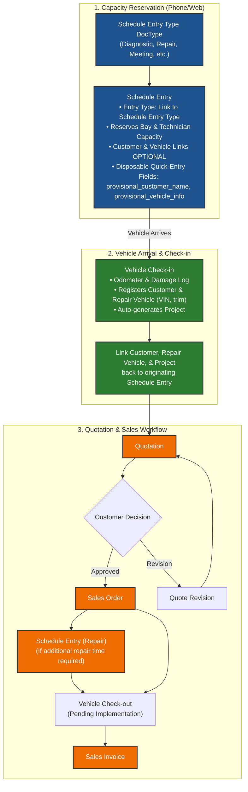

# Standalone Diagnostic Scheduling & Dynamic Entry Types Specification

## 1. Executive Summary

This document specifies the technical design for **Standalone Diagnostic & Operational Scheduling** in Induct Shop. 

The primary objective of a diagnostic schedule entry is to **reserve shop capability** (Service Bay + Technician capacity) without requiring any pre-existing transactions or master entities (`Sales Order`, `Customer`, `Repair Vehicle`, or `Project`). Master vehicle and customer records are created upon vehicle arrival at **Vehicle Check-in**, which automatically generates the **Project** (master service file) and links back to the originating Schedule Entry for diagnostic labor accounting.

Furthermore, this specification introduces a dedicated **`Schedule Entry Type`** DocType to categorize shop schedule activities (e.g., `Diagnostic`, `Repair`, `Meeting`, `Maintenance / Shop Cleaning`, `Internal Service`) dynamically.

---

## 2. Architecture & Domain Model



---

## 3. Detailed Data Schemas

### 3.1 `Schedule Entry Type` DocType (New Standard DocType)

A standard DocType (`custom=0`, `module="Induct Shop"`) for managing schedule entry categories.

| Field Name | Field Type | Options | Description |
| :--- | :--- | :--- | :--- |
| `type_name` | Data | — | Unique identifier / label (e.g. `Diagnostic`, `Repair`, `Meeting`). **Required, Unique, Title Field**. |
| `color` | Color / Data | — | Color hex code for calendar rendering (e.g. `#1f538d`). |
| `description` | Small Text | — | Operational notes describing the schedule entry type. |
| `requires_sales_order` | Check | — | Indicates if this entry type requires a linked Sales Order (default: `0`). |

#### Provisioned Seed Data
Upon installation/migration, the following standard types will be seeded:
- **Diagnostic**: Initial inspection/diagnostic slot (Requires SO: `0`, Color: `#1f538d`)
- **Repair**: Confirmed repair job (Requires SO: `1`, Color: `#2e7d32`)
- **Meeting**: Internal staff/shop meeting (Requires SO: `0`, Color: `#7b1fa2`)
- **Maintenance / Shop Cleaning**: Service bay or equipment maintenance (Requires SO: `0`, Color: `#c62828`)
- **Internal Service**: Internal vehicle maintenance or fleet service (Requires SO: `0`, Color: `#ef6c00`)

---

### 3.2 `Schedule Entry` DocType (Modified Schema)

| Field Name | Field Type | Options | Reqd | Description |
| :--- | :--- | :--- | :--- | :--- |
| `naming_series` | Select | `SE-.#####` | Yes | Autoname series. |
| `entry_type` | Link | `Schedule Entry Type` | Yes | Categorization link (Default: `Diagnostic`). |
| `sales_order` | Link | `Sales Order` | **No** | Linked Sales Order. |
| `customer` | Link | `Customer` | **No** | Linked master Customer (Editable). |
| `repair_vehicle` | Link | `Repair Vehicle` | **No** | Linked master Repair Vehicle (Editable). |
| `project` | Link | `Project` | **No** | Linked master Project (Editable). |
| `vehicle_check_in` | Link | `Vehicle Check-in` | **No** | Linked Vehicle Check-in (Read Only). |
| `provisional_customer_name` | Data | — | **No** | Disposable quick-entry name for phone bookings (e.g. "John"). |
| `provisional_vehicle_info` | Data | — | **No** | Disposable quick-entry vehicle info for phone bookings (e.g. "2021 Model Y"). |
| `scheduled_date` | Date | — | Yes | Appointment date. |
| `scheduled_time` | Time | — | Yes | Start time. |
| `estimated_duration` | Int | — | No | Duration in minutes (User-defined or SO-calculated). |
| `service_bay` | Link | `Service Bay` | Yes | Assigned service bay (Drives capacity check). |
| `assigned_technician` | Link | `Employee` | No | Assigned technician. |
| `status` | Select | Draft, Scheduled, Needs Review, In Progress, Completed, Cancelled | Yes | Operational status. |

---

### 3.3 Dynamic Title & Display Helpers

The `ScheduleEntry` Python controller will expose display methods for UI and calendar rendering:

```python
def get_display_customer(self) -> str:
    """Returns linked Customer name, or provisional customer name, or fallback."""
    if self.customer:
        return frappe.db.get_value("Customer", self.customer, "customer_name") or self.customer
    if self.provisional_customer_name:
        return self.provisional_customer_name
    return "Guest"

def get_display_vehicle(self) -> str:
    """Returns linked Repair Vehicle title, or provisional vehicle info."""
    if self.repair_vehicle:
        return frappe.db.get_value("Repair Vehicle", self.repair_vehicle, "title") or self.repair_vehicle
    if self.provisional_vehicle_info:
        return self.provisional_vehicle_info
    return ""
```

---

## 4. Vehicle Check-in & Intake Integration

When a customer arrives at the shop:
1. Staff click **"Vehicle Check-in"** action on the `Schedule Entry` form.
2. The `Vehicle Check-in` form opens with pre-populated fields:
   - `schedule_entry` set to the originating entry.
   - `customer` pre-selected if master Customer exists.
3. Staff perform intake, record odometer reading, upload damage media, and select/create `Customer` and `Repair Vehicle` if not already present.
4. Saving `Vehicle Check-in`:
   - Auto-creates the **Project**.
   - Invokes `on_check_in_saved` script to update originating `Schedule Entry`:
     - Sets `Schedule Entry.project = project.name`
     - Sets `Schedule Entry.repair_vehicle = check_in.vehicle`
     - Sets `Schedule Entry.customer = check_in.customer`
     - Sets `Schedule Entry.vehicle_check_in = check_in.name`

---

## 5. Quotation & Sales Order Integration

1. Advisor generates a standard **Quotation** from the `Project` (covering diagnostic fee, labor, and required parts).
2. Customer approves Quotation -> converts to **Sales Order**.
3. The Sales Order links to the `Project`. If additional repair time is needed, staff click **"Schedule Service"** on the Sales Order to create a secondary `Schedule Entry` with `entry_type = "Repair"`.
