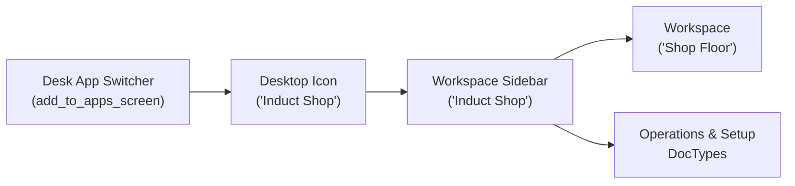

# Induct Shop Desk Workspace

This document provides technical reference for the dedicated **Induct Shop** workspace integration on Frappe Desk (v16), modeled after Frappe HR (`hrms`).

---

## Architectural Overview

The Induct Shop Desk Workspace provides dedicated Desk launcher access, a customized left-hand navigation sidebar, and a default landing page (`/desk/shop-floor`).



---

## Components & Declarations

### 1. App Hooks & Launcher (`hooks.py`)

- **Default Home Route**: `app_home = "/desk/shop-floor"`
- **Desk App Switcher Hook**:
  ```python
  add_to_apps_screen = [
      {
          "name": "induct_shop",
          "logo": "/assets/induct_shop/images/induct-shop-logo.svg",
          "title": "Induct Shop",
          "route": "/desk/shop-floor",
          "has_permission": "induct_shop.utilities.permission.check_app_permission"
      }
  ]
  ```

### 2. Desktop Icon (`desktop_icon/induct_shop.json`)

- **DocType**: `Desktop Icon`
- **Name**: `Induct Shop`
- **Type**: `App` (`link_type: External`, `link: /desk/shop-floor`)
- **Branding**: `/assets/induct_shop/images/induct-shop-logo.svg`

### 3. Workspace Sidebar (`workspace_sidebar/induct_shop.json`)

- **DocType**: `Workspace Sidebar`
- **Title**: `Induct Shop`
- **Navigational Structure**:
  - **Shop Floor**: Link to `Shop Floor` Workspace
  - **Operations Section**: `Schedule Entry`, `Vehicle Check-in`, `Project`, `Quotation`, `Sales Order`, `Sales Invoice`
  - **Fleet & Equipment Section**: `Repair Vehicle`, `Inspection Template`, `Service Bay`, `Equipment Tag`
  - **Setup & Settings Section**: `Shop Settings`, `Service Part Association`

### 4. Standard Workspace (`induct_shop/workspace/shop_floor/shop_floor.json`)

- **DocType**: `Workspace`
- **Module**: `Induct Shop`
- **Title**: `Shop Floor`
- **Content**: Clean, unpopulated layout prepared for user customization.

---

## Reinstall Resilience

Per [Feature Requests Rule](file:///home/real2/projects/.project/frappe_docker/development/frappe-bench/apps/induct_shop/.agents/rules/feature-requests.md), all `Desktop Icon`, `Workspace Sidebar`, and `Workspace` documents are defined programmatically as standard codebase JSON files (`standard: 1`) in version control. Running `bench migrate` automatically imports and updates them.
