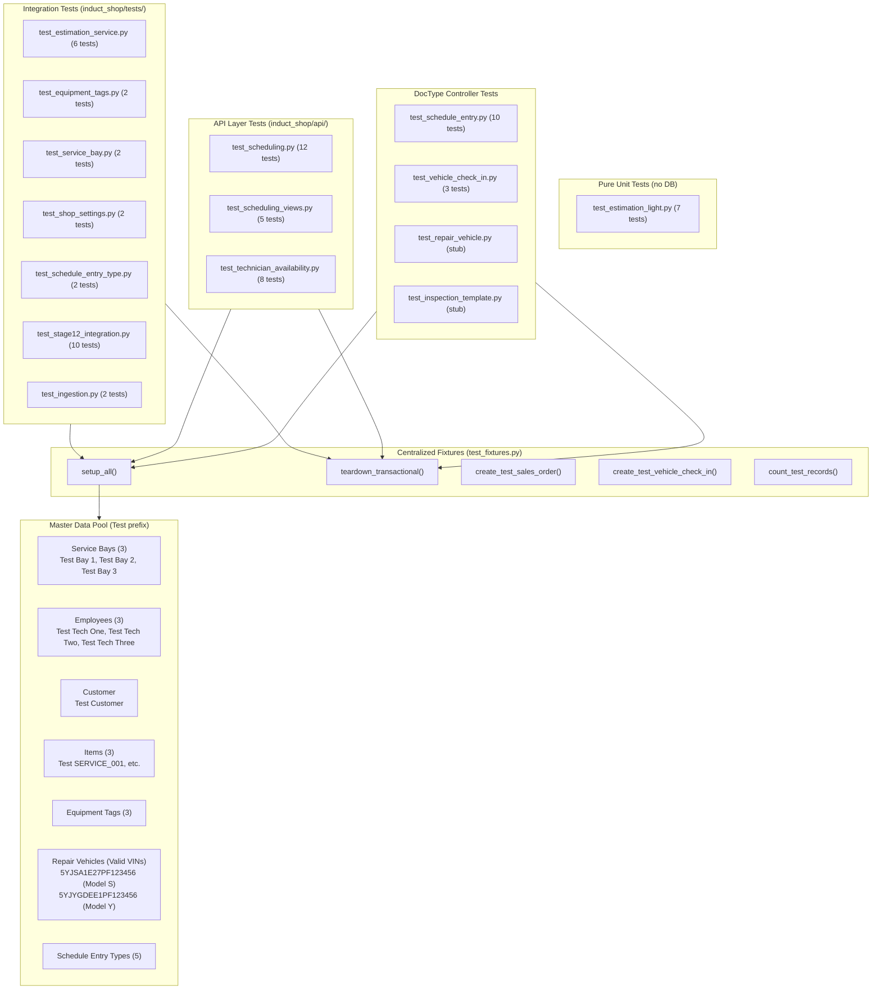

# Test Suite Architecture & Inventory Reference

## 1. Executive Summary

The `induct_shop` test suite provides automated coverage across all business logic, API endpoints, DocType controllers, and duration estimation algorithms. The test infrastructure relies on a centralized master data fixture pool (`induct_shop/tests/test_fixtures.py`) to enforce consistent test data naming (`Test ` prefix), valid Tesla VIN decoding, and complete cleanup of transactional records after every test execution.

---

## 2. Architecture Diagram

The diagram below illustrates the relationship between test files, the centralized fixture system, and database entities:



---

## 3. Test Suite Inventory

The `induct_shop` test suite consists of **15 test files**, **15 test classes**, and **73 active test methods**.

| Location / File | Test Class | Methods | Category | Key Responsibilities |
|:---|:---|:---:|:---|:---|
| `tests/test_estimation_light.py` | `TestLightweightEstimator` | 7 | Pure Unit | Log-normal P80 estimation math, Fenton-Wilkinson log-normal summation, variance parameter calculations. |
| `tests/test_estimation_service.py` | `TestEstimationService` | 6 | Integration | Item custom FRT lookup, sigma overrides, fallback handling, multi-item total estimation, defensive column handling. |
| `tests/test_equipment_tags.py` | `TestEquipmentTags` | 2 | Integration | Equipment tag querying, item equipment requirements updating, mobile capability derivation. |
| `tests/test_service_bay.py` | `TestServiceBay` | 2 | Integration | Service Bay creation, child equipment tag association, active filtering. |
| `tests/test_shop_settings.py` | `TestShopSettings` | 2 | Integration | Singleton Shop Settings default verification, property updates, and cleanup restoration. |
| `tests/test_schedule_entry_type.py` | `TestScheduleEntryType` | 2 | Integration | Seed entry type existence and properties, custom entry type creation and uniqueness. |
| `tests/test_stage12_integration.py` | `TestStage12Integration` | 10 | Integration | End-to-end shop workflow, capacity limits, Sales Order amendments, leave/holiday/lunch edge cases, equipment filtering, bay rescheduling, capacity warnings. |
| `tests/test_ingestion.py` | `TestIngestion` | 2 | Integration | Tesla catalog parts ingestion with compatibility deduplication, service item ingestion with mocked HTTP responses. |
| `api/test_scheduling.py` | `TestSchedulingApi` | 12 | API | Break/lunch-aware end time calculations, bay overlap detection, auto-assign capacity checks, slot search, equipment tags, holiday detection. |
| `api/test_scheduling_views.py` | `TestSchedulingViewsApi` | 5 | API | FullCalendar event payload formatting, break events generation, date range filtering, vehicle info resolution via VIN. |
| `api/test_technician_availability.py` | `TestTechnicianAvailabilityApi` | 8 | API | Active technician fetching, leave integration, daily capacity gating, capacity toggle, technician assignment overlap warnings, dual resource slot search, queue & overview data. |
| `doctype/schedule_entry/test_schedule_entry.py` | `TestScheduleEntry` | 10 | DocType Controller | Customer/vehicle/project auto-population from SO, FRT line overrides, duplicate SO blocking, status state transitions, standalone entry creation, capacity conflicts, display fallbacks, VCI linkage, repair entry creation. |
| `doctype/vehicle_check_in/test_vehicle_check_in.py` | `TestVehicleCheckIn` | 3 | DocType Controller | Schedule Entry cross-linking, automatic Project creation & naming on check-in, duplicate active check-in validation. |
| `doctype/repair_vehicle/test_repair_vehicle.py` | `IntegrationTestRepairVehicle` | 0 | Stub | Placeholder stub for future Repair Vehicle controller integration tests. |
| `doctype/inspection_template/test_inspection_template.py` | `IntegrationTestInspectionTemplate` | 0 | Stub | Placeholder stub for future Inspection Template controller integration tests. |

---

## 4. Test Categories

The test suite is structured into four distinct test categories:

1. **Pure Unit Tests**: Tests execution of pure math and logic functions without database interaction (e.g., `test_estimation_light.py`). Runs rapidly and requires no setup or teardown.
2. **Integration Tests**: Tests business logic spanning multiple modules or DocTypes in `induct_shop/tests/`. Uses `test_fixtures.setup_all()` for master data and `teardown_transactional()` for cleanup.
3. **API Tests**: Tests whitelisted API endpoints in `induct_shop/api/`. Verifies request structure, error responses, slot calculations, and permissions.
4. **DocType Controller Tests**: Tests DocType event hooks (`before_insert`, `validate`, `on_update`, `on_cancel`) located directly in `doctype/<doctype>/test_<doctype>.py`.

---

## 5. Centralized Fixture System (`test_fixtures.py`)

All database tests rely on `induct_shop/tests/test_fixtures.py` as the single source of truth for test data.

### 5.1 Master Data Pool (`Test ` Prefix)

Master records are created idempotently by `setup_all()`. All records use the standardized `Test ` prefix to ensure clear separation from production or manual data:

* **Customer**: `Test Customer`
* **Service Bays**: `Test Bay 1` (Active, Lift), `Test Bay 2` (Active, Lift + Alignment Rack), `Test Bay 3` (Inactive)
* **Employees**: `Test Tech One` (Technician), `Test Tech Two` (Technician), `Test Tech Three` (Inactive/Left)
* **Items**: `Test SERVICE_001` (Service Item, 60m FRT), `Test EST_ITEM_001` (Service Item, 60m FRT), `Test EST_ITEM_002` (Service Item, 90m FRT)
* **Equipment Tags**: `Lift`, `Alignment Rack`, `HV Battery Station`
* **Schedule Entry Types**: `Diagnostic`, `Repair`, `Meeting`, `Maintenance / Shop Cleaning`, `Internal Service`
* **Repair Vehicles**: Valid Tesla VIN records with automatic specification decoding:
  * `5YJSA1E27PF123456` (Tesla Model S Plaid)
  * `5YJYGDEE1PF123456` (Tesla Model Y Long Range)

### 5.2 Transactional Record Helpers

* **`create_test_sales_order(customer=None, item_code=None, qty=1, rate=150.0)`**: Creates and submits a test Sales Order linked to `Test Customer`.
* **`create_test_vehicle_check_in(customer=None, vehicle=None, schedule_entry=None)`**: Creates an active Vehicle Check-in.
* **`count_test_records()`**: Returns a counts map `{"vci": count, "project": count, "se": count, "so": count}` of all residual test records in the database.

### 5.3 Transactional Teardown (`teardown_transactional`)

Calls `teardown_transactional()` in `tearDown()` to purge all transactional records created during test runs in FK-safe order:
1. `Vehicle Check-in`
2. `Schedule Entry`
3. `Project`
4. `Sales Order`
5. `Leave Application`

---

## 6. Valid Tesla VIN Requirement & Automatic Vehicle Decoding

> [!CRITICAL]
> **No Manual Vehicle Attribute Population**: Tests MUST NOT populate vehicle attributes (`manufacturer`, `model`, `trim`, `model_year`, etc.) by hand or use dummy VIN strings (e.g. `TEST-VIN-01`, random hashes).

* All tests requiring a vehicle must use valid 17-character Tesla VINs provided in `test_fixtures.py` (`5YJSA1E27PF123456` or `5YJYGDEE1PF123456`).
* When saving a `Repair Vehicle` with a valid VIN, `RepairVehicle.before_save()` automatically decodes all vehicle specifications (`is_valid_vin = 1`, `manufacturer = "Tesla"`, `model = "Model S"`, `trim = "Plaid"`, etc.).

---

## 7. Test Execution Guide

All `bench` commands MUST be executed inside the Docker container using `docker exec`.

### 7.1 Run the Full Test Suite

```bash
docker exec -i devcontainer-frappe-1 bash -c "cd /workspace/development/frappe-bench && bench --site development.localhost run-tests --app induct_shop"
```

### 7.2 Run Tests for a Specific Module

```bash
docker exec -i devcontainer-frappe-1 bash -c "cd /workspace/development/frappe-bench && bench --site development.localhost run-tests --module induct_shop.tests.test_stage12_integration"
```

### 7.3 Run a Single Test Class or Method

```bash
docker exec -i devcontainer-frappe-1 bash -c "cd /workspace/development/frappe-bench && bench --site development.localhost run-tests --doctype \"Schedule Entry\""
```

### 7.4 Verify Zero Residual Records

```bash
docker exec -i devcontainer-frappe-1 bash -c "cd /workspace/development/frappe-bench && bench --site development.localhost execute induct_shop.tests.test_fixtures.count_test_records"
```

---

## 8. Transactional Hygiene Contract

When writing or updating tests in `induct_shop`:

1. **Always Call `setup_all()`**: Call `test_fixtures.setup_all()` in `setUp()` to ensure master pool availability.
2. **Always Call `teardown_transactional()`**: Every test class that writes transactional records must define `tearDown()` and call `teardown_transactional()`.
3. **Account for Cascading Side-Effects**: Inserting a `Vehicle Check-in` automatically creates a `Project`. Inserting a `Schedule Entry` auto-populates SO links. `teardown_transactional()` handles these cascades automatically.
4. **Restore Singleton Settings**: If a test modifies `Shop Settings` or another singleton, wrap changes in `try/finally` blocks to restore original values.
