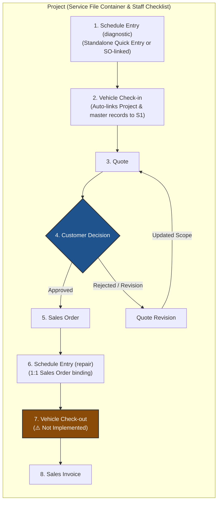

# Primary Vehicle Repair Workflow

This document serves as the official **source of truth** for the primary end-to-end vehicle diagnostic and repair workflow in Induct Shop. 

> [!NOTE]
> This is one of multiple operational workflows within our shop management software. Future workflows (e.g., Express Maintenance, Direct Repair, and Parts Sales) will be documented as separate business process specs.

---

## The Project as the Master Case & Checklist Container

In Induct Shop, the **Project** (`Project` DocType) is the **highest-level entity** that encompasses the entire service case lifecycle from start to finish.

- **Complete Service File Scope**: Unlike sub-documents that handle specific transactional steps, the Project serves as the top-level container housing all operations—including the initial diagnostic booking ([Schedule Entry](/doctypes/schedule-entry.md)).
- **Checklist-Style User Experience**: Designed for shop staff navigation, the Project acts as an interactive, checklist-style hub where technicians and advisors move a case sequentially through each phase of intake, diagnosis, quotation, repair, and billing.
- **Unified Hub**: Every document created during the job links directly back to the parent Project, giving staff a single-pane dashboard to track status, costs, vehicle information, and history.

---

## Workflow Sequence Overview

The primary vehicle diagnostic and repair checklist follows an 8-step progression managed inside the Project:

1. **Schedule Entry (diagnostic)** — Initial appointment booked for diagnostic inspection (supports standalone quick entry with provisional customer and vehicle info, or linking to an existing Sales Order/Customer).
2. **Vehicle Check-in** — Intake of the vehicle, odometer recording, and condition documentation. Auto-creates or links the parent **Project**, updating the originating diagnostic Schedule Entry with master `customer`, `repair_vehicle`, `project`, and `vehicle_check_in` references.
3. **Quote** — Estimate generated listing labor, services, teardown/diagnostic findings, and parts.
4. **Quote Approval / Rejection Loop** — Customer decision point:
   - **Approval**: Authorizes the quote and advances to a **Sales Order**.
   - **Rejection / Revision**: Customer requests scope or cost adjustments, triggering a **Quote Revision** loop back to the Quote.
5. **Sales Order** — Confirmed sales order generated directly from the approved quote.
6. **Schedule Entry (repair)** — Booking service bay and technician allocation for repair execution (enforces 1:1 binding with Sales Order).
7. **Vehicle Check-out** — Final quality check, key handoff, and vehicle release (*Not Implemented*).
8. **Sales Invoice** — Final customer billing and financial transaction posting.

---

## Process & Checklist Diagram

The diagram below illustrates how the **Project (Service File)** acts as the top-level container encapsulating the complete checklist experience for shop staff.

---

## Detailed Step Specifications

### 1. Schedule Entry (diagnostic)
* **DocType**: [Schedule Entry](/doctypes/schedule-entry.md)
* **Description**: Captures the customer's initial appointment request for diagnostic inspection using the `Diagnostic` Schedule Entry Type. Can be created standalone prior to establishing formal Customer, Repair Vehicle, or Sales Order records via provisional quick-entry text fields (`provisional_customer_name`, `provisional_vehicle_info`). Reserves service bay capacity and checks technician pool availability.

### 2. Vehicle Check-in
* **DocType**: [Vehicle Check-in](/doctypes/vehicle-check-in.md)
* **Description**: Records physical arrival of the vehicle at the shop. Links to the originating diagnostic `Schedule Entry` (or can be initiated directly from its form via custom action button). The technician/advisor logs intake mileage, completes a multi-point intake inspection template, captures damage photos, auto-creates the master `Project`, and automatically updates the originating diagnostic `Schedule Entry` with formal `project`, `repair_vehicle`, `customer`, and `vehicle_check_in` references.

### 3. Quote
* **DocType**: [Quotation](/doctypes/quotation.md)
* **Description**: Standard quotation listing labor operation codes, required parts, FRT estimates, and fee structures. Serves as the single quote object whether created for initial diagnostics or complete vehicle repairs.

### 4. Quote Approval / Rejection Loop
* **DocType**: [Quotation](/doctypes/quotation.md) (Status: `Submitted` / Customer Decision)
* **Description**: The customer evaluates the quotation.
  * **Approved Path**: Upon customer approval, the Quotation is locked and converted into a firm **Sales Order**.
  * **Rejected / Revision Path**: If the customer rejects the estimate or requests changes (e.g., deferring non-critical labor, swapping parts), the advisor generates a **Quote Revision** (amended Quotation version). The updated Quote loops back to Step 3 for re-review until approved or explicitly cancelled.

### 5. Sales Order
* **DocType**: `Sales Order` (Standard ERPNext)
* **Description**: Created directly from the approved quote. Establishes committed items, reserved parts inventory, and financial commitments for the job.

### 6. Schedule Entry (repair)
* **DocType**: [Schedule Entry](/doctypes/schedule-entry.md)
* **Description**: Scheduled appointment specifically for executing the approved repairs (`Repair` entry type). Enforces 1:1 relationship with the Sales Order, calculates P80 FRT duration, and validates service bay and technician capacity.

### 7. Vehicle Check-out (Pending Implementation)
* **DocType**: `Vehicle Check-out` *(Unimplemented)*
* **Status**: 
> [!WARNING]
> **Implementation Status: Pending**
> Vertical checkout functionality has not yet been implemented in the codebase.
* **Description**: Planned vertical process for final quality assurance inspection, recording outtake mileage, customer sign-off, key handoff, and marking the vehicle as released.

### 8. Sales Invoice
* **DocType**: `Sales Invoice` (Standard ERPNext)
* **Description**: Final accounting billing document generated from the Sales Order / Project. Triggers payment collection, updates accounting ledgers, and finalizes project costing.

---

## Related Documentation

* [Project DocType Customizations](/doctypes/project.md)
* [Vehicle Check-in DocType](/doctypes/vehicle-check-in.md)
* [Schedule Entry DocType](/doctypes/schedule-entry.md)
* [Quotation DocType](/doctypes/quotation.md)
